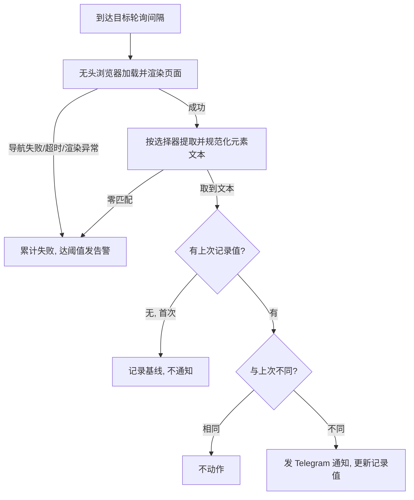
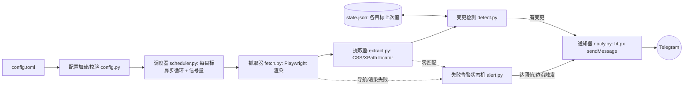

# 网页元素变更监控通知 (HawkEye) - Plan

## Goal Capsule

- **目标（Objective）：** 被监控的网页元素文本发生变化时，用户在 1~2 个轮询间隔内通过 Telegram 收到一条含"旧值→新值"的通知；主用例为商品可售状态（充足 / 较少 / 售罄）的变化。
- **手段（Means）：** 用 Python + 无头浏览器（Playwright / Chromium）编写常驻守护进程，基于 `asyncio` 按配置轮询：Playwright 渲染页面后按 CSS 或 XPath 选择器提取元素文本、扁平 JSON 文件持久化上次值、直连 Telegram Bot API（`httpx`）发送通知（见 KTD1–KTD8）。默认每 1 分钟轮询一次，可配置。
- **产品授权：** 单用户个人工具。仅覆盖"网页元素变更监控 + Telegram 通知"；自动下单、多用户账户、网页/指令式目标管理均不在范围内。
- **开放阻塞：** 无。规划期问题已在 Planning Contract 中解决。

> **本次修订（2026-09-02）：** 应用户指令将技术栈由 "Rust + 轻量 HTTP 抓取" 改为 **"Python + 无头浏览器"**，并将默认轮询间隔改为 **1 分钟（可配置）**。这反转了原 Product Contract 的两条 Key Decision（"不用无头浏览器"、"每几分钟轮询"）。稳定 ID（R1–R8 / F1–F2 / AE1–AE5 / U1–U6 / KTD1–KTD8）全部沿用，含义变化处已就地更新并在 Planning Contract 注明。

---

## Product Contract

### Summary

一个用 Python 编写、常驻 VPS 24/7 运行的守护进程，按配置文件定义的目标列表默认每 1 分钟（可配置）用无头浏览器渲染并抓取一次指定网页元素，检测其文本变化，并通过 Telegram 向用户推送"旧值→新值"通知。主用例是多站点、多商品的可售状态提醒，但检测机制是通用的"网页元素文本变更监控"。采用无头浏览器意味着既支持服务端渲染页面，也支持依赖 JavaScript 动态渲染的页面。

### Problem Frame

用户需要盯多个网站、每个网站多个商品的可售状态——例如 yunyoo.cc 购物页中一个元素在"充足 / 较少 / 售罄"之间变化。目前只能靠手动刷新页面，或依赖别人运营的监控 bot：那个 bot 不受用户控制、无法按自己的目标定制、也不能自托管。用户希望有一个完全属于自己、可自由增删监控目标、跑在自己服务器上的工具，取代对第三方 bot 的依赖。

### Key Decisions

- **（用户指定，本次修订）以 Python + 无头浏览器实现。** 用 Python 编写，Playwright 驱动 Chromium 无头浏览器渲染页面后再提取元素。好处：可处理 JS 动态渲染页面、可直接复用用户给的 XPath、对动态内容更稳健、生态成熟上手快。代价：VPS 资源开销显著高于纯 HTTP（每次抓取需渲染，内存/CPU 更重），且需在服务器安装浏览器二进制。缓解见 KTD2、KTD3 与 Risks。Governs R1、R2、R8。
- **（用户指定，本次修订）默认 1 分钟轮询，可配置。** 全局默认 60 秒，单目标可覆盖；比几分钟级更及时。仍不做秒级/代理池抢购。相较原方案更频繁 + 无头渲染，需注意资源与被封风险（见 Risks）。Governs R2。
- 任何文本变化都通知，而非仅"变可售"。机制更通用，契合"网页元素变更监控"定位，避免把三态语义硬编码进核心。Governs R3、R5。
- 配置文件驱动目标管理（v1）。最快出 MVP、维护成本最低；代价是增删改目标需登服务器改文件。Governs R7。
- 首次观测只建基线、失效要告警。首次不通知避免启动即把所有目标当"变更"轰炸；抓取/渲染/选择器失效时告警避免监控静默失效。Governs R4、R6。
- 单用户个人工具。通知只发往用户本人的 Telegram，不引入多用户/多账户体系。Governs R5。

### Requirements

**抓取与检测**

- R1. 用无头浏览器（Playwright / Chromium）加载每个目标 URL 并等待渲染，按配置的选择器（CSS 或 XPath，Playwright 原生支持两者）提取目标元素的文本；既支持服务端渲染页面，也支持 JavaScript 动态渲染页面。
- R2. 每个目标按可配置的轮询间隔（**默认 60 秒**）定期检查；支持全局默认间隔并允许单个目标覆盖。
- R3. 将本轮提取的元素文本与该目标上次记录值比较（比较前规范化空白）；不同即判定为一次"变更"。
- R4. 目标首次被观测时，只记录基线值，不发送通知。

**通知**

- R5. 检测到变更时，通过 Telegram Bot 向用户发送通知，内容至少包含：目标标识（名称或 URL）、旧值、新值、发生时间。
- R6. 当某目标连续抓取/渲染失败或选择器匹配不到元素时，发送一条告警通知，使用户知晓监控异常；告警需限频/去重，不得每轮重复轰炸。

**配置与运行**

- R7. 监控目标在配置文件中定义（至少含 URL、选择器，及可选的名称、间隔、选择器类型、等待策略），Telegram 凭据一并配置；修改后经重启生效。
- R8. 以常驻守护进程形式在 VPS 上 24/7 运行；进程重启后不丢失各目标的上次记录值（状态持久化），避免重启后误报或漏报。

### Key Flows



- F1. 正常监控循环
  - **Trigger:** 守护进程运行中，某目标到达其轮询间隔。
  - **Steps:** 无头浏览器加载 URL 并按等待策略渲染 → 用选择器提取元素文本并规范化空白 → 与持久化的上次值比较 → 首次则记录基线且不通知；不同则发 Telegram 通知并更新记录值；相同则不动作。
  - **Outcome:** 元素文本的变化在一个轮询间隔内被推送给用户。
  - **Covers:** R1、R2、R3、R4、R5、R8
- F2. 抓取/渲染或选择器失败
  - **Trigger:** 某目标加载报错（导航超时/网络异常/页面崩溃）或选择器匹配不到元素，且连续失败达到阈值。
  - **Steps:** 记录失败计数 → 达阈值后发送一条告警通知（受限频/去重约束）→ 恢复正常后内部重置计数（v1 不发恢复通知）。
  - **Outcome:** 用户知道监控出了问题，而不是静默失效。
  - **Covers:** R6

### Acceptance Examples

- AE1. 售罄→充足触发通知
  - **Covers R3、R5.**
  - **Given** 某目标上次记录值为"售罄"。
  - **When** 本轮渲染后提取到"充足"。
  - **Then** 用户收到含"售罄→充足"的 Telegram 通知，该目标记录值更新为"充足"。
- AE2. 首次观测不通知
  - **Covers R4.**
  - **Given** 某目标此前无记录值。
  - **When** 首次渲染后提取到"售罄"。
  - **Then** 不发送通知，仅将基线值记录为"售罄"。
- AE3. 值未变化不通知
  - **Covers R3.**
  - **Given** 某目标上次记录值为"较少"。
  - **When** 本轮仍为"较少"（含仅有空白差异的情形）。
  - **Then** 不发送通知。
- AE4. 选择器失效发告警
  - **Covers R6.**
  - **Given** 某目标选择器连续多轮匹配不到元素。
  - **When** 连续失败达到阈值。
  - **Then** 用户收到一条告警通知；后续轮次不重复轰炸。
- AE5. 重启后不误报
  - **Covers R8.**
  - **Given** 进程已将某目标记录为"充足"后发生重启。
  - **When** 重启后首轮渲染仍为"充足"。
  - **Then** 不因重启把它当作变更来通知。

### Scope Boundaries

**Deferred for later（以后可能做）**

- Telegram 指令式管理目标（如 `/add`、`/list`、`/remove`）。
- 网页管理后台。
- 多渠道通知（Bark / 邮件 / 微信等）。
- 秒级轮询配合代理池，以应对极限抢购。
- 恢复通知与更精细的告警策略。
- 配置热重载（监听文件变更，免重启生效）。
- 轻量 HTTP 快路径（对已确认服务端渲染的目标跳过浏览器渲染以省资源）——v1 统一走无头浏览器，此优化推迟。

**Outside this product's identity（不属于本工具）**

- 自动下单 / 加购 / 结算等购买自动化——本工具只做"通知"。
- 多用户 / 多租户账户体系。

### Dependencies / Assumptions

- 依赖一台常开的 VPS/服务器运行守护进程，且该机器能运行无头 Chromium（建议内存 ≥1GB；需可安装 Playwright 浏览器二进制及其系统依赖库）。
- 采用无头浏览器后，目标页无论服务端渲染还是 JS 动态渲染均受支持；不再要求状态文字直接出现在 HTML 源码中。
- 假设 1 分钟级轮询 + 无头浏览器不会触发目标站点（含 Cloudflare）的人机校验或对无头浏览器的封禁。
- 依赖一个 Telegram Bot Token 及用户的目标 chat id。
- 用户提供的示例 XPath 为按位置索引（如 `article[4]`），页面改版或商品顺序变化时易失效；v1 的稳健性策略见 KTD1。

### Outstanding Questions

**Resolve Before Planning**

- 无。

**Deferred to Planning**

- 均已在 Planning Contract 解决：选择器机制（KTD1）、无头浏览器与渲染等待（KTD2）、异步调度（KTD3）、状态持久化方式（KTD4）、配置格式与重启生效（KTD5）、失败阈值与告警限频（KTD7）、是否需要恢复通知（KTD7：v1 不发）、Python 依赖选型（Dependencies）。

### Sources / Research

- yunyoo.cc 示例页 `https://yunyoo.cc/cart?fid=1&gid=27` 抓取验证（2026-09-02）：HTTP 200、约 128KB HTML；`售罄`×4、`较少`×2、`yy-cart-page`×28 均出现在原始 HTML 中；页面脚本仅为 Tabler 模板静态资源与 Cloudflare email-decode，非 SPA。即该示例页本为服务端渲染；本次改用无头浏览器是按用户指令统一技术栈、以换取对 JS 渲染页面的支持与更强稳健性，并可直接复用用户给的 XPath。
- 用户提供的目标元素 XPath：`//*[@id="yy-cart-page"]/div[3]/main/div[2]/div[2]/article[4]/div/div/span`，状态取值为 充足 / 较少 / 售罄。Playwright 原生支持 XPath，可直接使用（见 KTD1）。
- 依赖版本外部核实缺口：规划/深化期两次派发外部研究均因工具（web 检索/抓取、子代理）临时不可用而未成，未能联网核实 Playwright / httpx 等库的 2026 年最新版本与已知问题。选型基于截至 2025-08 的 Python 生态知识（Playwright 为当前主流无头浏览器方案，httpx 为主流异步 HTTP 客户端，`tomllib` 为 3.11+ 标准库）。实现期应以 `pip`/官方文档复核一次各库现状与 `playwright install` 步骤。

---

## Planning Contract

**Product Contract 修订说明（用户指定）：** 本次为用户主动发起的技术栈变更，非仅 HOW 层调整。反转了两条 Key Decision（"不用无头浏览器" → 改用无头浏览器；"每几分钟轮询" → 默认 1 分钟可配置），并相应更新 Goal Capsule Means、Summary、R1（渲染/JS 支持/XPath 原生）、R2（默认 60s）、F1/F2、Assumptions、Scope、Sources。R1–R8 / F1–F2 / AE1–AE5 稳定 ID 全部沿用（编号不变，含义变化处就地更新）。以下 KTD 与 HOW 层章节整体改写为 Python + Playwright 栈。

### Key Technical Decisions

- KTD1. **选择器机制：CSS 与 XPath 均原生支持，直接用用户提供的 XPath。** Playwright 的 `page.locator()` / `Locator` API 同时支持 CSS 与 XPath（`//` 开头或 `xpath=` 前缀自动识别为 XPath），因此 v1 **不再需要**把 XPath 翻译为 CSS（这消除了原 Rust 方案的 XPath→CSS 翻译负担与相应的 Deferred 项）。配置项 `selector` + 可选 `selector_type`（`auto`|`css`|`xpath`，缺省 `auto`：以 `//` 或 `(` 或 `xpath=` 开头判为 XPath，否则 CSS）。降低脆弱性的建议仍保留：优先用 id/class/属性锚定；多匹配时默认取首个（见 KTD8），可选 `nth` 指定。Governs R1。
- KTD2. **无头浏览器：Playwright（Python）+ Chromium headless，进程级复用单浏览器实例。** 进程启动时 `async_playwright().start()` 并 `chromium.launch(headless=True)` 一次，整个生命周期复用该浏览器；每次抓取新建 `browser_context`（隔离 cookie/存储）→ `new_page` → `page.goto(url, wait_until=<配置>, timeout=<配置>)` → 视需要 `locator.wait_for(state="visible", timeout=...)` 确保动态内容加载 → 提取 → 关闭 context 释放内存。设置真实 viewport 与 User-Agent。部署需 `playwright install --with-deps chromium`。Governs R1。
- KTD3. **异步运行时与调度：`asyncio` + 每目标独立轮询协程 + 并发上限信号量。** 每个目标 `asyncio.create_task` 一个循环协程，循环体末尾 `await asyncio.sleep(interval)` 按各自间隔触发，互不阻塞；用 `asyncio.Semaphore(max_concurrent_fetches)` 限制同时打开的浏览器页面数以控内存（1 分钟高频 + 无头渲染下尤为关键）；共享状态用 `asyncio.Lock` 串行化写入。与 Playwright 的 async API 天然契合。Governs R2、R8。
- KTD4. **状态持久化：扁平 JSON 文件 + 原子写。** 仅持久化"各目标上次已知良好值"（key = 目标稳定标识 → value = 规范化文本 + 时间戳）；用标准库 `json` 序列化，写入时先写 `state.json.tmp` 再 `os.replace()` 到 `state.json`（同文件系统 `os.replace` 原子，防止崩溃中途损坏）。文件缺失=首次全量建基线；文件损坏（JSON 解析失败）=备份为 `state.json.corrupt.<ts>` 后按空状态重建基线并记录告警日志，避免崩溃循环。失败计数为内存态、不持久化（重启后重置，可接受）。不引入 SQLite（对此规模属过度设计）。Governs R8、R4、R3。
- KTD5. **配置格式：TOML（标准库 `tomllib` 只读解析，Python 3.11+），重启生效。** 用 `[[targets]]` 数组表列目标，全局默认 + 单目标覆盖；Telegram 凭据同文件。选 TOML 的关键原因：`tomllib` 是 3.11+ 标准库，只读解析零第三方依赖，对目标列表结构清晰；配置为只读加载，无需写回。v1 改配置需重启；热重载推迟。（若需兼容 <3.11，可回退第三方 `tomli`，实现期按运行环境确定。）Governs R7、R2。
- KTD6. **Telegram 发送：直连 Bot API `sendMessage`（`httpx.AsyncClient`），纯文本，发送成功后再更新记录值。** 只发不收，无需 `python-telegram-bot` 框架；一次异步 POST 到 `https://api.telegram.org/bot<token>/sendMessage`，带 `chat_id` 与 `text`。不设 `parse_mode`（纯文本），因值来自任意页面文本，纯文本免去 MarkdownV2/HTML 转义 bug。发送失败按有限次退避重试，仍失败则记日志且**不更新**该目标记录值——下一轮以旧值再比对，实现"至少一次"送达（代价：极端情况下可能跳过中间态，只报到最新态，对状态监控可接受）。Governs R5。
- KTD7. **失败语义与告警：失败路径与变更路径分离；连续失败阈值默认 3；边沿触发单次告警。** 抓取/渲染失败（导航超时/网络异常/页面崩溃/选择器编译错）与选择器零匹配都归"失败路径"，**永不**当作一次值变更，也**不覆盖**上次已知良好值（防止"充足→空→充足"式误报）。每目标维护连续失败计数，达阈值（默认 3，可配置）时发一条告警并进入"告警已发"抑制态；成功一次即重置计数与抑制态。v1 **不发**恢复通知（与 Scope Boundaries 一致），但内部重置保证再次失败能再次告警。Governs R6、R3。
- KTD8. **提取语义：取首个匹配元素，规范化=去首尾空白+折叠内部连续空白为单空格。** 选择器匹配多个元素时取第一个（`locator.first`，或配置 `nth`）；用 `inner_text()` 取浏览器计算后的可见文本（更贴近用户所见、已按渲染折叠空白），必要时回退 `text_content()`；再做规范化（trim + 折叠内部空白）后比较；零匹配走 KTD7 的失败路径。Governs R1、R3。

### High-Level Technical Design

模块与数据流（组件拓扑）。既有 Key Flows 的 mermaid 描述单目标分支逻辑，此处描述模块协作：



配置结构（TOML，方向性示例，非最终 schema）：

```toml
# 全局默认
poll_interval_secs = 60          # 默认 1 分钟, 可被单目标覆盖
failure_threshold = 3
state_path = "state.json"
max_concurrent_fetches = 4       # 同时打开的浏览器页面上限, 控内存
nav_timeout_secs = 30            # 单次导航/渲染超时

[telegram]
bot_token = "123456:ABC..."
chat_id = "987654321"

[[targets]]
name = "yunyoo fid1 gid27 第4个商品"
url = "https://yunyoo.cc/cart?fid=1&gid=27"
# Playwright 原生支持 XPath, 可直接粘用户给的 XPath
selector = "//*[@id=\"yy-cart-page\"]/div[3]/main/div[2]/div[2]/article[4]/div/div/span"
selector_type = "auto"           # auto|css|xpath, 缺省 auto(以 // 开头判为 xpath)
poll_interval_secs = 60          # 可选, 覆盖全局
wait_until = "networkidle"       # 可选: load|domcontentloaded|networkidle, 缺省用全局策略
```

### Dependencies（Python 库选型，实现期以官方文档/`pip` 复核最新版本）

- `playwright`（无头浏览器驱动 + Chromium；部署需 `playwright install --with-deps chromium`）— KTD2、KTD1、KTD8
- `httpx`（异步 HTTP 客户端，用于 Telegram sendMessage）— KTD6
- 标准库：`asyncio`（调度）— KTD3；`tomllib`（配置解析，3.11+，或回退 `tomli`）— KTD5；`json` + `os`（状态与原子写）— KTD4；`logging`（结构化日志）；`datetime`（通知时间戳）；`signal`（优雅关闭）
- 开发/校验：`pytest` + `pytest-asyncio`（异步测试）、`ruff`（lint/format）、`mypy`（类型检查）

### Assumptions（规划期）

- 状态文件单写者（仅守护进程本身），写操作经 `asyncio.Lock` 串行化，`os.replace` 与状态目录在同一文件系统。
- 依赖版本与已知问题未能联网复核（工具临时不可用，见 Sources）；选型偏向主流、活跃维护方案。
- VPS 具备运行无头 Chromium 的资源与系统库；`playwright install` 可成功拉取浏览器二进制。
- 目标页在 1 分钟级轮询 + 无头浏览器下持续可正常渲染（不触发对无头浏览器的封禁/质询）。

### Sequencing

U1（骨架+配置）→ U2（抓取+提取）、U3（检测+持久化）→ U4（通知）、U5（失败告警）→ U6（调度+守护装配）。U2 与 U3 可并行；U4 依赖 U3，U5 依赖 U3；U6 汇总全部。

### Risks & Dependencies

- **无头浏览器资源开销（新增，重点）：** 每次抓取渲染整页，Chromium 内存/CPU 远高于纯 HTTP；1 分钟高频 + 多目标会放大占用。缓解：进程级复用单浏览器（KTD2）、每次抓取后关闭 context 释放内存、`max_concurrent_fetches` 信号量限并发（KTD3）、README 建议 VPS 内存 ≥1GB 并监控内存。
- **无头浏览器被检测/封禁（新增）：** 部分站点识别并拦截无头浏览器或对其加人机校验；1 分钟购物页轮询风险较低但存在。缓解：设置真实 UA/viewport；若某目标被拦截将走失败告警路径（KTD7），用户可感知。
- **浏览器二进制/系统依赖部署（新增）：** Playwright 需 `playwright install --with-deps chromium`，精简服务器可能缺系统库。缓解：README 写明安装步骤与常见缺库处理。
- **1 分钟轮询更激进（新增）：** 较原几分钟级更频繁，被限流/封禁概率略升；仍远非秒级抢购强度。缓解：间隔可配置，用户可按站点调大。
- **Cloudflare 升级风险：** 某目标日后可能开始返回人机质询；届时该目标需单独升级（代理/更强反检测），属推迟范围，非 v1 承诺。
- **位置型选择器脆弱：** 页面改版或商品顺序变化会使 `article[4]` 这类位置型 XPath 失效——但会走失败告警路径（KTD7），用户可感知并更新配置，不会静默误报。
- **Telegram 依赖：** Token/网络异常时通知延迟；KTD6 的"发送成功再更新值"保证不静默丢失变更。
- **凭据明文存储：** `bot_token`、`chat_id` 明文存于配置文件；VPS 上配置权限过宽会导致 token 泄露、他人冒用该 bot。缓解：README 说明将配置文件权限收紧为 `600`（仅属主可读写）；env 变量覆盖 token 属可选后续增强，非 v1 要求。

---

## Output Structure

绿地项目，在仓库根初始化 Python 工程。现有 `src/Main.java`、`.idea/` 为无关 Java 占位物，应移除（`.gitignore` 换为 Python 模板）。预期布局（per-unit `Files` 为准，可按实现调整）：

```text
pyproject.toml               # 项目元数据 + 依赖 (U1)
config.example.toml          # 示例配置
src/hawkeye/
  __init__.py
  __main__.py                # 入口: python -m hawkeye, 解析配置/装配调度 (U1, U6)
  config.py                  # 配置模型 + tomllib 加载/校验 (U1)
  fetch.py                   # Playwright 渲染抓取, 区分失败类型 (U2)
  extract.py                 # CSS/XPath 提取 + 空白规范化 (U2)
  state.py                   # JSON 状态加载/原子写/损坏恢复 (U3)
  detect.py                  # 变更检测 + 基线逻辑 (U3)
  notify.py                  # Telegram sendMessage (httpx) (U4)
  alert.py                   # 失败计数 + 边沿触发告警 (U5)
  scheduler.py               # 每目标异步轮询循环, 优雅关闭 (U6)
tests/
  test_config.py             # 配置解析/校验 (U1)
  test_extract.py            # 用离线 HTML fixture 验证提取 (U2)
  test_detect.py             # 变更检测纯逻辑 (U3)
  test_state.py              # 状态读写/原子性/损坏恢复 (U3)
  test_notify.py             # 消息文案构造 (U4)
  test_alert.py              # 告警状态机 (U5)
  fixtures/
    yunyoo_sample.html       # 渲染快照, 供提取测试 (set_content 加载)
README.md                    # 部署(systemd + playwright install)与配置说明 (U6)
```

---

## Implementation Units

### U1. 项目骨架与配置加载

- **Goal:** 初始化 Python 工程与包结构，定义配置模型并从 TOML 加载与校验。
- **Requirements:** R7、R2（间隔配置）；R8（守护骨架）。
- **Dependencies:** 无。
- **Files:** `pyproject.toml`、`src/hawkeye/__init__.py`、`src/hawkeye/__main__.py`、`src/hawkeye/config.py`、`config.example.toml`、`tests/test_config.py`。
- **Approach:**
  1. 初始化 Python 项目（`pyproject.toml`：运行依赖 `playwright`、`httpx`；dev 依赖 `pytest`、`pytest-asyncio`、`ruff`、`mypy`）；移除无关的 `src/Main.java`、`.idea/`，`.gitignore` 换为 Python 模板。
  2. 按 KTD5 定义配置结构（`dataclass`）：全局 `poll_interval_secs`（默认 60）、`failure_threshold`（默认 3）、`state_path`、`max_concurrent_fetches`、`nav_timeout_secs`；`[telegram]`（`bot_token`、`chat_id`）；`[[targets]]`（`name`、`url`、`selector`、可选 `selector_type`、`wait_until`、`poll_interval_secs`、`nth`）。
  3. 用 `tomllib` 读取 + 手写校验：URL 非空且可解析、`selector` 非空、间隔 > 0、`selector_type ∈ {auto,css,xpath}`、单目标缺省项回退全局默认。
  4. 目标"稳定标识"用于状态 key：优先 `name`，缺省用 `url`（+ `nth`）；同一标识重复应报错。
- **Test Scenarios:**
  - 合法配置（含全局默认 + 单目标覆盖）解析出预期结构，覆盖生效。
  - 缺 `telegram.bot_token` 或 `chat_id` → 校验报错。
  - 间隔为 0 或负 → 报错。
  - 目标缺 `poll_interval_secs` → 回退全局默认 60。
  - `selector_type` 非法值 → 报错。
  - 重复目标标识 → 报错。
- **Verification:** `python -m hawkeye`（或加载函数）能解析示例 TOML 得到结构，非法配置被拒绝。

### U2. 抓取与元素文本提取

- **Goal:** 用无头浏览器加载并渲染目标 URL，按 CSS/XPath 选择器提取首个匹配元素文本并规范化空白，区分成功 / 导航渲染失败 / 无匹配。
- **Requirements:** R1。
- **Dependencies:** U1。
- **Files:** `src/hawkeye/fetch.py`、`src/hawkeye/extract.py`、`tests/test_extract.py`、`tests/fixtures/yunyoo_sample.html`。
- **Approach:**
  1. 按 KTD2 管理浏览器：抓取器接收一个进程级共享的 `Browser` 实例；单次抓取 `new_context`（真实 UA/viewport）→ `new_page` → `goto(url, wait_until=<目标/全局>, timeout=nav_timeout)` → 可选 `locator.wait_for(state="visible")` → 提取 → `finally` 关闭 context。
  2. 抓取结果用枚举/结果对象表达：`Ok(text)` / `NavError`（超时/导航/渲染失败）/ `NoMatch`（选择器零匹配）。
  3. 提取（KTD8、KTD1）：`page.locator(selector)`（按 `selector_type`/auto 识别 CSS 或 XPath）取 `.first`，`inner_text()`（回退 `text_content()`）→ 规范化（trim + 折叠内部空白）；零匹配 → `NoMatch`。
  4. 选择器语法错误 → 归入失败路径并输出可诊断日志。
- **Execution note:** 规范化是纯函数（纯单测）；选择器提取用 Playwright `page.set_content(fixture_html)` 加载离线 fixture 做集成测试（`pytest-asyncio`，真实浏览器但离线）；真实 URL 抓取用手动冒烟，不 mock 网络。
- **Test Scenarios:**
  - Covers R1. 用 `yunyoo_sample.html` fixture + 目标 XPath（`set_content` 后）提取出 `售罄`/`充足` 等预期文本。
  - CSS 与 XPath 两种 `selector_type` 对同一 fixture 均能提取（验证 KTD1 原生双支持）。
  - 含多余空白/换行的元素文本 → 规范化为单空格、去首尾。
  - 选择器零匹配 → 返回 `NoMatch`。
  - 非法选择器语法 → 返回可诊断错误（失败路径）。
  - 多元素匹配 → 默认取第一个；给定 `nth` → 取对应项。
- **Verification:** fixture 提取用例通过；对真实 URL 手动冒烟能渲染并取到当前状态文字。

### U3. 变更检测与状态持久化

- **Goal:** 比较提取值与持久化的上次值，首次建基线不通知，值变化才判定变更；状态用原子写持久化并能跨重启恢复。
- **Requirements:** R3、R4、R8。
- **Dependencies:** U1。
- **Files:** `src/hawkeye/state.py`、`src/hawkeye/detect.py`、`tests/test_state.py`、`tests/test_detect.py`。
- **Approach:**
  1. 状态模型（KTD4）：`dict[目标标识, {"value": str, "updated_at": str}]`，`json` 序列化。
  2. 加载：文件缺失→空状态；损坏（`json` 解析失败）→ 备份为 `state.json.corrupt.<ts>` 并按空状态继续 + 告警日志。
  3. 原子写：写 `state.json.tmp` 再 `os.replace()`。
  4. 检测（纯函数）：无上次值→`Baseline`（记录、不通知）；相同→`Unchanged`；不同→`Changed{old,new}`。
  5. 失败/无匹配结果**不**进入检测、不覆盖已知良好值（KTD7）。
- **Execution note:** 检测与状态是纯逻辑，优先测试先行（test-first）。
- **Test Scenarios:**
  - Covers AE2. 无上次值 + 提取"售罄" → `Baseline`，写入值，无变更信号。
  - Covers AE1. 上次"售罄" + 本轮"充足" → `Changed{售罄→充足}`。
  - Covers AE3. 上次"较少" + 本轮"较少"（含仅空白差异）→ `Unchanged`。
  - Covers AE5. 写入"充足"后重新加载状态，再遇"充足" → `Unchanged`（重启不误报）。
  - 原子写：写入后文件可重新解析；无残留 `.tmp`。
  - 损坏文件加载 → 生成 `.corrupt.<ts>` 备份并以空状态继续。
- **Verification:** 检测/状态用例全绿；状态文件手动查看内容正确。

### U4. Telegram 通知

- **Goal:** 变更时向用户发送含目标标识、旧值、新值、时间的 Telegram 消息；发送成功后才更新记录值。
- **Requirements:** R5。
- **Dependencies:** U3。
- **Files:** `src/hawkeye/notify.py`、`tests/test_notify.py`。
- **Approach:**
  1. 按 KTD6 直连 `sendMessage`（`httpx.AsyncClient` POST，`chat_id` + `text`，不设 `parse_mode`）。
  2. 消息文案：目标名称（或 URL）、`旧值 → 新值`、发生时间（本地时区，`datetime`）。
  3. 发送有限次退避重试；成功→由调用方更新记录值，失败→保留旧值以便下轮重试（至少一次送达）。
- **Execution note:** 消息文案构造为纯函数可单测；实际发送用真实测试 bot 冒烟，不 mock HTTP。
- **Test Scenarios:**
  - Covers R5. 给定目标 + 旧值 + 新值 → 生成含四要素（名称/旧→新/时间）的文案。
  - 值含特殊字符（`<`、`&`、emoji、中文）→ 纯文本原样呈现、无需转义、不破格式。
  - 发送失败（模拟非 200/网络错）→ 返回失败，调用方不更新记录值。
- **Verification:** 用真实测试 bot 手动触发一次变更，收到格式正确的通知。

### U5. 失败告警状态机

- **Goal:** 统计每目标连续失败，达阈值时边沿触发单次告警，恢复后内部重置；v1 不发恢复通知。
- **Requirements:** R6。
- **Dependencies:** U3。
- **Files:** `src/hawkeye/alert.py`、`tests/test_alert.py`。
- **Approach:**
  1. 每目标内存态：`consecutive_failures`、`alerted`（是否已就本次失败周期告警）。
  2. 失败/无匹配一次 → 计数 +1；达 `failure_threshold` 且 `not alerted` → 发一条告警（复用 U4 发送）并置 `alerted=True`。
  3. 成功一次 → 计数归零、`alerted=False`（KTD7；不发恢复通知）。
  4. 告警文案含目标标识与失败原因摘要（连续失败次数、错误类型）。
- **Execution note:** 状态转移是纯逻辑，test-first。
- **Test Scenarios:**
  - Covers AE4. 连续失败达阈值 → 恰发一次告警；继续失败不再重复发。
  - 阈值前的失败（如 1、2 次，阈值 3）→ 不告警。
  - 达阈值告警后成功一次 → 重置；再次连续失败达阈值 → 再发一次告警。
  - 边界：`failure_threshold=1` → 首次失败即告警。
- **Verification:** 状态机用例全绿；配合调度可观察到"失效发一条、不轰炸"。

### U6. 调度循环与守护进程装配

- **Goal:** 按各目标间隔并发轮询，串起渲染抓取→提取→检测→通知/告警，加结构化日志与优雅关闭，可作为 systemd 服务常驻。
- **Requirements:** R2、R8。
- **Dependencies:** U2、U3、U4、U5。
- **Files:** `src/hawkeye/scheduler.py`、`src/hawkeye/__main__.py`、`README.md`。
- **Approach:**
  1. 进程启动时用 `async_playwright` 启动共享 `Browser`；每目标一个 `asyncio` 循环任务，循环末尾 `await asyncio.sleep(interval)` 按各自间隔触发（KTD3）。
  2. 每轮：渲染抓取→提取→（成功）检测→变更则通知、成功后更新状态；（导航渲染失败/无匹配）走失败告警状态机。
  3. `asyncio.Semaphore(max_concurrent_fetches)` 限并发页面；共享状态存储用 `asyncio.Lock` 串行化写入。
  4. `logging` 结构化日志（每目标每轮结果、通知/告警、错误）。
  5. 捕获 SIGTERM/SIGINT，优雅停止：取消任务、关闭浏览器与 context、确保状态已落盘。
  6. README 写 systemd 单元样例、`playwright install --with-deps chromium` 步骤、配置说明（含将配置文件权限收紧为 `600`）、无头浏览器资源注意事项。
- **Execution note:** 以配置/装配为主，优先运行时冒烟验证（真实跑一遍）而非重单测。
- **Test Scenarios:**
  - 两个不同间隔的目标 → 各按自身节奏触发（可用短间隔 + 计时冒烟）。
  - 单目标端到端冒烟：指向 fixture/本地服务，制造一次变更 → 收到通知且状态更新。
  - 收到 SIGTERM → 进程退出前状态已落盘、浏览器已关闭、无残留 `.tmp`、无残留 Chromium 进程。
  - Test expectation: 装配层以集成冒烟为主，纯逻辑已在 U2–U5 覆盖。
- **Verification:** `python -m hawkeye` 起服务，按 README 以 systemd 常驻，日志显示各目标正常渲染轮询，制造变更能收到 Telegram 通知。

---

## Verification Contract

| 命令 / 手段 | 适用 | 完成信号 |
|---|---|---|
| `pip install -e .` + `playwright install --with-deps chromium` | 全部 | 依赖与浏览器就绪 |
| `pytest` | U1–U5（含 `tests/`） | 全部用例通过；覆盖 AE1–AE5 对应场景 |
| `ruff check` / `ruff format --check` | 全部 | 无告警、格式合规 |
| `mypy src/hawkeye` | 全部 | 类型检查通过 |
| 提取冒烟（fixture set_content + 真实 URL） | U2 | 渲染后能取到当前状态文字 |
| Telegram 冒烟（真实测试 bot） | U4、U6 | 制造一次变更能收到格式正确通知 |
| 守护冒烟（systemd 跑于测试机） | U6 | 多目标按间隔轮询、失效发一条告警、重启不误报、无残留浏览器进程 |

---

## Definition of Done

**全局：**

- R1–R8 全部由对应单元实现并有测试或冒烟佐证；AE1–AE5 场景均有对应通过用例。
- `pytest`、`ruff check`、`ruff format --check`、`mypy src/hawkeye` 全绿；`playwright install` 成功。
- 提供 `config.example.toml` 与 README（部署含 `playwright install` + systemd + 配置 + 权限 600 + 资源注意事项）。
- 移除无关 Java 占位物（`src/Main.java`、`.idea/`），`.gitignore` 为 Python 模板。
- 清理未采用的试验代码，不留死代码在 diff 中。

**分单元（每个单元完成即满足其 Verification）：**

- U1 配置加载与校验可用且拒绝非法配置。
- U2 能用无头浏览器渲染并提取/规范化文本，正确区分失败/无匹配，CSS 与 XPath 均可用。
- U3 检测语义与原子持久化正确，重启不误报、损坏可恢复。
- U4 变更通知四要素齐全，发送成功后才更新值。
- U5 失效边沿触发单次告警、恢复内部重置、不轰炸。
- U6 多目标并发轮询、结构化日志、优雅关闭（关浏览器/落盘），可 systemd 常驻。
