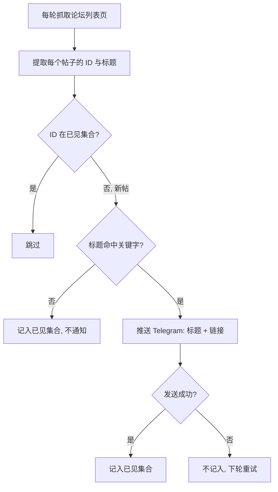
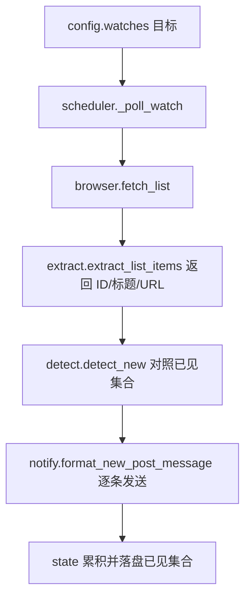

# 论坛关键字新帖监控 - Plan

## Goal Capsule

- **目标**：用户无需手动刷新论坛，HawkEye 自动发现论坛列表页上「标题命中关键字的全新帖子」，并逐条推送 Telegram 通知（标题 + 可点击链接）。
- **手段**：为 HawkEye 新增「列表新条目监控」模式，每轮抓一次论坛列表页、按帖子 ID 对照持久化已见集合去重、只对未见过且标题命中关键字的新帖通知。(KTD1, KTD2, KTD3, KTD4, KTD5, KTD6)
- **权威层级**：产品行为以 R-ID 为准；实现机制以 KTD 为准（在其所引 R 约束内）；实现单元不覆盖二者；AE 与 Flow 只举例与排序，不修订规则。
- **停止条件**：R1–R12 全部满足；`pytest` / `ruff` / `mypy` 三项全绿；既有「元素文本变更监控」测试不回归。
- **执行画像**：`code`；Deep 深度；流水线自动交付。
- **交付尾部**：交付流程由调用方流水线拥有；当前工作目录不是 git 仓库、无 remote，推送 / PR / CI 环节本地化或跳过。

---

## Product Contract

### Summary

给 HawkEye 增加一种新的监控模式：每轮轮询抓取一次论坛列表页，提取当前可见帖子的「ID + 标题」，用帖子 ID 对照持久化的已见集合去重，只对「ID 未见过」的新帖做标题关键字匹配，命中者逐条推送 Telegram 通知。判新只看帖子 ID，与帖子在列表中的位置和排序无关。

### Problem Frame

用户当前靠手动刷新浏览器盯论坛，等标题里含目标关键字（如 `hk`）的新帖出现——费时且容易漏。难点在于论坛首页按「最新回帖时间」排序，老帖被回帖顶到前面会造成「列表顺序变了但没有新帖」的假象，因此不能用「列表位置/顺序变化」判断新帖，只能用帖子自身的唯一标识（帖子 ID）判断「以前是否见过」。

### Key Decisions

- **通用列表监控，不写死具体论坛**——以「列表项 / 标题链接选择器 / 关键字列表」等通用配置表达。(session-settled: user-directed — chosen over 只为 NodeSeek 定制：便于将来复用到其他论坛或列表页) Governs R10.
- **列表页去重、按帖子 ID 判新**——每轮抓一次列表页，用帖子 ID 对照已见集合去重，判新与列表位置/排序无关。(session-settled: user-directed — chosen over 按帖子 ID 递增逐个探测访问：递增探测在 ID 序列存在空洞时会在首个 404 处永久卡住，且每帖一次请求代价高) Governs R1, R2.
- **关键字匹配：子串 + 不区分大小写 + 任一命中**——只针对标题。(session-settled: user-directed — chosen over 精确匹配 / 正则：简单够用) Governs R3.
- **首次静默建基线**——目标首次运行只记录当前可见帖子 ID、一律不推送。(session-settled: user-directed — chosen over 首次即推送当前命中帖：避免上线瞬间刷屏历史帖) Governs R7.
- **每条新帖一条独立通知；新增关键字只对未来新帖生效**——不合并、不回溯历史帖。(session-settled: user-directed — chosen over 合并推送 / 新增关键字回溯已见帖：符合用户明确诉求) Governs R4, R9.

### Requirements

**列表抓取与新帖发现**

- R1. 每轮轮询抓取一次论坛列表页，提取当前列表中每个帖子项的「帖子 ID」与「标题」：帖子 ID 取自帖子链接的 href（如 `post-{id}-{page}` 中的 `{id}`），标题取自链接文本。
- R2. 用帖子 ID 与持久化的「已见 ID 集合」比对去重：只有 ID 不在集合中的帖子才算新帖；判新不依赖帖子在列表中的位置或排序。

**关键字匹配**

- R3. 对新帖标题按可配置的关键字列表做匹配，规则为子串、不区分大小写、任一命中即命中（OR）。

**通知与投递**

- R4. 每个「新帖且标题命中关键字」的帖子推送一条独立的 Telegram 消息，含标题与可点击的帖子链接。
- R5. 命中并需通知的新帖，Telegram 发送成功后才把其 ID 记入已见集合；发送失败则不记入，下轮重试（至少一次交付）。
- R6. 新帖但标题未命中关键字的帖子，直接记入已见集合、不发通知，避免下轮被重复判为新帖。

**基线与状态**

- R7. 某个列表监控目标首次运行时静默建立基线：把当前列表可见的全部帖子 ID 记入已见集合，一律不推送。
- R8. 已见集合持久化落盘，进程重启后不重复推送历史帖子，复用现有状态原子落盘与损坏自愈机制。
- R9. 后续新增关键字只对其后发布（ID 未见过）的新帖生效，不回溯已在基线或已见集合中的历史帖子。

**配置与通用性**

- R10. 该能力以「列表项 / 标题链接选择器 / 关键字列表」等通用配置表达，不写死具体论坛；首个落地实例为 NodeSeek 首页、关键字 `hk`。

**与现有能力共存**

- R11. 新的「列表新条目监控」模式与既有「元素文本变更监控」模式并存，既有模式行为不变。
- R12. 列表抓取失败或列表项提取异常时，走既有两级失败告警路径（连续失败达阈值发一条、边沿触发不刷屏、成功后自动复位）。

### Key Flows

以下流程图描述**稳态**判定逻辑（首次建基线为 F1 的独立分支）：



- F1. 首次建立基线
  - **Trigger:** 某列表监控目标在状态文件中还没有已见集合（新增目标或首次启动）。
  - **Steps:** 抓取列表页 → 提取全部可见帖子 ID → 全部记入已见集合并落盘 → 不发任何通知。
  - **Outcome:** 基线建立；此后只有 ID 未见过的帖子才被视为新帖。
  - **Covers:** R7, R1
- F2. 稳态发现新帖并通知
  - **Trigger:** 已有基线的目标到达轮询周期。
  - **Steps:** 抓取列表页 → 提取每个帖子的 (ID, 标题) → 逐个对照已见集合、跳过已见 ID → 对新帖标题做关键字匹配 → 命中者逐条推送 Telegram（标题 + 链接），发送成功后记入已见集合；未命中的新帖直接记入已见集合。
  - **Outcome:** 每个命中关键字的新帖收到一条独立通知；列表按回帖时间排序不影响结果。
  - **Covers:** R1, R2, R3, R4, R5, R6
- F3. 通知失败下轮重试
  - **Trigger:** 命中新帖的 Telegram 发送失败。
  - **Steps:** 不将该帖 ID 记入已见集合 → 下一轮该帖仍被判为新帖 → 再次尝试发送。
  - **Outcome:** 至少一次交付，不因单次网络失败漏掉通知。
  - **Covers:** R5

### Acceptance Examples

- AE1. 命中关键字的新帖 → 通知
  - **Given:** 已建基线；关键字含 `hk`。
  - **When:** 列表出现一个 ID 未见过、标题含 `HK` 的新帖。
  - **Then:** 推送一条含该标题与其链接的 Telegram 消息，并在发送成功后记录该 ID。
  - **Covers:** R2, R3, R4
- AE2. 回帖顶起的老帖 → 不通知
  - **Given:** 某帖 ID 已在已见集合中。
  - **When:** 它因收到新回帖被顶到列表首位。
  - **Then:** ID 已见 → 不视为新帖 → 不推送。
  - **Covers:** R2
- AE3. 新帖但标题不含关键字 → 不通知但记为已见
  - **Given:** 已建基线；关键字含 `hk`。
  - **When:** 出现 ID 未见过、标题不含任何关键字的新帖。
  - **Then:** 不推送；该 ID 记入已见集合，之后不再被判为新帖。
  - **Covers:** R3, R6
- AE4. 首次运行时已在列表上的命中帖 → 不通知
  - **Given:** 目标首次运行，尚无已见集合。
  - **When:** 当前列表已有标题含 `hk` 的帖子。
  - **Then:** 静默建基线，全部记入已见集合，不推送。
  - **Covers:** R7
- AE5. 后续新增关键字 → 只命中之后的新帖
  - **Given:** 目标已运行、已见集合已包含历史帖 ID。
  - **When:** 新增一个关键字，且该关键字能匹配某个「早已在已见集合中」的历史帖标题。
  - **Then:** 不回溯推送该历史帖；只有此后 ID 未见过且命中的新帖才推送。
  - **Covers:** R9
- AE6. 发送失败 → 下轮重试直至成功
  - **Given:** 一个命中新帖。
  - **When:** 本轮 Telegram 发送失败。
  - **Then:** 不记录其 ID；下一轮仍判为新帖并重试，直到发送成功才记录。
  - **Covers:** R5

### Scope Boundaries

- 不改动既有「元素文本变更监控」模式；两种模式并存。
- 仅做通知，不做任何自动发帖、回帖、点赞或登录操作。
- 不翻页、不回溯历史帖子；只处理当前列表页（首页）可见的帖子项。
- 关键字匹配不做正则、词边界或多语言分词，只做子串 + 不区分大小写。

**Deferred to Follow-Up Work**

- 已见 ID 集合的上限 / 裁剪策略（阶段一保留完整集合，见 KTD2）。
- 列表翻页 / 多页抓取。
- 正则 / 词边界 / 多语言分词关键字匹配。
- 当列表链接文本不足以作标题时，回退到逐帖页面 `<head><title>` 提取（当前按 R1 用列表链接文本作标题）。

### Dependencies / Assumptions

- **复用现有基础设施**：asyncio 每目标轮询调度、Playwright 无头浏览器抓取与渲染、httpx 调 Telegram `sendMessage`、两级失败告警状态机、状态文件原子落盘与损坏自愈。
- **待实现期验证的假设**：NodeSeek 是否对无头浏览器触发 Cloudflare / 人机校验；帖子链接 `post-{id}-{page}` 形态是否稳定、能否可靠从列表页提取到帖子 ID 与标题；列表项链接文本是否等于帖子标题。若被拦截或提取不到，会走既有失败告警路径（R12），不会静默失败。
- **已知局限**：两次轮询之间，若某个新帖被大量涌入的更新帖挤出当前列表页，可能被漏掉；短轮询间隔下风险低。

---

## Planning Contract

### Key Technical Decisions

- KTD1. **配置用新增顶层 `[[watches]]` 块表达列表监控目标**，与既有 `[[merchants]]` 平行，不复用三层 `merchants → pages → elements`。每个 watch 携带 `name` / `url` / `link_selector` / `keywords`（非空列表），可选 `id_pattern`，并沿用全局级联默认（`poll_interval_secs` / `wait_until` / `nav_timeout_secs` / `failure_threshold` / `selector_type`）。`load_config` 的「至少一个 merchant」校验放宽为「`merchants` 与 `watches` 至少一个非空」。理由：列表监控是集合差集范式，与元素「单选择器→单文本值」字段差异大，塞进 `elements` 会污染语义；平行顶层块使既有元素配置零改动。被否：复用 `elements`（语义污染、字段冲突）。Governs R10, R11.
- KTD2. **状态文件同一 `state.json` 内支持两种条目形状**：既有元素条目 `{"value": str, "updated_at": str}` → `StateEntry`；新增已见集合条目 `{"seen_ids": [str, …], "updated_at": str}` → 新 `SeenSetEntry`。`load_state` 按 JSON 键形状分派解析并严格校验（`value` 为 str / `seen_ids` 为 str 列表），损坏走既有备份重建；`save_state` 按条目类型回写对应形状。两类标识命名空间不重叠（元素为「商家 / 页面 / 元素」，watch 为「watch / {name}」），互不干扰。阶段一保留完整已见集合、不裁剪（NodeSeek 首页每轮至多新增数十个 ID，JSON 体积增长可忽略）。理由：单文件复用既有原子落盘与损坏自愈（R8），两种形状向后兼容（R11）。被否：把集合编码为 JSON 字符串塞进 `value`（不透明、破坏可读性）；另开独立状态文件（两文件、更多管线、`config` 只有单个 `state_path`）。Governs R8.
- KTD3. **`detect.py` 新增纯函数 `detect_new`**，镜像既有 `detect()` 的结果 dataclass 风格：`previous_seen is None` → 返回携带当前全部 ID 的「基线」结果（供静默记入）；否则返回 `current_ids` 中不在 `previous_seen` 的新 ID（保持列表顺序、去重）。保持无副作用、可单测。理由：把判新内核与 I/O 隔离，沿用现有 detect 可测试模式。Governs R2, R7.
- KTD4. **列表项用单一「标题链接选择器」表达**：`link_selector` 匹配列表中每个帖子的标题链接 `<a>`；每个 `<a>` 同时给出 href（→ 帖子 ID）与链接文本（→ 标题）。ID 从 href 用可配置正则 `id_pattern`（捕获组 1）提取，缺省取 href path 末段。相对 href 用 `urllib.parse.urljoin(watch.url, href)` 补全为可点击绝对 URL。理由：NodeSeek 场景标题链接本身即可同时提供 ID 与标题，单选择器比「行选择器 + 行内子选择器」两段式更简单；`urljoin` 正确处理绝对 / 根相对 / 协议相对各形态。被否：两段式选择器（NodeSeek 场景多余）；手工字符串拼接 URL（易错）。Governs R1, R4, R10.
- KTD5. **新帖通知为纯文本消息，裸 URL 由 Telegram 客户端自动成链**，不设 `parse_mode`。`format_new_post_message(title, url, when)` 镜像既有 `format_change_message` 的纯文本策略。理由：既有 `Notifier.send` 不带 `parse_mode`，纯文本避免 Markdown/HTML 转义问题；Telegram 对纯文本中的裸 URL 自动识别为可点击链接，满足 R4。Governs R4.
- KTD6. **`Scheduler` 为每个 watch 目标建独立 asyncio 任务**，与既有 per-page 任务并列，复用同一 `_semaphore`（并发限流）、`_state_lock`（状态串行写）、失败状态机（新增 `_watch_failures: dict[str, FailureState]`）与 `notifier`。一轮 watch poll 内：在锁外完成抓取 → 检测 → 逐条发送，累积「本轮确认已见的新 ID」（非命中新帖立即累积；命中新帖发送成功才累积，见 R5、R6），轮末一次性加锁并入已见集合、落盘一次。理由：两种模式共享进程级资源与失败告警语义，不复制调度骨架；轮末单次落盘减少 I/O。Governs R11, R12.

### High-Level Technical Design

各模块改动地图（新增为主，既有元素路径零改动）：

| 模块 | 改动 | 关联 |
|---|---|---|
| `config.py` | 新增 `WatchTarget` dataclass、`_parse_watch`、`Config.watches`；放宽 merchant 必填校验 | KTD1 |
| `state.py` | 新增 `SeenSetEntry`；`load_state`/`save_state` 支持双形状 | KTD2 |
| `detect.py` | 新增 `detect_new` 纯函数与结果类型 | KTD3 |
| `extract.py` | 新增 `extract_list_items`（href→ID、`urljoin` 补全、链接文本→标题） | KTD4 |
| `fetch.py` | `BrowserManager` 新增 `fetch_list`；新增 `ListFetched` 结果类型 | KTD4 |
| `notify.py` | 新增 `format_new_post_message` | KTD5 |
| `scheduler.py` | 新增 `_run_watch`/`_poll_watch`/`_handle_watch`；`run()` 建 watch 任务 | KTD6 |
| `__main__.py` | 启动日志加 watch 数 | KTD6 |

运行期数据流（一轮 watch poll）：



### Sequencing

- 无依赖、可并行：U1（config）、U2（state）、U3（detect）、U6（notify）。
- U4（extract）依赖 U1。
- U5（fetch）依赖 U1、U4。
- U7（scheduler）依赖 U1–U6。
- U8（装配与文档）依赖 U1、U7。

### System-Wide Impact

- **状态 schema 演进**：`state.json` 新增条目形状，向后兼容，既有元素条目不变（KTD2）。
- **共享进程级资源**：新模式与既有元素监控共用 Chromium、`_semaphore`、`_state_lock`、失败告警状态机与 `notifier`；watch 目标增多会与元素页面共同受 `max_concurrent_fetches` 限流（KTD6）。

---

## Implementation Units

### U1. config.py 新增列表监控目标配置

- **Goal**：让 `config.toml` 能声明列表监控目标，解析为强类型 `WatchTarget`，并与既有 merchant 配置共存。
- **Requirements**：R10、R11。
- **Dependencies**：无。
- **Files**：`src/hawkeye/config.py`、`tests/test_config.py`。
- **Approach**：
  1. 新增 frozen dataclass `WatchTarget`（`name` / `url` / `link_selector` / `selector_type` / `keywords` / `id_pattern` / `poll_interval_secs` / `wait_until` / `nav_timeout_secs` / `failure_threshold`），提供 `.identity`（如 `watch / {name}`）与 `.effective_selector_type`，与 `MonitoredElement` 风格一致。
  2. 新增 `_parse_watch`，复用现有校验辅助（`_require_str` / `_validate_url` / `_check_enum` / `_override_defaults`）；`keywords` 必须为非空字符串列表，`id_pattern` 可选（给出时校验为合法正则）。
  3. `Config` 增加 `watches: tuple[WatchTarget, ...]` 字段。
  4. `load_config` 解析 `raw.get("watches")`；把「至少一个 merchant」校验放宽为「`merchants` 与 `watches` 至少一个非空」（KTD1）。
- **Technical design**（directional，非实现规格）：

  ```toml
  [[watches]]
  name = "NodeSeek 首页"
  url = "https://www.nodeseek.com/"
  link_selector = '//*[@id="nsk-body-left"]/ul/li/div/div[1]/a'
  keywords = ["hk"]
  id_pattern = 'post-(\d+)-'   # 可选；缺省取 href path 末段
  ```

- **Patterns to follow**：既有 `MonitoredElement` / `Page` dataclass 与 `_parse_element` / `_parse_page` 的校验风格；`detect_selector_type` 的 auto 判定。
- **Test scenarios**：
  - 合法 `[[watches]]` 解析出 `WatchTarget`，字段与级联默认正确。
  - 缺 `url` / `link_selector` / `keywords` 各自抛 `ConfigError`。
  - `keywords` 为空列表抛 `ConfigError`。
  - `id_pattern` 为非法正则抛 `ConfigError`；缺省时为 `None`。
  - 只配置 `[[watches]]`、无 `[[merchants]]` 时加载成功。
  - `merchants` 与 `watches` 都为空时抛 `ConfigError`。
  - 既有 merchant-only 配置解析行为不变（回归）。
- **Verification**：新增与既有 config 测试全绿；`mypy` 对新 dataclass 无类型错误。

### U2. state.py 支持已见集合条目

- **Goal**：让状态文件在既有元素条目之外持久化「已见 ID 集合」，复用原子落盘与损坏自愈。
- **Requirements**：R8、R11。
- **Dependencies**：无。
- **Files**：`src/hawkeye/state.py`、`tests/test_state.py`。
- **Approach**：
  1. 新增 frozen dataclass `SeenSetEntry`（`seen_ids: tuple[str, ...]` 或 `list[str]`、`updated_at: str`）。
  2. `load_state` 返回类型放宽为 `dict[str, StateEntry | SeenSetEntry]`；按条目是否含 `value` / `seen_ids` 分派解析，严格校验类型（`seen_ids` 必须为字符串列表），任一条目形状非法视为损坏 → 走既有 `.corrupt.<ts>` 备份 + 返回 `{}`。
  3. `save_state` 按条目实际类型序列化回对应 JSON 形状。
- **Patterns to follow**：既有 `StateEntry`、`load_state` 的严格校验与损坏备份逻辑、`save_state` 的 tmp + `os.replace` 原子写。
- **Test scenarios**：
  - `SeenSetEntry` 写入后 `load_state` 往返一致。
  - 同一文件混合元素条目与集合条目，load/save 均正确保留两类。
  - 集合条目 `seen_ids` 含非字符串元素 → 视为损坏、备份并重建为 `{}`。
  - 既有纯元素条目文件 load/save 行为不变（回归）。
  - 空 / 不存在文件返回 `{}`。
- **Verification**：新增与既有 state 测试全绿；`mypy` 对 union 返回类型无错误。

### U3. detect.py 新增新帖判定纯函数

- **Goal**：提供「对照已见集合算出新帖 ID」的纯函数内核，含首次基线分支。
- **Requirements**：R2、R7。
- **Dependencies**：无。
- **Files**：`src/hawkeye/detect.py`、`tests/test_detect.py`。
- **Approach**：新增结果 dataclass（基线结果携带全部 ID，稳态结果携带新 ID 列表）与 `detect_new(previous_seen, current_ids)`；`previous_seen is None` → 基线；否则返回不在集合中的 ID，保持顺序并去重。
- **Patterns to follow**：既有 `Baseline` / `Unchanged` / `Changed` dataclass 与 `detect` 的分支返回风格。
- **Test scenarios**：
  - Covers R7. `previous_seen is None` → 返回携带全部当前 ID 的基线结果。
  - Covers R2. 全部 ID 已见 → 新 ID 为空。
  - Covers R2. 部分 ID 未见 → 只返回未见 ID，且保持输入顺序。
  - `current_ids` 内有重复 ID → 结果去重。
  - `current_ids` 为空 → 新 ID 为空（非基线分支）。
- **Verification**：`test_detect.py` 全绿；函数无副作用（不触碰 I/O）。

### U4. extract.py 新增列表项提取

- **Goal**：从已加载的列表页 DOM 提取每个帖子的 (ID, 标题, 绝对 URL)。
- **Requirements**：R1、R4、R10。
- **Dependencies**：U1。
- **Files**：`src/hawkeye/extract.py`、`tests/test_extract.py`、`tests/fixtures/`（新增 NodeSeek 列表样例 HTML）。
- **Approach**：
  1. 新增 `extract_list_items(page, watch, timeout_ms)`，用 `watch.link_selector` 定位全部标题链接 `<a>`。
  2. 逐个 `<a>` 读 href 与文本：href 经 `id_pattern`（缺省取 path 末段）提取帖子 ID；文本经 `normalize_text` 折叠空白作标题；href 经 `urllib.parse.urljoin(watch.url, href)` 补全绝对 URL（KTD4）。
  3. 无匹配项时返回空结果（交由 fetch/scheduler 归入失败路径，R12）。
- **Patterns to follow**：既有 `_playwright_selector`（xpath= 前缀）、`normalize_text`、`extract_text` 的 locator 使用方式。
- **Test scenarios**：
  - Covers R1. 从样例 HTML 提取出多个 (ID, 标题, URL)，数量与内容正确。
  - Covers R4. 相对 href（如 `/post-911200-1`）补全为绝对 URL（`https://www.nodeseek.com/post-911200-1`）。
  - `id_pattern` = `post-(\d+)-` 时从 href 提取出 `911200`。
  - 缺省 `id_pattern` 时按 href path 末段取 ID。
  - 标题链接文本含多余空白 → 折叠归一。
  - `link_selector` 无匹配 → 返回空结果。
- **Verification**：`test_extract.py` 全绿（需已安装 chromium）。

### U5. fetch.py 新增列表页抓取

- **Goal**：一次导航加载列表页并返回提取到的列表项，页面级失败与既有 `fetch_page` 一致处理。
- **Requirements**：R1、R12。
- **Dependencies**：U1、U4。
- **Files**：`src/hawkeye/fetch.py`、`tests/test_fetch.py`。
- **Approach**：
  1. 新增结果类型 `ListFetched(items)`；页面级失败复用既有 `PageLoadError`。
  2. `BrowserManager` 新增 `fetch_list(watch)`：镜像 `fetch_page` 的 context 创建、UA / viewport、导航瞬时错误重试（`_TRANSIENT_NAV_ERRORS` + `_NAV_RETRY_BACKOFF_SECS`）、`finally` 关闭 context；导航成功后调 `extract_list_items` 返回 `ListFetched`。
- **Patterns to follow**：`fetch_page` 的重试、上下文清理与异常吞吐（捕获 `Exception` 而非 `BaseException`）。
- **Test scenarios**：
  - Covers R1. 导航成功 → 返回 `ListFetched`，携带提取到的列表项。
  - Covers R12. 导航失败 → 返回 `PageLoadError(reason=…)`。
  - 瞬时 `net::ERR_*` → 重试后成功。
  - 关停竞态下 context 关闭异常被吞掉、不覆盖正常返回。
- **Verification**：`test_fetch.py` 全绿（需已安装 chromium）。

### U6. notify.py 新增新帖消息格式

- **Goal**：提供新帖通知的纯文本消息格式（标题 + 可点击链接 + 时间）。
- **Requirements**：R4。
- **Dependencies**：无。
- **Files**：`src/hawkeye/notify.py`、`tests/test_notify.py`。
- **Approach**：新增 `format_new_post_message(title, url, when)`，纯文本、无 `parse_mode`，裸 URL 自动成链（KTD5），风格与 `format_change_message` / `format_failure_message` 一致（如 `【新帖】{title}\n{url}\n时间：{when}`）。
- **Patterns to follow**：既有 `format_change_message`。
- **Test scenarios**：
  - Covers R4. 输出含标题、URL、时间三部分。
  - URL 原样保留、不做转义（保证客户端可成链）。
- **Verification**：`test_notify.py` 全绿。

### U7. scheduler.py 新增列表监控循环

- **Goal**：为每个 watch 目标跑并行轮询循环，编排抓取→判新→关键字匹配→通知→状态更新，含首次静默建基线与失败告警。
- **Requirements**：R2、R3、R4、R5、R6、R7、R8、R9、R11、R12。
- **Dependencies**：U1、U2、U3、U4、U5、U6。
- **Files**：`src/hawkeye/scheduler.py`、`tests/test_scheduler.py`。
- **Approach**：
  1. `__init__` 新增 `_watch_failures: dict[str, FailureState]`；`run()` 除既有 per-page 任务外，为每个 `config.watches` 目标建 `_run_watch` 任务。
  2. `_run_watch` 镜像 `_run_page` 的循环 + 可打断间隔等待；`_poll_watch` 受 `_semaphore` 限流后调 `browser.fetch_list`，`PageLoadError` → 走两级失败告警（复用 `_send_failure_alert`、R12），`ListFetched` → `record_success` + `_handle_watch`。
  3. `_handle_watch`：取该 watch 已见集合（`SeenSetEntry.seen_ids` 或 `None`）→ `detect_new`；基线结果 → 全部 ID 记入、落盘、不通知（R7）；稳态 → 逐个新帖：标题按 `keywords` 子串 + 不区分大小写 + 任一命中匹配（R3），命中则 `format_new_post_message` 发送、成功才累积记入（R5），未命中直接累积记入（R6）；轮末一次性加锁并入已见集合并落盘。
  4. 关键字匹配用 `any(kw.lower() in title.lower() for kw in watch.keywords)`。
- **Patterns to follow**：`_run_page` / `_poll_page` / `_handle_element` / `_handle_value` 的结构；`_store` / `_flush_state` 的加锁落盘；「发送成功才更新状态」的至少一次交付语义。
- **Test scenarios**：
  - Covers AE4 / R7. 首次运行 → 全部可见 ID 记入已见集合、不发任何通知。
  - Covers AE1. 已建基线后出现命中新帖 → 发一条含标题+链接的通知，成功后记入 ID。
  - Covers AE2 / R2. 已见 ID 的帖被顶到列表首位 → 不判为新帖、不通知。
  - Covers AE3 / R6. 新帖标题未命中 → 不通知，但 ID 记入已见集合，下轮不再判新。
  - Covers AE6 / R5. 命中新帖发送失败 → 不记入 ID；下轮仍判为新帖并重试。
  - Covers AE5 / R9. 已见集合已含历史帖 ID 时新增关键字 → 不回溯推送历史帖（历史 ID 不再判新）。
  - Covers R12. `fetch_list` 返回 `PageLoadError` → 连续达阈值发一条失败告警、边沿触发不刷屏、成功后复位。
  - 一轮出现多个命中新帖 → 各发一条独立通知（R4），已见集合一次性落盘。
  - Covers R11. 既有元素页面轮询与 watch 轮询并存，元素路径行为不变（回归）。
- **Verification**：`test_scheduler.py` 全绿，覆盖上述 AE 映射场景；既有元素调度测试不回归。

### U8. 装配与文档

- **Goal**：把新模式接入启动装配并对外说明配置方式。
- **Requirements**：R10、R11。
- **Dependencies**：U1、U7。
- **Files**：`src/hawkeye/__main__.py`、`README.md`、`config.example.toml`。
- **Approach**：
  1. `__main__._run` 的启动日志加入 watch 目标数（现打印商家 / 页面 / 元素数）。
  2. `README.md` 增补「列表新条目监控」模式说明与 `[[watches]]` 字段。
  3. `config.example.toml` 增补 `[[watches]]` 示例（NodeSeek 首页、关键字 `hk`），并注明不提交真实凭据。
- **Patterns to follow**：既有 README 配置章节与 `config.example.toml` 注释风格。
- **Test scenarios**：Test expectation: none —— 装配日志与文档改动无独立行为；正确性由 U1/U7 测试与 `pytest` 全绿间接覆盖。
- **Verification**：`python -m hawkeye -c config.toml` 启动日志正确显示 watch 数；README 与示例配置可据以配出可运行的 NodeSeek watch。

---

## Verification Contract

| 命令 | 适用 | 通过信号 |
|---|---|---|
| `pytest` | 全部单元（`test_extract` / `test_fetch` 需已安装 chromium） | 全绿；覆盖 U1–U7 的 test scenarios 与 AE1–AE6 |
| `ruff check . && ruff format --check .` | 全部改动文件 | 无 lint / 格式问题（line-length 100，E/F/I/UP/B） |
| `mypy src/hawkeye` | 全部改动模块 | strict 模式无类型错误（含 `StateEntry \| SeenSetEntry` union、新 dataclass） |

---

## Definition of Done

**全局**

- R1–R12 全部满足，AE1–AE6 有对应通过测试。
- `pytest` / `ruff check . && ruff format --check .` / `mypy src/hawkeye` 三项全绿。
- 既有「元素文本变更监控」的 config / state / detect / scheduler / fetch / extract / notify 测试不回归。
- 新增代码与注释、docstring 用中文，风格与既有模块一致。
- 无遗留的试探性或死代码（未采用的中间实现全部移除）。
- 不提交、不打印 `config.toml` 中的真实 Telegram 凭据；`config.example.toml` 仅含占位示例。

**每单元**

- 各实现单元达成其 `Verification` 所述结果，方可视为完成。
