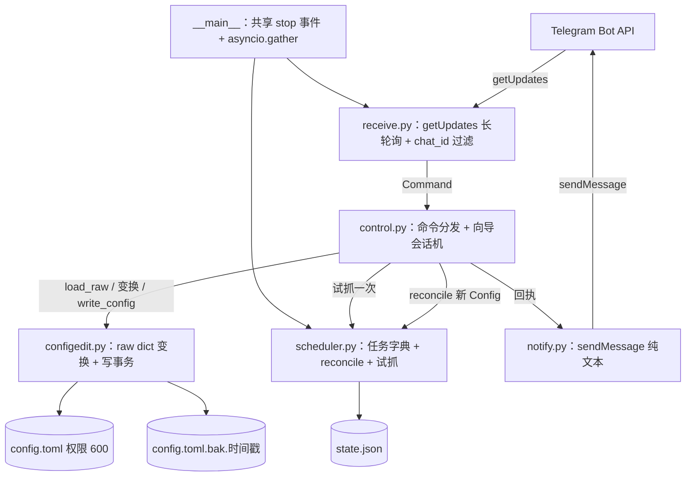
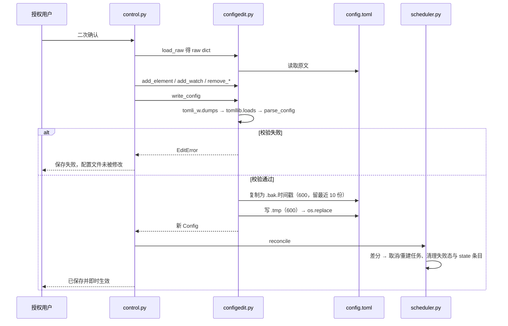

# Telegram 控制命令 - Plan

## Goal Capsule

- **Objective:** 让 HawkEye 的授权使用者仅通过 Telegram 聊天即可完成监控项的新增、查看与删除,改动即时生效且不中断其他监控,无需登录服务器、手工编辑配置或重启进程。
- **Product authority:** 本次 ce-brainstorm 对话定案产品行为与边界;`config.toml` 是监控项的唯一真相来源。实现方式(命令接收机制、TOML 写入方式、调度器运行时改造)由 ce-plan 决定。
- **Open blockers:** 无。产品决策与 HOW 技术决策均已定案（见 Planning Contract KTD6–KTD16）；唯一待补的是需要 Debian / Ubuntu VPS 与真实 bot 的手工端到端验证（本机为 macOS，与 `deploy.sh` 的验证受同一限制）。

---

## Product Contract

### Summary

为运行中的 HawkEye 守护进程增加一个 Telegram 命令接口。授权用户通过引导式聊天创建元素变更监控或论坛关键词监控、列出全部监控、删除监控。所有增删直接写回 `config.toml`(单一真相来源),并即时协调进运行中的守护进程,无需重启。

### Problem Frame

目前新增或删除一个监控,必须登录 VPS、手工编辑 `config.toml`、再重启 systemd 服务才能生效。三重门槛都有代价:手输长 XPath / URL 易错,编辑明文密钥文件有风险,重启带来监控中断窗口。日常「加一个盯、撤一个盯」是高频操作,却被绑死在低频的运维流程上。

### Key Decisions

- KTD1. **引导式分步交互。** bot 逐项追问缺失字段,删除时列出带编号的监控、用户回编号 (session-settled: user-approved — chosen over 单行命令/混合式: 手机上填长 XPath/URL 更省事、不易出错)。Governs R3, R4, R8。
- KTD2. **聊天管理全部监控,含 `config.toml` 手写项。** (session-settled: user-directed — chosen over 只列全部/只删聊天创建项: 要对所有监控有完全控制)。Governs R7, R8。
- KTD3. **增删直接读写 `config.toml`,不引入独立存储。** (session-settled: user-directed — chosen over 保留原文+停用覆盖层: 取所见即所得,接受注释/排版可能不保留)。Governs R10, R11。
- KTD4. **改动立即生效、不中断。** (session-settled: user-approved — chosen over 自我重启/手动重启: 零中断的即时遥控手感)。Governs R12, R13。
- KTD5. **聊天创建的元素监控按页面 URL 判重合并。** (session-settled: user-directed — chosen over 每次新建独立目标: URL 已存在则并入该页面、共享一次页面加载,避免重复加载与被封风险)。Governs R6。

### Requirements

**接入与授权**

- R1. 守护进程在现有「发送通知」之外新增「接收命令」能力,从 Telegram 接收用户指令。
- R2. 仅接受来自 `config.toml` 中已配置的那个 `chat_id` 的消息;任何其他来源的消息一律忽略,不作任何响应。
- R3. 提供入口 / 帮助指令,列出支持的操作(创建、列出、删除)及其用法。

**创建监控**

- R4. 用户可通过引导式对话创建一个元素变更监控:bot 逐项索取必填字段(页面 URL、选择器、监控项名称),仅在缺失时追问;可选字段(如 `selector_type`、`nth`)缺省沿用全局默认。
- R5. 用户可通过引导式对话创建一个论坛关键词监控(watch):bot 逐项索取必填字段(列表页 URL、`link_selector`、关键词列表),可选字段(如 `id_pattern`)缺省沿用默认。
- R6. 创建元素监控时按页面 URL 判重合并:若 `config.toml` 中已存在相同 URL 的页面,新元素并入该页面并与其共享同一次页面加载;URL 不存在时才新建页面。不产生重复的独立目标。
- R7. 保存前先做一次试抓校验并回显结果:元素监控回显命中的文本;关键词监控回显「找到 N 条链接,其中 M 条命中关键词」。校验失败时让用户在「仍然保存」与「取消」之间选择。

**查看与删除**

- R8. 用户可列出当前全部监控(含 `config.toml` 手写项与聊天创建项),每项带编号,显示类型(元素 / 关键词)、名称与 URL,并附一个当前状态指示(元素显示最近记录值,关键词显示已见帖子数)。
- R9. 用户可删除某个监控:bot 展示带编号的监控列表,用户回复编号选定,删除前需二次确认。
- R10. 删除会把对应条目从 `config.toml` 中移除;若删除的是某页面下最后一个元素,随之变空的页面(以及随之变空的商家)一并移除,不留空壳。

**配置写入与生效**

- R11. 所有增删都直接改写 `config.toml`。改写会重写整个文件,可能不保留原有注释、排版与字段顺序;改写前先写一份带时间戳的备份。
- R12. 改写必须完整保留 `[telegram]` 凭据块及全局默认等本次未涉及的配置项,并保持文件权限为 600、不放宽。
- R13. 改动即时对运行中的守护进程生效:新建的监控无需重启即开始轮询,被删除的监控即时停止轮询,且不影响其他正在运行的监控。
- R14. 列表输出始终反映守护进程运行中的真实监控集合,与 `config.toml` 当前内容一致。

### Key Flows

- F1. 创建元素监控
  - **Trigger:** 授权用户在聊天中发起「新建元素监控」。
  - **Steps:** bot 依次索取页面 URL、选择器、名称 → 试抓一次并回显命中文本 → 按 URL 判重:命中已有页面则并入、否则新建页面 → 二次确认后改写 `config.toml`(先备份)→ 通知守护进程加入该监控。
  - **Outcome:** 新监控出现在列表中并在无需重启的情况下开始轮询。
  - **Covers:** R4, R6, R7, R11, R13。
- F2. 创建关键词监控
  - **Trigger:** 授权用户在聊天中发起「新建关键词监控」。
  - **Steps:** 结构同 F1,但索取列表页 URL、`link_selector`、关键词列表,且不做 URL 判重合并(watch 为顶层平行目标);试抓回显「找到 N 条链接、M 条命中」。
  - **Outcome:** 新 watch 加入运行集合,首轮静默建基线。
  - **Covers:** R5, R7, R11, R13。
- F3. 删除监控
  - **Trigger:** 授权用户在聊天中发起「删除监控」。
  - **Steps:** bot 列出带编号的全部监控 → 用户回编号 → 二次确认 → 改写 `config.toml` 移除条目(先备份,清理空页面 / 空商家)→ 通知守护进程停止该监控。
  - **Outcome:** 该监控即时停止轮询,并从列表中消失。
  - **Covers:** R8, R9, R10, R11, R13, R14。

### Acceptance Examples

- AE1. **Covers R6.** Given `config.toml` 已有一个 URL 为 `X` 的页面,When 用户在聊天里为 URL `X` 新建元素监控,Then 新元素并入该页面、与既有元素共享同一次页面加载,不新建独立目标。
- AE2. **Covers R6.** Given 没有 URL 为 `Y` 的页面,When 用户为 URL `Y` 新建元素监控,Then 新建一个页面来承载该元素。
- AE3. **Covers R7.** Given 试抓时选择器未命中,When 用户提交创建,Then bot 报告未命中并让用户选择「仍然保存」或「取消」。
- AE4. **Covers R10.** Given 某页面下仅剩一个元素,When 用户删除该元素,Then 该空页面(及随之变空的商家)一并从 `config.toml` 移除。
- AE5. **Covers R2.** Given 一条来自非配置 `chat_id` 的命令消息,When 守护进程收到它,Then 不响应、不执行、不回复。
- AE6. **Covers R13, R14.** Given 一个正在轮询的监控,When 用户删除它,Then 它即时停止轮询且不再出现在后续列表中,而其他监控不受影响。

### Scope Boundaries

**Deferred for later(以后可能做,非本次)**

- 通过聊天编辑已有监控的字段(本次要改字段需删掉重建)。
- 暂停 / 恢复监控。

**Outside this feature's scope(本次明确不做)**

- 通过聊天修改全局默认(如 `poll_interval_secs`)或 `[telegram]` 凭据。
- 多个授权用户 / 多个 `chat_id`。
- 基于 webhook 的命令接收(接收机制的具体取舍留给 ce-plan,但本需求不承诺 webhook)。

### Outstanding Questions

**Deferred to Planning(由 ce-plan 在实现阶段决定的 HOW)** —— 五条均已在 Planning Contract 定案，括号内为落点：

- 命令接收机制:`getUpdates` 长轮询 vs webhook。(→ KTD6)
- TOML 写入方式:用保留注释的写库还是普通序列化(直接影响 KTD3 「注释可能不保留」的实际表现)。(→ KTD7)
- 调度器运行时动态新增 / 取消监控循环的具体改造(现为启动时一次性建任务)。(→ KTD11)
- `config.toml` 改写与守护进程内存态之间的并发与一致性:备份、原子替换、写入失败回滚、以及改写后守护进程如何感知并重载。(→ KTD8、KTD9、KTD10、KTD12)
- 聊天创建元素监控时的自动命名规则,以及新建页面归属到哪个 merchant。(→ KTD15)

### Success Criteria

- 授权用户能在不登录服务器、不重启进程的前提下,完成一次「新增监控 → 生效 → 删除」的闭环。
- 非授权来源的任何命令都无副作用。
- 每次改写后的 `config.toml` 仍能被守护进程正常加载(结构合法、`[telegram]` 与全局默认完好、权限 600)。

### Sources / Research

- `src/hawkeye/scheduler.py`(`run()` 约第 69–84 行):启动时为每个页面 / watch 一次性创建 asyncio 任务后即 `await self._stop.wait()`,无运行时增删任务能力 —— R13 要求的即时生效需在此改造。
- `src/hawkeye/notify.py`:`Notifier` 目前仅发送(`sendMessage` / `verify`),无接收能力 —— R1 的命令接收为新增面。
- `src/hawkeye/config.py` 与 `src/hawkeye/__main__.py`:配置为不可变 frozen dataclass,经 `tomllib` 只读加载,进程启动仅加载一次;标准库 `tomllib` 不能写 TOML —— 关系到 KTD3 / R11 的写入实现。
- `config.example.toml`:三层结构 `[[merchants]]` → `[[merchants.pages]]` → `[[merchants.pages.elements]]`、顶层 `[[watches]]`、`[telegram]` 块;注释丰富,是 R11「整份重写可能丢注释」的直接来源。
- `src/hawkeye/state.py`:`state.json` 原子写(`os.replace`);监控标识改名等价于新目标、静默重建基线 —— 删除 / 重命名监控时与状态的关系需留意。

---

## Planning Contract

> Product Contract 未改动：R1–R14、KTD1–KTD5、F1–F3、AE1–AE6 的措辞与编号原样保留；仅在 Outstanding Questions 的五条上追加了 `→ KTDn` 落点指针。本节起为 ce-plan 追加的 HOW。

### Key Technical Decisions

- KTD6. **命令接收用 `getUpdates` 长轮询，不用 webhook。** webhook 需要公网 HTTPS 入站端点、开放端口与证书，而 systemd 服务以非特权 `nologin` 用户运行、绑不了 443，`deploy.sh` 也没有提供反向代理；`getUpdates` 只需出站 HTTPS，正是 `notify.py` 现在做的事，可直接复用同一个 `httpx.AsyncClient`。Governs R1。
- KTD7. **TOML 写入用新依赖 `tomli-w`，不用 `tomlkit`。** 标准库 `tomllib` 只读，二者都得新装。KTD3 / R11 已经接受「注释与排版可能不保留 + 写前带时间戳备份」，所以不需要 `tomlkit` 的保注释能力；而 `tomlkit` 对 `[[merchants.pages.elements]]` 这种嵌套表数组的原地增删相当啰嗦，`tomli-w` 体积小、在 `mypy strict` 下类型干净。Governs R11。
- KTD8. **写路径改的是原始 TOML dict，绝不序列化已解析的 `Config`。** `Config` 是**已级联展开**的形态（`poll_interval_secs` 等默认值已经逐层落到每个页面 / 元素上），把它回写会把显式值盖满全文、破坏级联语义，并直接违反 R12「完整保留本次未涉及的配置项」。因此写路径固定为「`tomllib.loads` 得 raw dict → 在 raw dict 上做最小改动 → 写回」。Governs R11、R12。
- KTD9. **写事务是「先验证、后替换」（validate-then-swap）。** 顺序固定：改 raw dict → `tomli_w.dumps` → `tomllib.loads` → `parse_config`（一次同时验证「序列化结果可解析」与「语义合法」）→ 复制出带时间戳备份 → 写 `.tmp` 并 `chmod 600` → `os.replace` 覆盖 → 才 reconcile。任一步失败都在触碰原文件之前，原 `config.toml` 字节不变，无需回滚逻辑。手法与 `state.py` 的原子落盘一致。Governs R11、R12。
- KTD10. **备份是敏感文件，保留数上限 10。** 备份是 `config.toml` 的完整副本，**同样含明文 `bot_token`**，因此创建后立即 `chmod 600`，并按 mtime 只保留最近 10 份，避免一个高频操作的目录里堆满明文密钥副本。Governs R12。
- KTD11. **调度器改为 identity 键控的任务字典 + 结构相等差分。** `run()` 里的局部 `tasks` 列表升为实例字段 `self._tasks: dict[str, asyncio.Task]`（键 `page:<identity>` / `watch:<identity>`）。reconcile 时与新 `Config` 求差：新增键 → 建任务；消失键 → 取消任务；**键相同但对象 `!=`** → 取消并按新对象重建。所有配置 dataclass 都是 `frozen=True`，天然有结构相等，所以「页面 URL 没变但其 `elements` 元组变了」会自动判为需要重建，不需要手写字段比较。Governs R13。
- KTD12. **每条命令的第一步都是 `sync()`。** 读文件 → `parse_config` → 与运行中的 `Config` 不等则先 reconcile，然后才执行命令本体。这让手工编辑过的 `config.toml` 在下一条命令时被自然吸收，R14 的「列表始终与文件一致」不靠额外的文件监听（inotify / mtime 轮询）达成。若文件当前不可解析，则照常返回运行中的集合并附一条警告，不让一次手写笔误堵死所有命令。Governs R14。
- KTD13. **放宽 `load_config` 的「至少一个监控」校验。** 现在 `parse_config` 会在既无 `[[merchants]]` 又无 `[[watches]]` 时抛 `ConfigError`，这会让「删掉最后一个监控」必然失败。删掉该校验，改由 `__main__` 在启动时打一条 warning。`[telegram]` 的校验不放宽。Governs R10。
- KTD14. **删除监控时一并清掉 `state.json` 里的对应条目。** 否则删掉再重建同名监控会拿到旧的记录值 / 已见集合，可能立刻误报一次「变更」。清掉之后重建等价于新目标、静默重建基线，与 `state.py` 现有的「改名即新目标」语义一致。Governs R10。
- KTD15. **bot 创建的条目不写 `name`，新页面挂到以 URL host 命名的 merchant 下。** 现有 `_parse_page` 把页面的 `name` 缺省为 `url`，`_parse_watch` 把 watch 的 `name` 也缺省为 `url` —— 所以「自动命名规则」不需要发明：省略 `name` 即可得到 URL 作为标识。新建页面需要一个宿主商家，取 URL 的 host 作商家名，同 host 已存在则复用，不重复建商家。R6 的 URL 判重跨全部商家搜索。Governs R4、R5、R6。
- KTD16. **命令面固定为 `/help`、`/add`、`/list`、`/del`、`/cancel`；向导会话只存内存；启动先丢弃积压。** 向导进行中的数字回复算向导输入，与 `/del` 选编号共用同一套「回数字」的手感（KTD1）。会话态不落盘，进程重启即作废，避免半截向导跨重启复活。启动时先用 `offset=-1` 把 `getUpdates` 的积压推进掉，否则停机期间发的 `/del` 会在重启后被重放执行。Governs R2、R3、R9。

### High-Level Technical Design

**三个新模块，四个改动模块。** 新增 `configedit.py`（配置写事务）、`receive.py`（Telegram 接收）、`control.py`（命令与向导）；改动 `config.py`（拆出可复用的解析入口、放宽零监控校验）、`scheduler.py`（任务字典 + reconcile + 试抓）、`__main__.py`（两条循环并存）、`pyproject.toml`（加 `tomli-w`）。`notify.py` 与 `state.py` 的公开接口不变。

`notify.py` 现有的 `install_token_redaction(token)` 在 `__main__` 里于任何 HTTP 调用之前装好，作用于 httpx 的全局日志过滤器，因此 `receive.py` 的 `getUpdates` 请求 URL 里的 token 自动被脱敏为 `<REDACTED>`，无需在接收侧另做处理。

**写事务的时序**（KTD9，`/add` 与 `/del` 的保存段共用同一条路径，全程在 `Controller` 的单个 `asyncio.Lock` 内）：

**唯一写入口。** 任何对 `config.toml` 的改动都必须经 `configedit.write_config`；`control.py` 不自己拼 TOML、不自己 `os.replace`。这是 R11 / R12 三条约束（备份、结构合法、权限 600）能被一处测穿的前提。

**试抓必须借道调度器的信号量。** `BrowserManager.fetch_page` 自身不取信号量（现在由 `Scheduler._poll_page` 代持），所以 R7 的试抓若直连 `BrowserManager` 就会突破 `max_concurrent_fetches`。因此试抓入口开在 `Scheduler` 上（`trial_fetch_page` / `trial_fetch_list`），在其 `async with self._semaphore:` 内调用。

**取消任务是安全的。** `save_state` 是同步调用，`_state_lock` 的临界区内不含 `await`，所以在任意 await 点取消一个轮询任务都不会留下写了一半的 `state.json`。

### Assumptions

以下是 ce-plan 推断的范围判断，不是用户明确指示；若有一条不对，改动面都局限在单个实现单元内。

- A1. **单进程单实例。** 同一台机上不会有第二个 HawkEye 同时写同一份 `config.toml`，因此并发只靠「进程内单个 `asyncio.Lock` + `os.replace` 原子替换」，不引入文件锁。
- A2. **手工编辑窗口很短。** R14 靠命令前置 `sync()`（KTD12）达成，不做 inotify / mtime 轮询监听。极端情形（用户编辑完但从不发命令）下运行态会短暂落后于文件，这是接受的。
- A3. **同一时刻最多一个进行中的向导。** 收到新的顶层命令时自动放弃旧向导并提示「已取消上一个未完成的操作」，而不是拒绝新命令 —— 手机上被半截向导卡住比丢掉一次输入更烦。`/cancel` 是显式退出。
- A4. **试抓走调度器的并发预算。** 试抓与正常轮询共用同一个 `max_concurrent_fetches` 名额；忙时试抓会排队等待，回执因此可能慢几秒。
- A5. **备份与配置同目录。** 命名 `config.toml.bak.YYYYMMDD-HHMMSS`，权限 600，按 mtime 保留最近 10 份。不引入单独的备份目录或保留期配置项。
- A6. **回执是纯文本。** 沿用 `notify.py` 现在不带 `parse_mode` 的发送方式，列表用纯文本编号，不引入 Markdown 转义面。超过 Telegram 的 4096 字符上限时分段发送。
- A7. **类型选择用数字。** `/add` 之后回 `1` = 网页元素变更监控、`2` = 论坛关键词监控，与 `/del` 选编号同一套输入习惯（KTD1）。

### Sequencing

U1 与 U4 无依赖，可并行起步。U2、U3 依赖 U1；U5 依赖 U2 / U3 / U4；U6 依赖 U3 / U5；U7 收尾。

| 单元 | 主题 | 依赖 |
|---|---|---|
| U1 | 配置读写基座 | — |
| U2 | 配置写事务与 raw dict 变换 | U1 |
| U3 | 调度器运行时协调与试抓 | U1 |
| U4 | Telegram 命令接收 | — |
| U5 | 命令分发与引导式向导 | U2、U3、U4 |
| U6 | 进程组装：两条循环并存 | U3、U5 |
| U7 | 文档 | U5、U6 |

U1–U4 都可以在没有 U5 的情况下独立测穿（U2 / U3 是纯逻辑 + 假 browser，U4 是假 transport），所以真正的集成风险只集中在 U5 与 U6。

---

## Implementation Units

### U1. 配置读写基座

- **Goal:** 让配置既能从文件读、也能从内存中的 raw dict 解析校验，并允许「零监控」的守护进程存在。
- **Requirements:** R10、R11、R12
- **Dependencies:** 无
- **Files:** `src/hawkeye/config.py`（改）、`pyproject.toml`（改）、`tests/test_config.py`（改）
- **Approach:**
  - 从 `load_config` 抽出 `parse_config(raw: dict[str, Any]) -> Config`：现有函数体中「读文件」之后的全部逻辑（`_parse_globals` / `_parse_merchants` / `_parse_watches` / 标识去重校验）原样移入，错误消息与异常类型逐字不变。
  - 新增 `load_raw(path) -> dict[str, Any]`：承担文件读取与 `FileNotFoundError` / `TOMLDecodeError` → `ConfigError` 的包装，返回未解析的 raw dict 供写路径使用（KTD8）。`load_config` 收缩为 `parse_config(load_raw(path))`，公开签名与行为不变。
  - 删去 `if not merchants and not watches: raise ConfigError("至少需要配置一个 ...")`（KTD13）。提示改由 U6 在 `__main__` 里以 warning 形式给出。`[telegram]` 相关校验一律不放宽。
  - `pyproject.toml` 的 `dependencies` 增 `tomli-w>=1.0`（KTD7）。`deploy.sh` 的 `setup_venv` 走 `pip install "$INSTALL_DIR"`，新依赖随部署自动安装，**`deploy.sh` 无需改动**。
- **Test scenarios:**
  - `parse_config` 吃一个内存 dict，产出的 `Config` 与同内容文件经 `load_config` 得到的完全相等（frozen dataclass 结构相等）。
  - 只有 `[telegram]`、既无 `[[merchants]]` 也无 `[[watches]]` 的配置现在解析成功，且 `config.pages == ()`、`config.watches == ()`（此前抛 `ConfigError`）。
  - 回归：缺 `[telegram]`、`bot_token` 为空、页面缺 `url`、元素缺 `selector`、标识重复等既有失败用例的异常类型与消息文本不变。
  - `load_raw` 对不存在的文件与 TOML 语法错误抛出与 `load_config` 相同的 `ConfigError` 消息。
- **Verification:** `pytest tests/test_config.py` → `mypy src/hawkeye` → `ruff check . && ruff format --check .`

### U2. 配置写事务与 raw dict 变换

- **Goal:** 提供「在 raw TOML dict 上做四种结构变换，再以先验证后替换的事务写回 `config.toml`」的唯一入口。
- **Requirements:** R6、R10、R11、R12
- **Dependencies:** U1
- **Files:** `src/hawkeye/configedit.py`（新）、`tests/test_configedit.py`（新）
- **Approach:**
  - `class EditError(Exception)`：写事务失败（校验不通过、备份或替换失败、语义上不允许的变换）。
  - 四个纯函数变换，各自接 raw dict 的深拷贝、返回新 dict，互不耦合：
    - `add_element(raw, url, selector, name=None, nth=None)`：遍历 `raw["merchants"][*]["pages"][*]` 按 `url` **精确匹配**找页面（R6 / KTD5）。命中 → 往该页面的 `elements` 追加 `{"selector": ...}`，仅在调用方显式给了 `name` / `nth` 时才写这两个键（KTD15）。未命中 → 找 `name` 等于 URL host 的商家，没有则追加 `{"name": <host>, "pages": []}`，再往其 `pages` 追加 `{"url": url, "elements": [...]}`，页面本身不写 `name`。
    - `add_watch(raw, url, link_selector, keywords, id_pattern=None)`：追加到顶层 `watches`，不写 `name`。URL 已存在时抛 `EditError("该列表页已在监控中，请先删除再新建")` —— 在这里挡掉，避免上层撞见 `_parse_watch` 的原始「监控目标标识重复」`ConfigError`。
    - `remove_element(raw, identity)`：按「商家 / 页面 / 元素」标识定位并删除；删后该页面 `elements` 为空则删页面，删后该商家 `pages` 为空则删商家（R10）。
    - `remove_watch(raw, identity)`：从顶层 `watches` 删除对应项，其余顺序不动。
  - `write_config(path, new_raw) -> Config`（唯一写入口，KTD9）：① `text = tomli_w.dumps(new_raw)`；② `config = parse_config(tomllib.loads(text))`，失败即抛 `EditError` 且此时原文件尚未被触碰；③ `shutil.copy2` 出 `.bak.YYYYMMDD-HHMMSS` 并 `chmod 600`，按 mtime 只留最近 10 份（KTD10）；④ 写同目录 `.tmp`、`chmod 600`、`os.replace` 覆盖（手法同 `state.py`，R12 权限不放宽）；⑤ 返回新 `Config`。
  - 变换与 `write_config` 全部是同步函数，并发由上层的单个锁串行化（A1）。
- **Test scenarios（全部在 `tmp_path` 上，不碰真实 `config.toml`）:**
  - `add_element` 命中已有 URL：元素并入该页面的 `elements`，`merchants` 与 `pages` 条数不变（AE1）。
  - `add_element` 未命中 URL：新建以 host 命名的商家与该页面；同 host 第二次新建时复用该商家（AE2）。
  - `add_element` 省略 `name` / `nth` 时，解析出的元素 `identity` 回退为 selector，与手写同内容配置一致。
  - `remove_element` 删掉页面下最后一个元素 → 页面与随之变空的商家一并消失，另一个商家 / 页面完全不受影响（AE4）。
  - `remove_watch` 只删目标项；`add_watch` 遇重复 URL 抛 `EditError`。
  - **往返回归（KTD8 的关键用例）**：含 `[telegram]`、全局默认、多商家多页面的配置写回后再 `load_config`，得到的 `Config` 逐字段相等（R12）；且**页面 / 元素上没有多出原本没有的键** —— 这是「没把级联后的默认值写进去」的机器可验证形式。
  - 权限：预置 600 的文件写回后仍是 600；生成的备份也是 600。
  - 备份：写回后同目录出现 `.bak.<时间戳>`，内容等于写前原文；连续写 12 次后备份数为 10。
  - 校验失败：传入必然解析失败的 raw（如删掉某页面的 `url`）→ 抛 `EditError`，原文件字节未变、目录里没留下 `.tmp`。
- **Verification:** `pytest tests/test_configedit.py` → `mypy src/hawkeye` → `ruff check . && ruff format --check .`

### U3. 调度器运行时协调与试抓

- **Goal:** 让调度器能在不重启、不影响其他监控的前提下增删轮询循环，并对外提供一次受限流的试抓与一份列表快照。
- **Requirements:** R7、R8、R10、R13
- **Dependencies:** U1
- **Files:** `src/hawkeye/scheduler.py`（改）、`tests/test_scheduler.py`（改）
- **Approach:**
  - `run()` 中的局部 `tasks` 列表升为实例字段 `self._tasks: dict[str, asyncio.Task[None]]`，键 `page:<identity>` / `watch:<identity>`；抽出 `_spawn_page(page)` / `_spawn_watch(watch)` 负责建任务并登记。`run()` 用它们建初始任务，`finally` 改为遍历 `self._tasks.values()` 取消并 `gather`，`_flush_state()` 保持不变。
  - 新增 `async def reconcile(self, new_config: Config) -> tuple[int, int]`（返回「新增数, 移除数」）：
    - 求差：新集合中「键不存在」或「键存在但对象 `!=` 旧对象」的 → 需要建 / 重建；旧有而新集合没有的 → 需要移除。frozen dataclass 的结构相等让「页面 URL 未变但 `elements` 元组变了」自然判为 `!=`（KTD11）。
    - 移除 / 重建前先 `task.cancel()`，再 `await asyncio.gather(*被取消的, return_exceptions=True)` 等其真正退出，然后才建新任务。
    - 清理失败告警态：`_page_failures` / `_elem_failures` / `_watch_failures` 中已消失的 identity 逐个 `pop`，**存活的保留** —— 删一个监控不该把别人的连续失败计数清零。
    - 清理状态（KTD14）：被移除的 identity 从 `self._state` 中 `pop`，随后 `await self._flush_state()`。
    - 最后 `self._config = new_config`。`_semaphore` 与 `state_path` 沿用启动时的值、不随 reconcile 改变（全局默认不在本次可改范围内，见 Scope Boundaries）。
  - 新增 `async def trial_fetch_page(self, page) -> PageResult` 与 `async def trial_fetch_list(self, watch) -> ListResult`：在 `async with self._semaphore:` 内调 `self._browser.fetch_page` / `fetch_list`（A4）。
  - 把模块私有的 `_matches` 改为公开的 `matches`（同时更新 `_handle_watch` 里的调用点），让 U5 的试抓回显复用同一套命中口径，保证「回显 M 条命中」与真实轮询判定完全一致。
  - 新增 `def snapshot(self) -> tuple[MonitorRow, ...]` 供 R8 使用，`MonitorRow` 为本模块内的小 frozen dataclass（`kind` / `identity` / `url` / `status`）。`status` 取自 `self._state`：`StateEntry` → 最近记录值；`SeenSetEntry` → `已见 N 帖`；缺失 → `尚未建立基线`。
- **Test scenarios（假 browser / notifier + 极短 `poll_interval_secs`）:**
  - 新增：reconcile 进一个多出页面的 Config → 任务数 +1，新页面开始被抓取，原页面的抓取不中断（AE6 的「不影响其他监控」侧）。
  - 移除：移除一个页面 → 其任务被取消、后续不再有该页面的抓取调用，其余页面继续（AE6）。
  - 元素变动：页面 URL 不变但 `elements` 元组变化 → 该页面任务被重建，新元素被抓取。
  - 清理：被移除 identity 的 `FailureState` 与 `state.json` 条目消失；存活 identity 的连续失败计数与记录值保留；把同一 identity reconcile 回来时走「建立基线」而非「变更」（KTD14）。
  - 幂等：用与当前完全相等的 Config 调用 → 返回 `(0, 0)`，没有任务被取消或重建。
  - `trial_fetch_page` 在信号量占满时排队等待，并发不超过 `max_concurrent_fetches`。
  - `snapshot()` 对元素给最近记录值、对 watch 给已见帖数、对无状态项给「尚未建立基线」。
- **Verification:** `pytest tests/test_scheduler.py` → `mypy src/hawkeye` → `ruff check . && ruff format --check .`

### U4. Telegram 命令接收

- **Goal:** 用 `getUpdates` 长轮询把**授权来源**的文本消息交给上层，并在启动时丢弃积压。
- **Requirements:** R1、R2
- **Dependencies:** 无（可与 U1–U3 并行）
- **Files:** `src/hawkeye/receive.py`（新）、`tests/test_receive.py`（新）
- **Approach:**
  - `@dataclass(frozen=True) class Command: text: str` —— 只需正文，来源已在本层滤掉。
  - `class Receiver(client: httpx.AsyncClient, token: str, chat_id: str)`：复用 `__main__` 里那个共享 client。`notify.py` 的公开接口与 `_API` 常量都不动，`receive.py` 自持同形式的 URL 模板；token 脱敏由已装好的全局 httpx 日志过滤器覆盖，接收侧无需额外处理。
  - `async def drain_backlog(self) -> None`：`getUpdates` 带 `offset=-1, timeout=0`，取回最后一条并把 `self._offset` 设为其 `update_id + 1`；无更新则保持 `None`（KTD16）。
  - `async def poll(self) -> list[Command]`：`getUpdates` 带 `offset=self._offset, timeout=30, allowed_updates=["message"]`，httpx 请求超时设为 `timeout + 10`。对每条 update：**无论是否采纳都推进** `self._offset = update_id + 1`（否则被忽略的消息会永久卡住游标）；仅当 `message.chat.id` 的字符串形式等于配置 `chat_id` 且存在 `message.text` 时产出 `Command`，其余静默丢弃、不回复（R2 / AE5）。
  - `async def run(self, on_command, stop: asyncio.Event) -> None`：`drain_backlog()` 后循环 `poll()` 并逐条 `await on_command(cmd)`；`stop` 置位即退出。网络 / HTTP 异常记 warning 并指数退避重试（起点沿用 `notify.py` 的 `_BASE_BACKOFF` 量级，上限 60s），**不让接收循环拖垮进程**；Telegram 致命状态（401 / 403 / 404）抛 `TelegramFatalError` 交由 `__main__` 走退出码 2，与现有 `verify()` 语义一致。
- **Test scenarios（假 client / `httpx.MockTransport`）:**
  - 授权 `chat_id` 的文本消息被产出为 `Command`。
  - 非授权 `chat_id` 的消息不产出任何 `Command`，且整条路径上零 `sendMessage` 调用（AE5）。
  - 非文本消息（如仅含 photo）被忽略而不抛异常。
  - offset 推进：被忽略的消息也推进 offset，同一条 update 不会被重复取回。
  - `drain_backlog` 用 `offset=-1` 吃掉积压后，首次 `poll` 不再返回它（KTD16）。
  - 网络异常后退避重试、循环存活；401 抛 `TelegramFatalError`。
  - `stop` 置位后 `run()` 及时返回。
- **Verification:** `pytest tests/test_receive.py` → `mypy src/hawkeye` → `ruff check . && ruff format --check .`

### U5. 命令分发与引导式向导

- **Goal:** 把收到的文本变成「帮助 / 新建 / 列出 / 删除」四条闭环，含试抓回显、二次确认，以及每条命令前置的一致性同步。
- **Requirements:** R3、R4、R5、R6、R7、R8、R9、R10、R14
- **Dependencies:** U2、U3、U4
- **Files:** `src/hawkeye/control.py`（新）、`tests/test_control.py`（新）
- **Approach:**
  - `class Controller(config_path, scheduler, notifier)`：持有一个 `asyncio.Lock`（串行化「读—改—写—reconcile」，A1）与内存中的 `self._session: Session | None`。
  - 会话态用小的可辨识联合表达「当前在等什么」：选类型 / 元素 URL / 元素选择器 / 元素名称 / watch URL / `link_selector` / 关键词 / 确认保存 / 确认删除，外加已收集字段与 `/del` 那次列出的「编号 → identity」映射。**只存内存**，重启即作废（KTD16）。
  - `async def sync(self) -> str | None`（每条命令第一步，R14 / KTD12）：`load_raw` → `parse_config` → 与 `scheduler` 当前 `Config` 不等则 `await scheduler.reconcile(...)`。返回 `None` 表示一致；返回一条警告文本表示文件当前不可解析，此时命令照常执行、输出运行中的集合并附上该警告。
  - `async def handle(self, text: str) -> None`：
    - `/cancel` → 丢弃会话并回执。
    - 顶层命令（`/help` `/add` `/list` `/del`）在有进行中会话时先隐式丢弃旧会话并提示「已取消上一个未完成的操作」（A3）。
    - 非命令文本 → 有会话则作为当前步骤输入，无会话则回一句「发 /help 看用法」。
    - `/help`：列出四条命令与用法（R3）。
    - `/add`：回「1 = 网页元素变更监控，2 = 论坛关键词监控」（A7），之后逐项追问**缺失**字段，已给的不重问（R4 / R5 / KTD1）。
    - 字段收齐后做一次试抓（R7）：元素走 `scheduler.trial_fetch_page(临时 Page)` 回显命中文本；watch 走 `scheduler.trial_fetch_list(临时 WatchTarget)` 回显「找到 N 条链接，其中 M 条命中关键词」，M 用 U3 公开出来的 `matches` 计算。
    - 试抓失败或未命中 → 明确报告原因，并让用户在「仍然保存 / 取消」间选择（AE3）。
    - 保存：锁内 `load_raw` → 对应 `add_*` 变换 → `configedit.write_config` → `scheduler.reconcile(新 Config)` → 回执「已保存并即时生效」。`EditError` → 回执失败原因并明确「配置文件未被修改」。
    - `/list`（R8）：`sync()` 后取 `scheduler.snapshot()`，输出 `#n [元素|关键词] <名称> — <URL> — <状态>`；空集合时提示可用 `/add` 添加；按 4096 字符上限分段发送（A6）。
    - `/del`（R9 / R10）：`sync()` 后列出同一套编号并记入会话映射 → 用户回编号 → 回显该条并要求二次确认 → 锁内 `load_raw` → `remove_element` / `remove_watch` → `write_config` → `reconcile`（其中一并清理 `state.json` 与失败态）→ 回执。编号越界、或列表在此期间已变（identity 不再存在）→ 要求重新 `/del`。
  - 所有回执经 `notifier.send`（纯文本、不带 `parse_mode`，A6）。
- **Test scenarios（假 scheduler / notifier + `tmp_path` 上的真实 config 文件）:**
  - `/help` 回执含四条命令。
  - 完整 `/add` → `1` → URL → selector → 名称 → 试抓成功回显 → 确认 → 文件里出现该元素，且 `reconcile` 被调用一次。
  - `/add` 元素时 URL 命中已有页面 → 并入该页面而非新建独立目标（AE1）；URL 不存在 → 新建页面（AE2）。
  - 试抓未命中 → 回执含未命中说明并给出「仍然保存 / 取消」；选「仍然保存」仍写入，选「取消」不写入且文件字节不变（AE3）。
  - 完整 `/add` → `2` → 列表页 URL → `link_selector` → 关键词 → 回显「找到 N 条，其中 M 条命中」→ 确认 → 顶层 `watches` 多一项。
  - `/list`：空配置时给提示；有监控时每行含类型、名称、URL 与状态；条目极多时被分成多次 `send`，每段不超过 4096 字符。
  - `/del` → 编号 → 二次确认 → 条目从文件消失、`reconcile` 被调用；若删的是页面最后一个元素，页面与商家一并消失（AE4）。
  - `/del` 后回 `/cancel` → 文件不变；`/del` 编号越界 → 回执报错、文件不变。
  - 手工编辑一致性（R14）：两条命令之间直接改动 `tmp_path` 上的 config → 下一条 `/list` 反映新文件内容，且 `reconcile` 被调用。
  - 文件被改成不可解析 → `/list` 仍返回运行中的集合并附警告，不抛异常。
  - 有进行中向导时收到 `/list` → 旧向导被丢弃并提示，`/list` 正常执行（A3）。
- **Verification:** `pytest tests/test_control.py` → `mypy src/hawkeye` → `ruff check . && ruff format --check .`

### U6. 进程组装：两条循环并存

- **Goal:** 让守护进程同时跑「轮询监控」与「接收命令」两条循环、共享一个停止信号，退出语义与现在一致。
- **Requirements:** R1、R13
- **Dependencies:** U3、U5
- **Files:** `src/hawkeye/__main__.py`（改）、`src/hawkeye/scheduler.py`（改，注入 stop）、`tests/test_main.py`（改）
- **Approach:**
  - 停止事件上提：`Scheduler.__init__` 增可选参数 `stop: asyncio.Event | None = None`，给了就用、没给就自建（现有调用方式与测试保持可用）。`request_stop()` 语义不变。
  - `_run()` 在 `browser.start()` 之后：建共享 `stop` → `Scheduler(config, browser, notifier, stop=stop)` → `Controller(config_path, scheduler, notifier)` → `Receiver(client, token, chat_id)` → `await asyncio.gather(scheduler.run(), receiver.run(controller.handle, stop))`。
  - 信号处理不变：SIGTERM / SIGINT 仍调 `scheduler.request_stop()`，它置的就是共享 `stop`，两条循环一起退出。
  - 任一循环抛出未捕获异常时，用 `try/finally: stop.set()` 保证另一条循环不会挂住进程。
  - `TelegramFatalError` 从接收循环上浮时仍走现有 `except` → 退出码 2，systemd 的 `RestartPreventExitStatus=2` 语义不变。
  - 零监控启动（KTD13）：`load_config` 之后若 `not config.pages and not config.watches`，打一条 warning「当前未配置任何监控，可在 Telegram 中用 /add 添加」，进程照常起。
- **Test scenarios:**
  - 两条循环都被启动：假 receiver 与假 scheduler 各记录一次 `run` 被调用。
  - `request_stop()` 后两条循环都返回，退出码 0。
  - 接收循环抛 `TelegramFatalError` → 退出码 2，且调度循环被停止、不挂住。
  - 零监控配置能启动并打印那条 warning。
- **Verification:** `pytest tests/test_main.py` → 全量 `pytest` → `mypy src/hawkeye` → `ruff check . && ruff format --check .`

### U7. 文档

- **Goal:** 让 README 说明命令接口、新依赖与备份文件的敏感性；`config.example.toml` 提示 bot 写入会重排文件。
- **Requirements:** R3、R11、R12
- **Dependencies:** U5、U6
- **Files:** `README.md`（改）、`config.example.toml`（改，仅注释）
- **Approach:**
  - README 新增一节「Telegram 控制命令」：四条命令与用法、只有配置中的那个 `chat_id` 能用（R2）、创建时会试抓回显、删除要二次确认、改动即时生效无需重启。
  - README「注意事项 / 密钥安全」补一条：bot 改写配置会在同目录留下 `config.toml.bak.<时间戳>`，**其中同样含明文 token**，权限 600、只留最近 10 份，清理时按同等敏感度处理。
  - README「配置」一节补一句：经 Telegram 增删后 `config.toml` 会被整份重写，注释与排版可能不保留（KTD3 / R11）；想保注释就手工编辑。
  - README「安装」一节的依赖说明带上 `tomli-w`（`pyproject.toml` 已在 U1 改）。
  - `config.example.toml` 顶部注释加一行：本文件复制为 `config.toml` 后，若经 Telegram `/add` `/del` 增删监控，`config.toml` 会被整份重写、注释与排版可能不保留。
- **Test scenarios:** 无自动化测试。人工对读两处：README 的命令用法与 `control.py` 的 `/help` 文案一致；README 写的备份文件名格式与 `configedit.write_config` 实际生成的一致。
- **Verification:** `ruff format --check .`（不涉及 Python 改动）+ 上述人工对读。

---

## Verification Contract

**自动化门槛**（三关全过才算完成）：

- 全量 `pytest`：9 个既有测试文件 + 3 个新增（`test_configedit.py` / `test_receive.py` / `test_control.py`）全绿。`test_extract` 仍需已安装 chromium，与现状一致。
- `ruff check . && ruff format --check .`：line-length 100、规则集 E / F / I / UP / B 下无问题。
- `mypy src/hawkeye`：`strict = true` 下无错误，含三个新模块。

**必须存在的关键回归**（每条都直接对应一个 Product Contract 条目）：

| 回归 | 落点 | 覆盖 |
|---|---|---|
| `write_config` 往返后页面 / 元素上没有多出原本没有的键 | `tests/test_configedit.py` | KTD8、R12 |
| 往返后文件权限仍为 600，备份权限亦为 600 | `tests/test_configedit.py` | R12 |
| 校验失败时原文件字节未变、无残留 `.tmp` | `tests/test_configedit.py` | R11 |
| 删掉页面最后一个元素 → 空页面与空商家一并消失 | `tests/test_configedit.py`、`tests/test_control.py` | AE4、R10 |
| 元素并入已有 URL 的页面而非新建独立目标 | `tests/test_configedit.py`、`tests/test_control.py` | AE1、AE2、R6 |
| 试抓未命中 → 给出「仍然保存 / 取消」二选一 | `tests/test_control.py` | AE3、R7 |
| 非授权 `chat_id` 的路径上零 `sendMessage` 调用 | `tests/test_receive.py` | AE5、R2 |
| reconcile 移除一个页面后，其余页面的抓取不中断 | `tests/test_scheduler.py` | AE6、R13 |
| 手工编辑 config 后下一条命令的输出反映新内容 | `tests/test_control.py` | R14 |
| 零监控配置可解析、可启动 | `tests/test_config.py`、`tests/test_main.py` | R10、KTD13 |

**手工端到端**（需一台 Debian / Ubuntu VPS + 真实 bot；本机为 macOS，与 `deploy.sh` 的验证受同一限制）：`/help` → `/add` 建一个元素监控 → `/list` 见到它 → 等一轮确认它真的在抓 → `/del` 删掉 → `/list` 不再有它。全程不重启服务，且其他监控的日志无中断。**没有 VPS 时此项记为「待现场验证」，不得默认判过，也不阻塞上面的自动化验收。**

## Definition of Done

- R1–R14 各有实现单元覆盖；AE1–AE6 各有对应的自动化测试。
- 三条命令闭环（`/add` / `/list` / `/del`）在测试中走通，含试抓回显与二次确认。
- 对 `config.toml` 的每一次改写都经 `configedit.write_config` 这唯一入口：先验证、后备份、再原子替换；失败不动原文件；权限保持 600 不放宽。
- 调度器能在不重启的前提下增删轮询循环；删除会一并清理 `state.json` 条目与失败告警态，存活监控的计数与记录值不受影响。
- 非授权来源的任何消息都无副作用、无任何回复。
- `pytest` / `ruff` / `mypy` 三关全过。
- README 与 `config.example.toml` 反映新命令、新依赖 `tomli-w`、备份文件的敏感性，以及「整份重写可能丢注释」。
- 手工端到端验证在有 VPS 时补做；缺 VPS 时在交接里明确记为待验证，而非默认通过。

