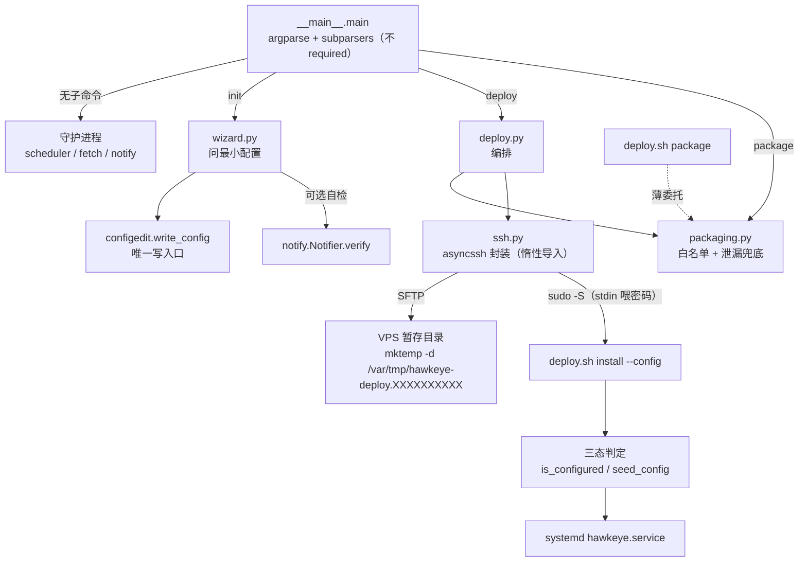
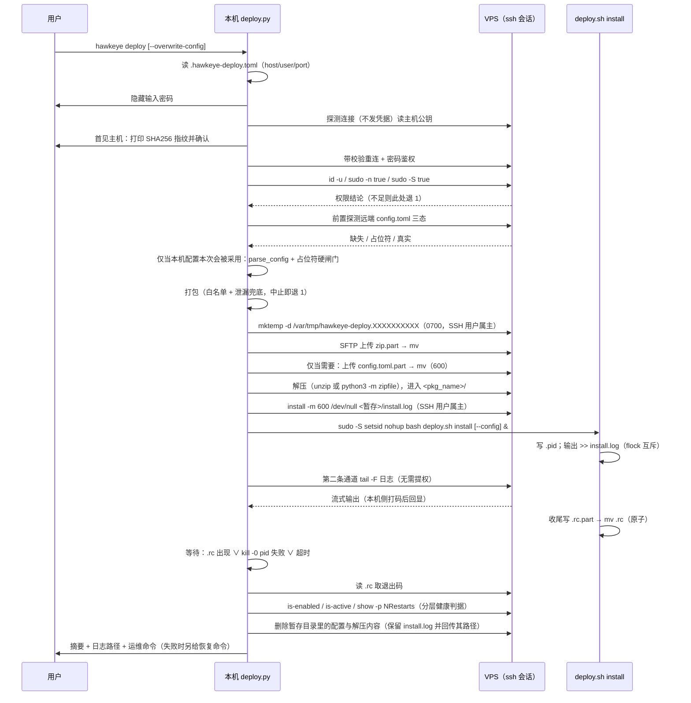
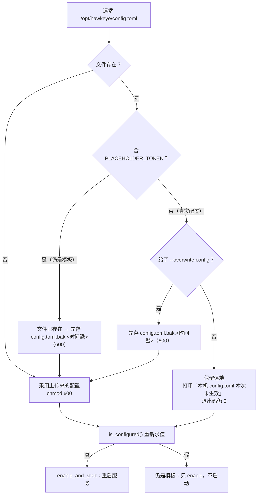

# 跨平台配置向导与一键部署 - Plan

## Goal Capsule

- **目标**：把「填配置 → 打包 → 上传 → 装服务」这套四步手工流程收敛成两条本机命令：`hawkeye init` 问出能启动的最小配置并写出本地 `config.toml`，`hawkeye deploy` 一键打包、上传程序与配置、在 VPS 上完成安装并把输出实时回传。
- **手段**：本机侧改由项目已有的 Python 命令行承载（Windows 没有 bash），新增 `init` / `deploy` 两个子命令；`deploy.sh` 收敛为只管服务器侧的 install / uninstall，继续复用它现有的白名单、幂等语义与 `is_configured()` 判据。
- **权威层级**：本计划自举 Product Contract（`product_contract_source: ce-plan-bootstrap`）。R1–R23 与 KTD1–KTD8 是用户已确认的 WHAT，KTD9 起是 ce-plan 补的 HOW。
- **停止条件**：R1–R26 全部落地，三道门（pytest / mypy / ruff）全绿，README 与实际行为一致。
- **执行画像**：单人、单仓、无 CI；开发机是 macOS，Windows 与 VPS 都无法在本地验证。
- **交付尾部**：跨平台运行与远端安装的端到端只能记为「待现场验证」，不得默认判过；本机侧（向导、打包、泄漏兜底、参数解析、退出码映射）必须由自动化测试覆盖并真实跑过。

---

## Product Contract

### Summary

HawkEye 现在上机要走四步手工流程：照 `config.example.toml` 手抄一份 `config.toml` 填 Telegram 凭据、`./deploy.sh package` 打包、`scp` 上传、`ssh` 进去 `unzip` 再 `sudo ./deploy.sh install`。这套流程要求本机有 bash 与 scp/ssh，在 Windows 上不成立；也没有任何一步替用户校验凭据，填错了要等服务起不来才发现。

本次把本机侧的两段能力做进 Python 命令行：`hawkeye init` 交互式问出最小可启动配置，原子写出权限收紧的本地 `config.toml`；`hawkeye deploy` 收集 VPS 的 SSH 信息（用户名 + 密码），打包、上传程序与配置、在远端执行安装并把输出实时回传本机。`deploy.sh` 不再承担任何本机职责，只保留服务器侧的 install / uninstall。

远端已有的配置不覆盖：`config.toml` 是 Telegram `/add`、`/del` 的写入目标，服务器上那份可能是「用户在手机上加过的监控项」的唯一记录。

### Problem Frame

- 四步手工流程依赖本机的 bash、scp、ssh，Windows 用户走不通。
- 密码认证在跨平台下没有现成的非交互通道：`ssh` / `scp` 故意拒绝从 stdin 读密码并直接开 tty，`sshpass` 在 Windows 上不存在，Win32-OpenSSH 的 `SSH_ASKPASS` 支持不完整、`ControlMaster` 完全未实现。
- 没有任何一步校验 Telegram 凭据，`bot_token` / `chat_id` 填错要等服务起不来才暴露。
- 服务器上的 `config.toml` 可能比本机新——Telegram `/add`、`/del` 写的就是那一份。
- 本机 `config.toml` 含明文 bot token，工作区里此刻还躺着 4 个同样含明文 token 的 `config.toml.bak.*`，任何「顺手打包」都可能把密钥带上服务器或带进仓库。

### Key Decisions

- KTD1. **本机侧能力由 Python 命令行承载，`deploy.sh` 收敛为服务器侧安装/卸载。** Windows 没有 bash，本机侧继续写在 shell 脚本里等于不支持 Windows；而 Python 3.11+ 已经是项目硬依赖（session-settled: user-directed — chosen over 继续扩写 `deploy.sh`：无法在 Windows 上运行）。Governs R1, R7, R19, R20。
- KTD2. **最小可启动配置只问 `bot_token` 与 `chat_id`。** `config.py` 只把 `[telegram]` 定为必填，零监控项是合法配置（`_parse_merchants` / `_parse_watches` 在缺键时返回空元组），监控项可以之后在 Telegram 里用 `/add` 补（session-settled: user-directed — chosen over 向导里一并问监控项：把首启门槛抬到用户还没拿到选择器的时刻）。Governs R2, R3。
- KTD3. **SSH 只支持用户名 + 密码。** 用户明确说「暂时支持用户名和密码」；公钥、跳板机、agent 转发不在本次范围（session-settled: user-directed）。Governs R7, R8, R10。
- KTD4. **`config.toml` 不进部署包，走带外通道单独上传。** `deploy.sh:313-316` 的兜底会在暂存目录里发现 `config.toml` / `config.toml.bak.*` / `state.json` 时直接中止打包，这条兜底是有意的——包会被转发、留档、误上传（session-settled: user-directed — chosen over 把配置打进 zip：让部署包本身变成密钥载体）。Governs R11, R12。
- KTD5. **远端 `config.toml` 用三态判定。** 远端缺失、或远端那份仍含 `config.example.toml` 的占位 token → 用本机那份；远端已是真实配置 → 保留，并明确提示「本机 config.toml 未生效」，只有显式 `--overwrite-config` 才覆盖，且覆盖前在服务器上留一份备份。理由两头都硬：服务器那份是 Telegram `/add` / `/del` 的写入目标，可能是手机上加的监控项的唯一记录，`deploy.sh` 的 `seed_config` 与 README 三处都承诺升级保留；而首次部署又不能因为「远端已有模板」就让本机配置静默不生效，所以占位符态必须算可覆盖（session-settled: user-directed — chosen over 总是用本机覆盖（会静默删掉手机上加的监控）/ 总是保留远端（首次部署时本机配置永远不生效））。Governs R14, R16。
- KTD6. **Windows 支持的是 `init` 与 `deploy` 两个子命令，不是监控守护进程。** `__main__.py:87-89` 用 `loop.add_signal_handler(SIGTERM/SIGINT)`，在 Windows 的事件循环上抛 `NotImplementedError`；而守护进程本来就跑在 VPS 上（session-settled: user-approved — chosen over 让守护进程也跨平台：要重写信号处理，且没有实际使用场景）。Governs R19。
- KTD7. **本机 `config.toml` 的权限保护在 Windows 上是尽力而为。** POSIX 上继续 600；Windows 没有等价语义，改用 `icacls` 去掉继承、只授当前用户完全控制，失败时降级为一条明确告警而不是失败退出（session-settled: user-directed — chosen over 在 Windows 上拒绝写配置：把平台差异变成功能缺失）。Governs R4。
- KTD8. **一键部署幂等，重复执行即升级。** 与 `deploy.sh install` 现有语义一致：保留服务器上的 `config.toml` 与 `state.json`，源码整体替换以免残留已删模块，配置就绪时自动重启服务（session-settled: user-directed）。Governs R16。

### Requirements

**配置向导（本机）**

- R1. 新增 `hawkeye init` 子命令，交互式引导生成本机 `config.toml`；目标路径沿用顶层 `-c/--config`（默认 `config.toml`）。
- R2. 向导只问最小可启动集：Telegram `bot_token` 与 `chat_id`；不问监控项，也不问全局默认值。
- R3. 目标文件已存在时，向导只改写 `[telegram]`，原有 `[[merchants]]` / `[[watches]]` 与全局默认值原样保留；写入一律经 `configedit.write_config`，不新增第二个写入口。
- R4. 写出的文件在 POSIX 上权限为 600；Windows 上尽力收紧，收紧失败时打印一条明确告警并继续。
- R5. 向导在**写盘前**做一次 Telegram 凭据自检：永久性拒绝（400/401/403/404）就地重问，网络异常只告警不阻断，用户也可以跳过自检。顺序是硬的——`configedit.py:257-259` 只要目标文件已存在就先生成一份 `config.toml.bak.*`，把自检放在写盘之后意味着用户输错一次 token 就在磁盘上留下一份含错 token 的明文备份，还占掉 `_prune_backups` 的 10 份配额。自检消息不透传 `verify()` 原文：`notify.py:112-115` 对 token 错与 chat_id 错回的是同一句话（token 错通常是 404），向导要提示重填的是 `bot_token` 与 `chat_id` 两项。
- R6. 向导不回显、不记录 `bot_token` 明文：输入用隐藏输入，结束摘要里只显示尾部若干位。

**SSH 连接与鉴权**

- R7. 新增 `hawkeye deploy` 子命令，收集 VPS 的 host / port / user，密码用隐藏输入、每次运行现问。
- R8. 连接参数（host / port / user，不含密码）可存本机 `.hawkeye-deploy.toml` 供下次复用，该文件权限收紧并进 `.gitignore`；密码永不落盘、不进配置文件、不进环境变量、不进命令行参数。
- R9. 首次连接某主机时打印 SHA256 主机指纹并要求一次性确认，确认后写入 `~/.ssh/known_hosts`；此后每次连接都校验主机密钥。读取主机公钥的探测连接不发送任何凭据。
- R10. 远端提权用 `sudo -S` 从 stdin 喂密码、不分配 pty；连接后立刻探 `id -u` 与 sudo 可用性，权限不足就在打包与上传之前失败。
- R26. 远端执行一律不拼 shell 字符串：要跑的命令写成脚本文件、SFTP 上传后以 `bash <脚本>` 执行；确实需要内联的场合，每个变量在本机用 `shlex.quote` 包好。`version` / `host` / `user` 这类会进路径或命令的值先过白名单校验（`^[A-Za-z0-9._-]+$`，host 额外允许 `:`），不合法直接退 1。

**打包与上传**

- R11. 打包复用现有语义：同一份文件白名单、`dist/hawkeye-<版本>-<时间戳>.zip` 命名、剥掉 `__pycache__` 与 `*.egg-info`。
- R12. 泄漏兜底保留为硬中止：暂存内容或 zip 成员名里出现 `config.toml` / `config.toml.bak.*` / `config.toml.tmp` / `state.json` / `state.json.tmp` / `state.json.corrupt.*` / `.hawkeye-deploy.toml` 就中止打包，不降级为告警。其中 `config.toml.tmp` / `state.json.tmp` / `state.json.corrupt.*` 三族是既有代码会留下的残留：`configedit.py:262` 的临时文件叫 `config.toml.tmp` 且内含明文 token，`state.py:92` 留 `state.json.corrupt.<时间戳>`、`:110` 留 `state.json.tmp`；`.hawkeye-deploy.toml` 是本次新增的第四族。已核实这四族当前**都没有被 `.gitignore` 挡住**（`git check-ignore` 全部返回未忽略），所以同一份七族清单要同时补进 `.gitignore`。
- R13. 上传先写临时名、再在远端改名，避免半截文件被当成完整包解压或安装。

**远端安装**

- R14. `deploy.sh install` 接受 `--config <路径>` 与 `--overwrite-config`，按 KTD5 的三态判定决定是否采用上传来的配置；覆盖前先把远端旧配置存成 `config.toml.bak.<时间戳>`（600）。是否启动服务继续由现有 `is_configured()` / `enable_and_start()` 决定，不在本机侧重新实现这个判断。
- R15. 远端安装输出实时回传本机；回传前把本机已知的密钥（bot token、SSH 密码）替换为打码串。
- R16. 一键部署幂等：重复执行即升级，保留服务器上的 `config.toml` 与 `state.json`。
- R17. 长时安装抗断连（Playwright 下 Chromium 可能十几分钟）：远端后台执行、输出落盘到权限收紧的日志文件，本机跟随该日志；断连后凭日志路径可继续排查。完成信号不能只靠退出码文件——后台进程被 OOM killer 杀掉时那个文件永远不会出现。远端同时写一个 `.pid`，本机的等待循环三条退出边任一成立就停：`.rc` 出现、`kill -0 <pid>` 失败、或总时长超上限（默认 30 分钟，可调）。
- R24. 远端暂存目录名不可预测且不可被他人抢占：由 SSH 登录用户（非 root）用 `mktemp -d /var/tmp/hawkeye-deploy.XXXXXXXXXX` 创建（0700、属主即该用户），zip / 配置 / 脚本 / 日志 / `.rc` / `.pid` 全部落在这一个目录里。root 只往其中追加写，不负责创建。
- R25. 部署成功的判据是分层的，不等于「`deploy.sh` 退出码为 0」：还要 `systemctl is-enabled` 为 enabled，且——仅当配置已就绪时——`systemctl is-active` 为 active 且 `systemctl show -p NRestarts` 在观察窗内不增长。任一不满足就以非零退出并打印该查什么。
- R18. 上传到远端的配置暂存文件在安装结束后一定删除，成功失败都删。

**跨平台与命令行契约**

- R19. `init`、`deploy` 与 `package` 在 macOS / Windows / Linux 均可运行；监控守护进程仍限 Linux / macOS。
- R20. 不带子命令的裸调用行为不变，仍是运行监控守护进程；现有 `-c` / `-v` / `--log-level` 的语义与默认值不变。
- R21. 退出码 2 继续专属守护进程的配置/Telegram 致命错误契约（systemd 单元里有 `RestartPreventExitStatus=2`）；`init` / `deploy` 的失败一律用 1，Ctrl-C 仍为 130。
- R22. SSH 依赖放在可选依赖组，不进 `[project.dependencies]`；缺失时给一条明确的安装指引而不是 traceback。

**文档**

- R23. README 同步：向导与一键部署的用法、Windows 上的权限与 shell 注意事项、远端配置三态语义、可选依赖的安装方式；四步手工流程要么删掉、要么明确降级为「进阶手工路径」。
### Key Flows

- F1. 首次上机

  **Trigger:** 用户克隆仓库、装好可选依赖，手上有一台干净的 Debian/Ubuntu VPS。

  **Steps:** `hawkeye init` → 隐藏输入 `bot_token`、输入 `chat_id` → 写出 600 的本地 `config.toml`（首次写不产生备份）→ 可选 Telegram 自检通过 → `hawkeye deploy` → 问 host / port / user / 密码 → 首见主机打印指纹、用户确认 → 探 `id -u` 与 sudo → 打包（泄漏兜底通过）→ 上传 zip 与配置（临时名 + 改名）→ 远端解压、后台跑 `deploy.sh install --config <暂存配置>` → 本机跟随日志、打码回显 → 远端判定为「缺失」，采用本机配置 → `is_configured()` 为真 → 服务自动启动 → 删除暂存配置、打印安装摘要与常用运维命令。

  **Outcome:** VPS 上服务已运行，本机留下 `dist/` 里的包、`.hawkeye-deploy.toml` 里的连接参数、远端日志路径。

  **Covers:** R1, R2, R4, R5, R7, R9, R10, R11, R13, R14, R15, R17, R18

- F2. 升级重部署（远端已是真实配置）

  **Trigger:** 本机改了代码，用户想把新版本推上去；期间他在 Telegram 里用 `/add` 加过监控项。

  **Steps:** `hawkeye deploy` → 复用 `.hawkeye-deploy.toml` 的 host / user / port、只问密码 → 连接、探权限 → 前置探测发现远端 `config.toml` 已是真实配置且没给 `--overwrite-config` → 打印「远端已有真实配置，本机 `config.toml` 本次不生效；要覆盖请加 `--overwrite-config`」→ 只上传程序包，不上传配置 → 远端 `install` 不带 `--config`，`seed_config` 保留原配置 → 源码整体替换、venv 重装、`enable_and_start` 重启服务。

  **Outcome:** 程序升级，手机上加的监控项与 `state.json` 都还在。

  **Covers:** R8, R14, R16

- F3. 显式覆盖远端配置

  **Trigger:** 用户换了 bot 或 chat，确认要用本机那份顶掉服务器上的。

  **Steps:** `hawkeye init` 改好本机配置 → `hawkeye deploy --overwrite-config` → 上传配置到远端暂存 → 远端 `install --config <暂存> --overwrite-config` → 先把旧 `config.toml` 存成 `config.toml.bak.<时间戳>`（600）→ 再落新配置并 `chmod 600` → 删除暂存文件 → 服务重启。

  **Outcome:** 远端用上新配置，旧配置在服务器上留了一份可回退的备份。

  **Covers:** R14, R18

- F4. 早失败

  **Trigger:** 可选依赖没装、密码错、`sudo` 不可用、或本机 `config.toml` 不合法。

  **Steps:** `hawkeye deploy` → 依赖缺失就直接给出 `pip install '.[deploy]'` 的指引并退 1；能连上则先探远端三态，仅当本机配置本次会被采用才 `parse_config` 校验并过占位符硬闸门，再探 `id -u` / `sudo -S true`；任一环节失败就在打包与上传之前退 1，不留半截远端状态。

  **Outcome:** 用户在几秒内知道原因，而不是等 Chromium 下了十分钟才发现没权限。

  **Covers:** R10, R21, R22

### Acceptance Examples

- AE1. **Covers R2, R3.** Given 一个已有 `[[watches]]` 与自定义 `poll_interval_secs` 的 `config.toml`，When 跑向导并填入新的 `bot_token` / `chat_id`，Then 文件里 `[telegram]` 两个键被替换，`[[watches]]` 与 `poll_interval_secs` 的**值**一个不少一个不改，且 `parse_config` 仍能解析。断言写成 `load_raw(p) == {**原始 raw, "telegram": {...新值}}`（值等价），**不是**文本等价——`configedit.write_config` 走 `tomli_w.dumps` 整份重序列化，注释与排版必然丢失，这一点 `config.example.toml:4-6` 已经写在文件里当作既定行为。
- AE2. **Covers R3, R4.** Given 目标路径不存在，When 向导写出配置，Then 不产生 `config.toml.bak.*`，文件权限为 600（POSIX）。
- AE3. **Covers R3.** Given 目标路径已存在且内容合法，When 向导写出配置，Then 产生一个 600 权限的 `config.toml.bak.<时间戳>`，且备份内容等于写入前的原文。
- AE4. **Covers R6.** Given 向导跑完，When 打印结束摘要，Then 输出中不含完整 `bot_token`，只含尾部若干位。
- AE5. **Covers R5.** Given Telegram 返回 401，When 向导做凭据自检，Then 就地重问 `bot_token` 而不是写盘后退出；Given 返回网络异常，Then 只打印告警并把流程走完。
- AE6. **Covers R11, R12.** Given 工作区里存在 `config.toml`、`config.toml.bak.20260905-163549`、`state.json`、`.hawkeye-deploy.toml`、`config.toml.tmp`、`state.json.tmp`、`state.json.corrupt.20260101-000000`，When 执行打包，Then zip 成员名里一个都不出现；Given 有人把 `config.toml` 塞进白名单，Then 打包以非零退出中止并在消息里点出泄漏的文件名，不生成 zip。
- AE7. **Covers R11.** Given 同一份源码，When Python 打包与 `deploy.sh` 服务器侧的白名单被并列比较，Then 两份清单包含同一组顶层条目（一致性断言，防止一边改了另一边没跟上）。
- AE8. **Covers R14.** Given 远端 `config.toml` 不存在，When 带 `--config` 跑 install，Then 采用上传来的配置；Given 远端 `config.toml` 仍含占位 token，Then 同样采用上传来的配置，**并且覆盖前先留一份 `config.toml.bak.<时间戳>`（600）**；Given 远端 `config.toml` 已是真实配置且未给 `--overwrite-config`，Then 保留远端、打印「本机配置未生效」提示、退出码仍为 0（这是正常升级，不是失败）。占位符态也要备份的理由：`is_configured()`（`deploy.sh:209-212`）是对整个文件做子串 grep，占位 token 只要在文件里出现过——一行注释掉的旧配置、粘进去的示例片段——判定就会翻成「未配置」，而采用分支目前会零备份地毁掉服务器上唯一那份配置。（已核实 `config.example.toml` 里该占位符只出现 1 次、在 `:36` 赋值行上，注释块中并不含它；风险来自用户自己的文件内容，不是来自模板。）
- AE9. **Covers R14, R18.** Given 远端已是真实配置且给了 `--overwrite-config`，When install 跑完，Then 存在一个 600 权限的 `config.toml.bak.<时间戳>` 内容等于旧配置，`config.toml` 内容等于上传来的那份，且上传的暂存文件已不存在。
- AE10. **Covers R20, R21.** Given 不带子命令调用，When `main([])` / `main(["-c", path])` 执行，Then 走的仍是守护进程路径、`-c` 默认值仍为 `config.toml`；Given `init` 或 `deploy` 内部抛出 `ConfigError`，Then 退出码为 1 而不是 2。
- AE11. **Covers R22.** Given 没装可选依赖，When 执行 `hawkeye deploy`，Then 输出一条含安装命令的中文提示并退 1，不打 traceback；Given 只跑 `hawkeye init` 或守护进程，Then 完全不受影响。
- AE12. **Covers R15.** Given 远端输出里出现了本机已知的 bot token 字符串，When 回显到本机，Then 该字符串被替换为打码串。
- AE13. **Covers R5, R25.** Given 本机 `config.toml` 里 `bot_token` 仍是 `123456:ABC-your-bot-token`，When 执行 `hawkeye deploy`，Then 在打包与上传之前就以退出码 1 中止并提示先跑 `hawkeye init`。这条不能靠 `parse_config` 兜——`config.py:259` 的 `_require_str` 只要求非空字符串，占位符能合法通过校验，一路跑到 VPS 上才由 `is_configured()` 判成未配置、服务静默不启动。
- AE14. **Covers R16.** Given 一台已装好且服务在跑的 VPS，When 原样再跑一次 `hawkeye deploy`，Then `config.toml` 的 sha256 与 inode 都不变、`config.toml.bak.*` 的数量不增、`state.json` 的 mtime 不变，且服务重启后 `is-active` 仍为 active。
- AE15. **Covers R26.** Given 把 `version` 构造成 `1.0; rm -rf /tmp/x` 或把 `host` 构造成 `h$(id)`，When 执行部署，Then 在建立连接之前就因白名单校验失败退 1，远端不产生任何副作用。
- AE16. **Covers R24, R17.** Given 远端暂存目录已由 `mktemp -d` 建出，Then 其权限为 0700、属主为 SSH 登录用户；Given 后台安装进程被强杀（模拟 OOM）而 `.rc` 从未出现，When 本机等待，Then 在 `kill -0` 探测失败后立刻以非零退出并给出日志路径，不无限挂着。

### Scope Boundaries

**Deferred for later（以后可能做，非本次）**

- SSH 公钥 / agent 转发 / 跳板机 / 端口转发。
- 非 Debian/Ubuntu 的部署目标（`check_os` 现在就只放这两类）。
- 向导里引导配置第一个监控项（选择器）。
- 把现有三处 `_mode(p) == 0o600` 断言改成跨平台可跑，让整个测试套件在 Windows 上绿。
- 多主机批量部署、部署回滚、版本切换。
- `deploy.sh uninstall` 的远端一键调用。

**Outside this feature's scope（本次明确不做）**

- 改动监控运行时行为（抓取、判变、通知、调度）。
- 让监控守护进程在 Windows 上运行（KTD6）。
- 改 systemd 单元的语义，包括 `RestartPreventExitStatus=2` 与退出码契约。
- 把 `config.toml` 打进部署包（KTD4）。
- 在本机侧重新实现「配置是否就绪、要不要启动服务」的判断（R14 把它留在服务器侧）。

### Outstanding Questions

- 向导之后是否要接一段「加第一个监控项」的引导？本次不做，理由见 KTD2 与 Scope Boundaries；如果用户上机后反馈「装好了但不知道下一步」，再回来补。
- 打包白名单怎么单一化而不破坏 README 里那条手工路径？(→ KTD11)
- 长时安装怎么抗断连、本机又怎么知道远端结束了？(→ KTD13)
- mypy strict 下把 asyncssh 放可选依赖，会不会让没装该依赖的机器上 `mypy src/hawkeye` 直接挂？(→ KTD9，并在 Verification Contract 里写明前置条件)

### Success Criteria

- 一台干净 VPS 从零到服务运行，本机只需两条命令，全程不用手动 `scp` / `ssh` / `unzip`。
- 重复 `hawkeye deploy` 是安全的升级动作：不丢服务器上的 `config.toml`，不丢 `state.json`。
- 本机 `config.toml` 与 SSH 密码都没有新增泄漏面：包里进不去、仓库里进不去、日志与回显里被打码。
- 本机侧行为由测试锁住；跨平台与远端安装的结论只以现场验证为准。

### Sources / Research
现有代码：

- `deploy.sh`（`copy_payload` 第 121–128 行）：`install` 与 `package` 共用的唯一白名单，只收 `src/`、`pyproject.toml`、`config.example.toml`、`README.md`、`deploy.sh`。这是「复用现有打包命令」的落点。
- `deploy.sh`（`cmd_package` 第 295–330 行）：包命名 `hawkeye-<版本>-<时间戳>`、`dist/` 落盘、`zip` 缺失时回落 `python3 -m zipfile`；第 313–316 行是硬中止的泄漏兜底。整个 `package` 命令**只存在于未提交的工作区**（`git grep cmd_package HEAD -- deploy.sh` 无结果）。
- `deploy.sh`（`seed_config` / `is_configured` / `enable_and_start` 第 166–224 行 + 常量 `PLACEHOLDER_TOKEN` 第 28 行）：现成的「配置是否就绪」判定过程，KTD5 的三态判定直接建在它上面。
- `deploy.sh`（`cmd_install` 第 247–261 行）：安装步骤顺序；`setup_venv` 第 153–158 行用 `pip install "$INSTALL_DIR"`，所以任何进 `[project.dependencies]` 的东西都会被装到 VPS 上——这是 R22 把 SSH 依赖放可选组的直接原因。`install_browser` 第 160–164 行是耗时最长的一步（R17）。
- `src/hawkeye/__main__.py`（`_parse_args` 第 30–47 行）：目前是扁平 argparse，没有子解析器也没有位置参数，只有 `-c/--config`、`-v/--verbose`、`--log-level`。第 87–89 行的 `loop.add_signal_handler` 在 Windows 上抛 `NotImplementedError`（KTD6）。第 105–125 行的 `main` 把 `ConfigError` 与 `TelegramFatalError` 映射为退出码 2（R21）。模块顶层 `from .fetch import BrowserManager`，而 `fetch.py:15` 顶层导入 playwright——所以新代码不能挂在 `__main__` 顶层（KTD10）。
- `src/hawkeye/configedit.py`（模块 docstring 第 1–12 行、`write_config` 第 246–266 行）：文档化的唯一写入口，先 `tomli_w.dumps` → `tomllib.loads` → `parse_config` 校验 → 已存在才备份 → 临时文件写入 → `os.chmod(0o600)` → `os.replace`。**文件不存在时不备份、直接写 600**，正是向导首次写盘需要的行为（测试锚点 `tests/test_configedit.py:283-290`）。`_make_backup` 第 233–243 行用 `os.open(..., O_WRONLY|O_CREAT|O_EXCL, 0o600)` 避开了 copy2 之后再 chmod 的 0644 窗口，但 `write_config` 第③步写临时文件时仍有同样的窗口（KTD14）。
- `src/hawkeye/config.py`：只有 `[telegram]` 必填（`bot_token` 非空字符串、`chat_id` 非空字符串或整数）；`_parse_merchants` 第 430–433 行与 `_parse_watches` 第 458–461 行在缺键时返回空元组，`parse_config` docstring 第 495–502 行记录了「零监控项合法」这条决定（KTD2）。`load_raw` / `load_config` 是现成的读取入口。
- `src/hawkeye/control.py`（步骤常量第 55–66 行、`Session` 第 95–107 行、`_step` 第 255–317 行）：项目里最接近交互向导的形状——单点分发、输入不合法就地重问、`_YES` 集合、`-` 表示用默认值、全中文单行提示。向导照这个形状写。
- `src/hawkeye/notify.py`（`Notifier.__init__` 与 `verify` 第 94 行起）：构造只要 `TelegramConfig` 与一个 `httpx.AsyncClient`，`verify()` 对 400/401/403/404 抛 `TelegramFatalError`、对网络异常只告警——正好是 R5 要的两档行为。`TokenRedactingFactory` 是 R15 打码的现成范式。
- `README.md`：第 27–47 行安装与 `chmod 600`、第 107–119 行裸 `python -m hawkeye -c`、第 161–168 行一键部署、第 182 与 209–211 行 install 幂等与保留承诺、第 190–207 行 `package` + scp/ssh/unzip 四步流程（同样未提交）、第 227–232 行退出码 2、第 255–263 行备份文件敏感性——R23 要动的就是这几处。
- `tests/`：13 个文件、无 `conftest.py`、零 pytest fixture 函数、零装饰器；模式是模块级 TOML 字符串常量 + 局部 `_write(tmp_path, ...)` 助手（末尾 `os.chmod(p, 0o600)`），权限用 `_mode()` 断言，异步测试是裸 `async def`（`asyncio_mode = "auto"`），替身是手写类 + `# type: ignore[arg-type]`，网络用 `httpx.MockTransport`。新测试沿用这一套。
- `pyproject.toml`：`dependencies` 只有 3 个（playwright / httpx / tomli-w）；`[tool.mypy]` 是 `strict = true` 且**没有 `[[tool.mypy.overrides]]` 段**——新依赖必须自带类型信息，否则要开这个仓库第一个 overrides（KTD9）。

外部调研（load-bearing，直接决定了 KTD9）：

- `ssh` / `scp` 故意不从 stdin 读密码，会直接打开控制终端；`sshpass` 靠伪造 pty 绕过，且在 Windows 上不存在。Win32-OpenSSH 的 `SSH_ASKPASS` 支持不完整（openssh-portable 仓库 issue #1152，长期未关），`ControlMaster` / `ControlPersist` 完全未实现（issue #1328，2019 年起挂在 backlog）——所以「多问几次密码 + 连接复用」这条退路也不存在。唯一的 shell-out 密码路径是随包分发 PuTTY 的 `plink -pw`，那会把密码暴露在进程参数里。**结论：本次必须引入一个 Python SSH 库，「不加依赖」这个选项在跨平台前提下已经死了。**
- asyncssh 2.24.0（2026-06-27 发布）实测三点：wheel 里带 `asyncssh/py.typed`，因此在 mypy strict 下不需要 stubs 也不需要 overrides 段（paramiko 需要 `types-paramiko`）；必需依赖只有 2 个（`cryptography`、`typing_extensions`），而 paramiko 5.0 有 4 个且把 `invoke` 提成了核心依赖；纯 Python wheel，`Requires-Python: >=3.10`。另外它是原生 asyncio（与本仓库全异步风格一致）、原生 stdout/stderr 分流的流式读取、原生递归 SFTP、默认校验 known_hosts（paramiko 的常见写法是 `AutoAddPolicy`，会被 CodeQL 标记）。**代价要记账：许可证是 `EPL-2.0 OR GPL-2.0-or-later`（paramiko 是 LGPL-2.1）——对私有自用仓库无影响，若将来要闭源分发则有影响。**
---

## Planning Contract

> Product Contract 的 KTD1–KTD8、F1–F4 原样保留；本节起是 ce-plan 追加的 HOW，KTD 编号从 Product Contract 续下去。深化阶段（Phase 5.3）对 Product Contract 做了四类有据可查的修正，都记在原条目里：R5 的自检从写盘后移到写盘前，R12 的泄漏清单补进三族既有代码残留，R17 补上 pid 哨兵与总时长上限，AE1 的「逐字保留」改成值等价断言（`tomli_w.dumps` 下逐字保留不可能）；新增 R24–R26 与 AE13–AE16。KTD5 的三态判定是用户直接拍的（`session-settled: user-directed`），深化只给它补了一条采用分支必须备份的理由，判定本身未动。

### Key Technical Decisions

- KTD9. **SSH 用 asyncssh，装在 `[project.optional-dependencies]` 的 `deploy` 组里。** 选它的三条硬理由与那笔许可证代价见 Sources / Research；放可选组是因为 `deploy.sh:157` 在 VPS 上跑 `pip install "$INSTALL_DIR"`，进主依赖就会被装到服务器上，而服务器根本不需要 SSH 客户端。代价有两条要一起认下来：本机开发/校验环境必须装 `.[deploy]`，否则 `mypy src/hawkeye` 会因为找不到 asyncssh 而报错；`import asyncssh` 必须写成惰性导入（在 `deploy` 的执行路径里），这样没装可选依赖的人照样能跑守护进程和向导（R22）。被否：paramiko（要开这个仓库第一个 `[[tool.mypy.overrides]]`，依赖多一倍，同步 API 与全异步代码风格错位）、fabric（在 paramiko 之上再叠一层，依赖更重）、shell-out 到 `ssh`/`sshpass`/`plink`（跨平台不可行，见 Sources / Research）。Governs R7, R10, R22。版本约束写 `asyncssh>=2.24.0,<3`。**这个上界是本仓库唯一一处上界，属于有意偏离既有约定，别顺手改回去：** 现有 3 个依赖全是只写下界，但那 3 个都不参与鉴权，而 asyncssh 是唯一一个要握着一个能提权的密码、并决定主机密钥校验行不校验的依赖；仓库既没有 lockfile 也没有 CI，一次 `pip install` 拉到 3.x 的 API 变更就可能静默改掉 `known_hosts` 的默认行为。另外要在文档里说清一件事：asyncssh 自身是纯 Python wheel，但它必需的 `cryptography` 带原生扩展——「三平台可跑」的前提是目标平台有 `cryptography` 的预编译 wheel（主流 macOS / Windows / Linux 都有），冷门平台会退化成源码编译，需要 Rust 工具链。
- KTD10. **本机侧代码放独立模块；惰性化的对象是 `__main__` 现有的顶层导入，不只是新模块。** 原先这条写成「`__main__` 只做惰性导入分发」，方向是错的：`__main__.py:9-17` 此刻在**顶层**就 `import httpx`、`from .fetch import BrowserManager`、`from .notify import ...`、`from .receive import Receiver`、`from .scheduler import Scheduler`，而 `fetch.py` 顶层 `import playwright`。也就是说只要把 `init` / `package` 挂进这个 `__main__`，即便新模块自己写成惰性导入，整套浏览器栈依然会在 `hawkeye init` 的第一毫秒被拉起来——Windows 用户为了填个配置仍然要先装 Playwright。所以这条的真实要求有三层：
  1. `__main__.py` 顶层只留 `argparse` / `asyncio` / `logging` / `sys` 这类 stdlib，`httpx` 与 `.fetch` / `.notify` / `.receive` / `.scheduler` 全部下移到守护进程分支内部导入；
  2. `packaging.py` 只用标准库（`pathlib` / `shutil` / `zipfile` / `re`），不碰 playwright、不碰 asyncssh、不 `import tomllib` 之外的第三方，这样 `hawkeye package` 在任何环境都能跑；
  3. `wizard.py` 只允许导入 `config` / `configedit`（两者都只依赖 stdlib + `tomli_w`），Telegram 自检要用的 `httpx` 与 `notify` 在自检函数内部导入——用户跳过自检时就完全不加载。
  验证手段是可执行的：在子进程里跑 `python -c "import sys; from hawkeye.__main__ import main; main(['package','--root','.']); assert 'playwright' not in sys.modules and 'asyncssh' not in sys.modules"`。Governs R1, R7, R19。
- KTD11. **打包的单一事实源放 Python，`deploy.sh package` 退化为薄委托；服务器侧白名单保留，另加一条一致性断言测试。** `copy_payload` 被 `cmd_package` 和服务器侧的 `deploy_files` 共用，所以把打包搬进 Python 并不能凭空消掉那份 bash 清单——服务器侧仍然需要它（从安装目录内重跑的场景）。折中：Python 拥有打包语义，`deploy.sh package` 改成调用 `python3 -m hawkeye package`（并在 Python 不可用时给出明确提示），README 里那条手工路径因此继续有效；两份清单的一致性由测试锁住（AE7）。泄漏兜底原样搬进 Python，仍然是**中止**而不是告警，并额外扫 zip 成员名——Windows 上没有 `find`，逐条比对成员名反而比原来更严。被否：让 `deploy_files` 整体采用解压出来的目录（能消掉第二份清单，但会改掉一条已写进文档的用户路径，超出本次范围）。Governs R11, R12。
- KTD12. **远端三态判定的权威在 `deploy.sh`，本机只做一次前置探测。** 判据 `is_configured()` 已经在服务器侧，且它同时决定要不要启动服务，本机重实现一遍就等于两个真相。本机那次探测（一条 `test -f` + 一次占位符 grep）只有两个作用：远端已是真实配置且没给 `--overwrite-config` 时**不上传配置**（避免明文 token 白跑一趟 `/tmp`），以及让用户在打包之前就看到「本机配置本次不生效」的提示。两侧用同一套规则判同一个文件；万一探测与实际不一致（例如探测到上传之间远端刚被 `/add` 改过），服务器侧的判断赢，并打印保留提示。**本机侧这两步的顺序是反的，必须纠正：先探远端三态，再决定是否校验本机配置。** F4 与时序图原先把 `parse_config` 放在三态探测之前，那会挡掉一条完全合法的路径——从干净 clone 升级一台已配好的 VPS，本机根本没有 `config.toml`，却因为「本机配置不合法」而退 1。正确的门是条件式的：只有当本机那份配置**本次真的会被采用**（远端缺失、远端是占位符、或显式 `--overwrite-config`）时才要求它存在且合法；否则只提示「本机配置本次不生效」并继续。而一旦要采用，校验就要比 `parse_config` 更严——占位符 token 能通过 `_require_str`（AE13），必须单独加一道硬闸门。Governs R14。
- KTD13. **长时安装用 `setsid nohup` 后台执行 + 落盘日志 + 哨兵文件，本机跟随日志；但暂存位置、日志属主、完成信号三处都不能按最直觉的写法来。** 直接在一条 SSH 通道上等 `install` 跑完，等于把十几分钟的 Chromium 下载绑在一条可能断的连接上。所以远端把 `deploy.sh install` 脱离会话后台跑、输出重定向进日志、收尾写退出码。三处修正：
  1. **暂存目录必须是 `mktemp -d`，不能是可预测路径（安全性最高的一条）。** `/tmp/hawkeye-install-<时间戳>.log` 这种名字在 world-writable + sticky 的 `/tmp` 里是可预测的：VPS 上任意一个本地非特权账号可以抢先把 `/tmp/hawkeye-<时间戳>` 建成自己的目录并放一个假的 `deploy.sh`，等我们 `sudo bash` 它——那是一次干净的本地提权到 root；或者预先把日志路径做成指向 `/etc/cron.d/x` 的符号链接，让 root 的 `>>` 写到任意位置；或者预先把 `.rc` 写成 `0`，让本机把一次从未发生的安装判成成功。改法是 R24：由 SSH 登录用户执行 `mktemp -d /var/tmp/hawkeye-deploy.XXXXXXXXXX`，随机名 + 原子创建 + 0700，其他用户既抢不到名字也进不去目录；用 `/var/tmp` 而非 `/tmp` 是因为它不受 tmpfiles 的短周期清理影响，十几分钟的安装期内不会被扫掉。
  2. **日志由 SSH 用户创建，root 只追加。** 如果日志是在 `sudo` 下第一次创建的，它会是 `root:root 0600`，本机第二条通道用普通用户 `tail -f` 会直接 Permission denied——「跟随日志」这个能力自己把自己废了。所以先由 SSH 用户 `install -m 600 /dev/null <日志>`（属主即该用户），再让 root 的 `>>` 往里写；`.rc` / `.pid` 同理。这样既不需要给 `tail` 提权，也不需要把日志放到 world-readable 的位置。
  3. **完成信号是「`.rc` 出现 ∨ pid 已死 ∨ 超时」三条边，不是只看 `.rc`（R17）。** 后台进程被 OOM killer 杀掉、或被 `systemd-oomd` 收走时，写 `.rc` 那一步根本不会执行，只等 `.rc` 就是永久挂起。远端在后台进程起来后立刻把 pid 写进 `.pid`，本机的等待循环每轮除了看 `.rc` 还做一次 `kill -0 <pid>`；另有总时长上限。`.rc` 的写入本身要原子——先写 `.rc.part` 再 `mv`，否则本机可能读到一个空文件并把它解释成异常退出码。跟随用 `tail -F`（大写）而不是 `-f`，日志被轮转或尚未创建时不会静默失守。
  另外在 `install_system_deps` 之前加一句 `dpkg --configure -a || true`，让上一次被打断的 apt 不至于把重跑卡死；`apt-get` 全部加 `-o DPkg::Lock::Timeout=600`，避免撞上开机时的 `unattended-upgrades` 直接失败。Governs R17, R24。
- KTD14. **顺手补掉 `configedit.write_config` 第③步的 0644 窗口。** `_make_backup` 早就用 `os.open(..., O_EXCL, 0o600)` 避开了「先建后 chmod」的窗口，但 `write_config` 写临时文件时还是 `tmp.write_text` 再 `os.chmod`——而向导是「token 第一次落盘」的路径，这个窗口正好落在最敏感的一次写上。同一处改动，同一处技术。**两条实现约束不能漏：** 一是临时文件名是**固定**的 `config.toml.tmp`（`configedit.py:262`），照抄 `_make_backup` 的 `O_EXCL` 会在任何一次崩溃留下残留后**永久**失败——`/add` / `/del` 从此全废；所以必须先 `tmp.unlink(missing_ok=True)` 再 `os.open(..., O_CREAT|O_EXCL|O_WRONLY, 0o600)`（残留文件本来就是要被覆盖的中间产物，删它是安全的）。二是这条只对 POSIX 成立，Windows 上 `os.open` 的 mode 参数基本被忽略，那边的收紧归 KTD15。Governs R4。
- KTD15. **Windows 上的权限收紧用 `icacls`，失败降级为告警。** POSIX 分支保持现状（`os.chmod(0o600)`）；Windows 分支调 `icacls <路径> /inheritance:r /grant:r <当前用户>:F`，用参数列表形式调用子进程（不拼 shell 字符串），非零返回或找不到 `icacls` 就打印一条中文告警说明「该文件权限未收紧，请自行确认它不在共享目录里」。这是 KTD7 那句「尽力而为」的具体形状。三条实现细节：授予对象用 `whoami /user` 拿到的 **SID**，不用 `os.getlogin()` 那样的用户名——域账号、非 ASCII 用户名、本地化的 `Users` 组名都会让按名授权失败；`icacls` 只能作用在最终路径上，所以要在 `os.replace` **之后**执行（临时文件被改名后 ACL 不会自动跟到新名字上，而且 `write_config` 是先写 tmp 再 replace）；`_make_backup` 产生的每一份 `config.toml.bak.*` 同样含明文 token，也要走同一次收紧，不能只管 `config.toml`。Governs R4。
- KTD16. **argparse 加 subparsers，但不设 `required`，全局选项通过共享父解析器让子命令也能吃到。** `add_subparsers(dest="command")` 不加 `required=True`，`args.command` 缺省为 `None` → 走守护进程，`_parse_args([])` 与 `main(["-c", path])` 的现有断言全部保持成立（AE10）。**只把 `-c` 挂在顶层是不够的**：`hawkeye init -c foo.toml` 这种最自然的写法会被 argparse 判成 usage error 并以退出码 **2** 结束——那正好撞上 R21 与 systemd 单元里 `RestartPreventExitStatus=2` 所专属的语义，一个用户拼写顺序问题会被记成「配置致命错误」。做法是建一个 `parents=[common]` 的父解析器，`common` 里的 `-c` / `-v` / `--log-level` 用 `default=argparse.SUPPRESS`，这样子命令解析出的 Namespace 不会用自己的默认值把顶层已解析的值覆盖掉，`-c` 放在子命令前后都成立，且只有一个真相。Governs R20, R21。
- KTD17. **`init` / `deploy` 的失败在子命令自己的 try/except 里收口成 1。** `main` 现有的 `except ConfigError → 2` 是给守护进程和 systemd 的契约；如果 `deploy` 内部调 `parse_config` 校验本机配置时抛出 `ConfigError`，冒泡到那个处理器就会错误地产出 2。所以子命令分派要包在自己的处理器里，把预期内的失败（配置不合法、连接失败、鉴权失败、远端非零退出、依赖缺失）统一映射为 1，`KeyboardInterrupt` 继续由外层给 130。捕获的异常元组是 `(ConfigError, EditError)` 两个，不是一个：`configedit` 的写入路径抛的是 `EditError`，`control.py:412-427` 已经是这个先例（`/add` 的处理器同时捕获两者）。缺失可选依赖的 `ImportError` 也要在这一层收口——它可能来自 `import asyncssh`，也可能来自 asyncssh 自己 `import cryptography` 时的原生扩展加载失败，两种都该给安装指引而不是 traceback。Governs R21, R22。
- KTD18. **`package` 的项目根显式传入，绝不从 `__file__` 往上推。** 这是一条会在服务器上炸的隐藏依赖：`deploy.sh:157` 跑的是 `pip install "$INSTALL_DIR"`（非 editable），装完之后 `hawkeye` 包在 `site-packages` 里，而 `pyproject.toml` / `config.example.toml` / `deploy.sh` **都不在** wheel 里——任何 `Path(__file__).parent.parent.parent` 之类的推导都会指向 `site-packages`，`read_version` 和白名单拷贝当场找不到源文件。所以 `packaging.py` 的入口签名收一个必填的项目根，`hawkeye package` 提供 `--root`（默认 `Path.cwd()`），并像 `deploy.sh:113-117` 那样先断言 `pyproject.toml` / `src/` / `config.example.toml` 三者都在，否则给一条「请在项目根目录运行」的中文错误。`deploy.sh package` 的薄委托要显式传：`PYTHONPATH="${SCRIPT_DIR}/src" python3 -m hawkeye package --root "${SCRIPT_DIR}"`。Governs R11。
- KTD19. **三层单向依赖：运行时层 ← 工具层 ← 编排层，反向导入一律禁止。** 运行时层（`config` / `configedit` / `fetch` / `notify` / `receive` / `scheduler` / `state` / `control`）跑在 VPS 上，那边**没有** asyncssh；工具层（`packaging` / `wizard`）只允许依赖运行时层与标准库；编排层（`ssh` / `deploy`）可以依赖前两层。一旦有人为了复用而让运行时层去 `import` 工具层或编排层，VPS 上的守护进程会在 import 阶段直接崩，而且是 `RestartPreventExitStatus=2` 管不到的崩法（ImportError 不是退出码 2），表现为每 10 秒重启一次的无声循环。具体到本次唯一一处真实的复用需求——远端输出打码（R15）要用到 `notify.py:40-56` 里 `TokenRedactingFactory` 那套逻辑——正确做法是把纯函数 `redact(text: str, secrets: Iterable[str]) -> str` 提到运行时层（`notify.py` 内或一个 stdlib-only 的小模块），让 `TokenRedactingFactory` 与 `ssh.py` 各自调它；不是让 `notify.py` 去 import `ssh.py`。Governs R15, R22。
- KTD20. **`deploy.sh install` 加文件锁互斥。** 现在没有任何互斥，而抗断连重跑（R17）恰恰会制造并发：第一次 `deploy` 断连后用户重跑，远端两个 `install` 同时在跑，第二个的 `rm -rf "${INSTALL_DIR}/src"`（`deploy.sh:145`）会在第一个的 `pip install "$INSTALL_DIR"`（`:157`）正读这棵树的时候把它抽走——结果是一个装了一半、`pip` 报着莫名文件缺失的安装目录。做法：`cmd_install` 开头 `exec 9>/run/hawkeye-install.lock` 后 `flock -n 9 || die "另一个安装正在进行中（见 /run/hawkeye-install.lock），请等它结束"`。`/run` 是 tmpfs，重启自动清空，不会留下需要人工清理的陈旧锁。Governs R16, R17。
- KTD21. **唯一不可逆的那一步做代际交换，并留一份可回退快照。** `rm -rf "${INSTALL_DIR}/src"`（`deploy.sh:145`）是整条链路上唯一真正不可逆的动作，而它后面还有 `pip install`、`playwright install`、`systemctl restart` 三个都可能失败的步骤——失败后现场既没有旧代码也没有可用服务。改成代际交换：新代码先拷成 `${INSTALL_DIR}/src.new`，成功后 `mv src src.old && mv src.new src`，全链路成功再删 `src.old`，任一步失败就把 `src.old` 换回去。失败路径必须打印**可直接粘贴执行**的恢复命令（三行以内：换回 `src.old`、`systemctl restart`、看日志的路径）。这条的紧要程度来自一个观察到的事实：升级失败时服务的失败模式是每 10 秒重启一次的静默循环，**且一条 Telegram 告警都不会发**——进程在 `Notifier` 构造出来之前就死了，`notify.py` 根本没机会工作。也就是说没有这条，一次失败的升级在用户下次主动去看之前是完全不可见的。Governs R16, R25。
- KTD22. **TOFU 的公钥读取用 `asyncssh.get_server_host_key()`，不是「先不校验连一次」。** 直觉写法是第一次 `connect(..., known_hosts=None)` 拿到密钥再确认——那等于在一条未经校验的通道上完成了一次密码鉴权，中间人拿到的是明文密码，用户随后确认的是攻击者的指纹（R9 里「探测连接不发送任何凭据」就是这条的产物，实现时别退化）。`get_server_host_key()` 只做密钥交换、不接受任何凭据参数，正好是这个语义。`known_hosts` 的四条卫生规则一并定下：`~/.ssh` 若不存在按 0700 创建、`known_hosts` 按 0600 创建；追加前先确认文件末尾有换行，否则新条目会粘到上一行尾部把它一起弄坏；非 22 端口的条目写成 `[host]:port` 格式；同一主机已有**不同**密钥时视为潜在中间人，打印两个指纹并中止，不静默追加也不覆盖。Governs R9。
### High-Level Technical Design

以下是方向性草图，不是待抄的实现：命名、签名、错误类型由实现时决定。

**职责一刀切在机器边界上。** 本机侧（Python）负责问、打包、传、跟随输出；服务器侧（`deploy.sh`）负责装、判配置、决定要不要启动服务。凡是「服务器上的事实」——配置是否就绪、服务该不该起、旧配置要不要备份——都留在服务器侧，本机不复制这套判断（KTD12）。

**唯一写入口不动。** 本机配置的所有写入继续经 `configedit.write_config`，向导只是它的一个新调用者：校验、备份、原子替换、权限收紧四件事一次都不重写（R3）。

**惰性导入是硬约束，不是优化。** `hawkeye init` 在 Windows 上必须能在没有 playwright、没有 asyncssh 的环境里跑起来，所以模块级导入图不能把这两个拉进 `init` 的路径（KTD10、KTD9）。



**一键部署的时序把「早失败」放在最前面。** 探权限只要一次 `id -u` 加一次 `sudo` 试探，几秒钟；打包和上传是分钟级，Chromium 是十几分钟级。顺序错了，用户会在十分钟后才知道自己没有 sudo。



**三态判定的两次求值不是两个真相。** 同一份文件、同一条规则（`is_configured()`：文件存在且不含 `PLACEHOLDER_TOKEN`）被求值两次：本机那次决定「要不要上传」，服务器那次决定「要不要采用」。冲突时服务器赢。



**每一段管道都要回答「带什么过去、绝不带什么」。** 这张表是泄漏面的清单，实现时逐行对照：

| 阶段 | 带过去的 | 绝不带的 | 落地约束 |
| --- | --- | --- | --- |
| 打包 | `src/`、`pyproject.toml`、`config.example.toml`、`README.md`、`deploy.sh` | `config.toml`、`config.toml.bak.*`、`config.toml.tmp`、`state.json`、`state.json.tmp`、`state.json.corrupt.*`、`.hawkeye-deploy.toml`、`__pycache__`、`*.egg-info` | 兜底命中即中止，非零退出（R12）；同一份清单同步进 `.gitignore` |
| 上传程序 | zip 字节 | 任何配置或状态 | 先 `.part` 再远端改名（R13） |
| 上传配置 | 仅在三态判定为可覆盖时的 `config.toml` | SSH 密码 | 远端暂存文件先建 600 再写内容，安装后必删（R18） |
| 提权 | 密码经 stdin 一次性喂给 `sudo -S` | 不写文件、不进 argv、不进环境变量 | 不分配 pty，`-p ''` 消掉提示回显（R10） |
| 远端执行 | 一个 SFTP 上传的脚本文件 | 任何拼接出来的 shell 字符串 | 内联值一律 `shlex.quote`；`version`/`host`/`user` 先过白名单（R26） |
| 回传输出 | 远端日志文本 | 明文 token、明文密码 | 本机侧打码后再打印（R15），打码走 KTD19 提出的纯函数 |
### Assumptions

以下是 ce-plan 的推断，不是用户指令；任何一条被推翻都要回来改计划。

- A1. **`deploy.sh` 的 `package` 命令与 README 第 190–207 行那段说明都还没提交。** 已核实：`git grep cmd_package HEAD -- deploy.sh` 无结果，`git diff --stat HEAD` 显示 `deploy.sh` 有 114 行未提交改动、`README.md` 有 27 行。本次要重写的正是这部分，**建议在动手前先把这两个文件的在写内容提交掉**，否则一次从零实现可能把它静默删掉。
- A2. **VPS 上有 `python3`（任意版本即可）或 `unzip` 之一。** 解压两条路都留（`unzip` 优先，回落 `python3 -m zipfile -e`），与 `cmd_package` 生成 zip 时的双路径对称。若两者都没有，`deploy.sh install` 本身也跑不起来（它要 Python ≥3.11），属于目标环境不满足前提。
- A3. **SSH 密码同时可用于 `sudo`。** 用户名 + 密码是唯一支持的鉴权方式（KTD3），分开问两个密码只会让流程更啰嗦；`sudo -S` 试探失败时的报错要点出「SSH 密码不能用于 sudo」这个可能性。
- A4. **测试套件继续只在 macOS/Linux 上跑。** 现有 `tests/test_configedit.py:245,256,288` 的 `_mode(p) == 0o600` 断言在 Windows 上必然失败；本次新增的权限断言用 `sys.platform` 守卫，但不回头改这三处（见 Scope Boundaries）。
- A5. **`~/.ssh/known_hosts` 在 Windows 上也是这个路径。** Win32-OpenSSH 用同一位置，用 `Path.home() / ".ssh" / "known_hosts"` 表达，目录不存在时创建。
- A6. **本机 `dist/` 已在 `.gitignore` 里**，包不会误入仓库；但 `.gitignore` 的密钥段现在只有三行（`config.toml` / `config.toml.bak.*` / `state.json`），已用 `git check-ignore` 逐个核实：`.hawkeye-deploy.toml`、`config.toml.tmp`、`state.json.tmp`、`state.json.corrupt.*` **四族都没有被忽略**。其中 `config.toml.tmp` 含明文 token，且它是既有代码（`configedit.py:262`）在崩溃时就会留下的残留——所以这不是为新功能预留，而是补一个现存缺口。四族都要加。
- A7. **`deploy.sh` 的单元测试要在 macOS 自带的 bash 3.2 上跑得动。** macOS 至今只随系统带 bash 3.2（GPLv3 之故），所以 U4 的测试与新增脚本代码都不能用 `declare -A`、`${var^^}`、`mapfile`、`&>>` 这些 4.0+ 语法。CI 不存在，唯一的执行环境就是用户这台 macOS 加一台 Debian/Ubuntu VPS。

### Sequencing

`hawkeye init`（U1）先落地，因为它顺手把 CLI 子命令骨架和跨平台权限基座一起立起来，后面所有单元都站在这两样东西上。打包（U2）与 SSH 传输层（U3）互不依赖，可以任意顺序；`deploy.sh` 的服务器侧改造（U4）也独立，它甚至不需要 Python 侧写完就能单独在一台 VPS 上手测。编排（U5）是汇合点，四个都齐了才动。文档（U6）压在最后，因为它要描述已经定型的行为。

| 单元 | 主题 | 依赖 |
| --- | --- | --- |
| U1 | 配置向导 `hawkeye init`（含 CLI 骨架与跨平台权限基座） | 无 |
| U2 | 打包统一到 Python（含泄漏兜底与 `deploy.sh package` 委托） | U1 |
| U3 | SSH 传输层（asyncssh 封装） | U1 |
| U4 | `deploy.sh` 服务器侧改造（`--config` 三态判定、后台安装日志） | 无 |
| U5 | 一键部署编排 `hawkeye deploy` | U1、U2、U3、U4 |
| U6 | README 与跨平台说明同步 | U5 |

### Risks & Dependencies

- **新增运行时依赖。** asyncssh 是本次唯一新依赖，落在可选组；连带 `cryptography` 与 `typing_extensions`。许可证 `EPL-2.0 OR GPL-2.0-or-later`，对私有自用无影响，闭源分发时有影响（KTD9）。
- **mypy 的前置条件变了。** 校验环境必须装 `.[deploy]`，否则 `mypy src/hawkeye` 会报找不到 asyncssh。这条要写进 README 和 Verification Contract，不能靠人记住。
- **远端安装无法在本地验证。** 开发机是 macOS，没有 VPS。U4 与 U5 的端到端只能记「待现场验证」；本机侧的可测部分必须真的测到，不能用「反正要现场验」把整个单元的测试豁免掉。
- **Windows 行为同样无法在本地验证。** `icacls` 调用、`getpass` 在 mintty 下的降级、控制台编码、zip 模式位——四项都只能现场确认。计划的应对是让它们全部**失败可见**（打印告警而不是静默），这样现场验证时能一眼看出哪条没生效。
- **远端暂存目录是本次最高的安全风险面，已按 KTD13 缓解。** 三态判定为可覆盖时，本机配置会在远端暂存目录里以 600 权限短暂存在；更要紧的是暂存目录本身会被 `sudo bash` 执行其中的脚本。可预测路径 + world-writable 的 `/tmp` 组合起来是一条本地提权到 root 的完整链路（抢占目录名换掉 `deploy.sh`、符号链接劫持 root 的 `>>`、预写 `.rc` 伪造成功）。缓解是五条一起：`mktemp -d` 随机名 + 0700 + 非 root 创建（R24）、先建 600 再写内容、安装结束必删（成功失败都删）、判定为「保留远端」时根本不上传（KTD12）、远端执行的脚本经 SFTP 上传而非 shell 拼接（R26）。
- **升级失败在用户主动去看之前是不可见的。** 失败模式不是一条告警，而是 systemd 每 10 秒重启一次的静默循环——进程在 `Notifier` 构造出来之前就因配置/导入错误死掉，`notify.py` 没有机会发任何 Telegram 消息。所以本次必须自带可观测性与回退：分层健康判据（R25）、代际交换 + 可粘贴的恢复命令（KTD21）。把「部署成功」等同于「`deploy.sh` 退出码为 0」是不够的。
- **抗断连重跑会制造并发安装。** 这是 R17 与幂等性之间一条真实的相互作用：断连后重跑时上一次的后台 `install` 很可能还在跑，两个进程会在 `rm -rf ${INSTALL_DIR}/src` 与 `pip install` 之间互相踩。由 KTD20 的 `flock` 挡住。
- **`.gitignore` 现存缺口。** 见 A7 上方的 A6：`config.toml.tmp`（含明文 token）、`state.json.tmp`、`state.json.corrupt.*`、`.hawkeye-deploy.toml` 目前都不被忽略。这不是新功能引入的风险，是本次顺手要补的现存缺口，且必须与 R12 的兜底清单保持同一份内容。
- **`cryptography` 的原生扩展。** asyncssh 本身是纯 Python，但它必需的 `cryptography` 带原生扩展；「三平台可跑」的前提是目标平台有预编译 wheel。冷门平台/架构会退化成源码编译并需要 Rust 工具链，`ImportError` 要按 KTD17 收口成一条可读提示。
- **`deploy.sh` 与 Python 两份白名单的漂移风险。** 由 AE7 的一致性断言锁住；测试失败的含义是「有人只改了一边」。

## Output Structure

```text
src/hawkeye/
  __main__.py        （改）顶层第三方导入下移、加 subparsers 与共享父解析器、退出码收口 (U1、U2、U5)
  wizard.py          （新）配置向导 (U1)
  configedit.py      （改）Windows 权限收紧 + 补 0644 窗口 (U1)
  notify.py          （改）把打码逻辑提成纯函数 redact()，供 ssh.py 复用 (U3、KTD19)
  packaging.py       （新）白名单打包与泄漏兜底（仅标准库） (U2)
  ssh.py             （新）asyncssh 封装：连接、主机密钥确认、sudo、SFTP、流式回传 (U3)
  deploy.py          （新）一键部署编排 (U5)
deploy.sh            （改）去掉本机打包实现改为委托 (U2)、install 加 --config 三态判定、
                     flock 互斥、src 代际交换、后台日志与 pid/rc 哨兵 (U4)
pyproject.toml       （改）新增 [project.optional-dependencies].deploy (U3)
.gitignore           （改）新增 .hawkeye-deploy.toml、config.toml.tmp、state.json.tmp、
                     state.json.corrupt.* (U2)（U5 引用 U2 补好的清单）
README.md            （改）向导、一键部署、Windows 注意事项、可选依赖 (U6)
tests/
  test_wizard.py     （新）(U1)
  test_packaging.py  （新）(U2)
  test_ssh.py        （新）(U3)
  test_deploy_sh.py  （新）`seed_config` 三态与代际交换的函数级验证 (U4)
  test_deploy.py     （新）(U5)
  test_main.py       （改）子命令分派、退出码映射、惰性导入断言 (U1)
  test_configedit.py （改）权限收紧与写入窗口 (U1)
```
---

## Implementation Units

### U1. 配置向导 `hawkeye init`（含 CLI 骨架与跨平台权限基座）

**Goal:** 一条 `hawkeye init` 能在 macOS / Windows / Linux 上问出最小可启动配置并安全写盘，同时把子命令骨架与退出码收口一次立好。

**Requirements:** R1、R2、R3、R4、R5、R6、R19、R20、R21（KTD2、KTD10、KTD14、KTD15、KTD16、KTD17）

**Dependencies:** 无

**Files:**

- `src/hawkeye/wizard.py`（新）
- `src/hawkeye/__main__.py`（改）
- `src/hawkeye/configedit.py`（改）
- `tests/test_wizard.py`（新）
- `tests/test_main.py`（改）
- `tests/test_configedit.py`（改）

**Approach:**

1. `__main__._parse_args` 加 `add_subparsers(dest="command")`，**不设 `required`**。`-c` / `-v` / `--log-level` 定义在一个 `common = ArgumentParser(add_help=False)` 父解析器里、每个键都带 `default=argparse.SUPPRESS`，顶层解析器与每个子解析器都 `parents=[common]`——顶层保留真正的默认值，子解析器因为 SUPPRESS 不会用自己的默认值覆盖顶层已解析的结果。这样 `hawkeye init -c foo.toml` 与 `hawkeye -c foo.toml init` 都成立，不会掉进 argparse 的 usage error（退出码 2，撞 R21 与 systemd 的 `RestartPreventExitStatus=2`，见 KTD16）。注册 `init`（无独有选项）与 `deploy`（占位，选项在 U5 补齐）。
2. 把 `__main__.py:9-17` 现有的顶层第三方导入（`httpx`、`.fetch`、`.notify`、`.receive`、`.scheduler`）下移进守护进程分支内部，顶层只留 stdlib 与 `.config` / `.control` 里不拉第三方的部分——不做这一步，KTD10 的惰性化等于没做（Windows 用户跑 `init` 仍会先加载 Playwright）。`main()` 在 `logging.basicConfig` 之后按 `args.command` 分派：`None` → 守护进程路径（行为不变）；否则在**子命令自己的 try/except 里**惰性 `from .wizard import run_wizard` 并调用，把预期内失败（`ConfigError`、`EditError`、`ImportError`）映射为 1（KTD17）。守护进程分支的 `ConfigError → 2` / `TelegramFatalError → 2` / `KeyboardInterrupt → 130` 全部保持原样。
3. `wizard.py` 的形状照 `control.py`：全中文单行提示、输入不合法就地重问、结尾一次确认。**交互不直接调 `input` / `print`**——包内此刻一个 `print` / `input` 都没有（已核实：`grep -rn '^\s*print(\|input('` 在 `src/hawkeye/` 下无结果），全部走 `logging`。所以把 `ask` / `ask_secret` / `emit` 三个可调用对象作为参数注入（默认值分别是 `input` / `getpass.getpass` / `print`），测试直接传替身，不依赖 `capsys` 或 `monkeypatch.setattr("builtins.input", ...)`；这与 `Notifier` 注入 `httpx.AsyncClient` 的既有做法同源。`bot_token` 用 `getpass.getpass` 隐藏输入，并用 `warnings.catch_warnings(record=True)` 捕获 `GetPassWarning`——命中就提示「当前终端可能会回显输入」。`chat_id` 明文输入，允许负数（群聊）。
4. 读现状：目标文件存在就 `raw = load_raw(path)`，不存在才用 `{}`。**`load_raw` 抛 `ConfigError` 时绝不能兜成 `{}`**——那会把一份只是 TOML 语法写坏了的配置里的 `[[merchants]]` / `[[watches]]` 全部静默丢掉，而 `write_config` 随后还会把这份丢了内容的结果当成正常写入。正确行为是把错误如实抛给用户，让他先修语法（提示里带上 `load_raw` 的原始消息，它已经区分了「文件不存在」与「TOML 解析失败」）。只替换 `raw["telegram"]` 的两个键，其余原样带过；写入调 `configedit.write_config(path, raw)`，它自带校验、备份、原子替换与 600。
5. 凭据自检在写盘**之前**（R5）：构造 `TelegramConfig` 与 `httpx.AsyncClient`，`await Notifier.verify()`。`TelegramFatalError` → 就地重问 `bot_token` / `chat_id`（不退出，也还没落盘）；`httpx` 层异常由 `verify()` 自己降级为告警。自检可跳过（离线场景）。`httpx` 与 `notify` 在这个函数内部导入，跳过自检的用户完全不加载它们（KTD10）。
6. `configedit` 加一个权限收紧助手，POSIX 走 `os.chmod(0o600)`、Windows 走 `subprocess.run(["icacls", <路径>, "/inheritance:r", "/grant:r", f"{sid}:F"], ...)` 的**参数列表**形式（不拼 shell 字符串），`sid` 取自 `whoami /user` 而不是用户名，失败打告警继续（KTD15）；收紧在 `os.replace` **之后**对最终路径执行，且 `_make_backup` 产出的每一份备份也要走同一次收紧。同一处把 `write_config` 第③步改成 `tmp.unlink(missing_ok=True)` 后 `os.open(tmp, O_WRONLY|O_CREAT|O_EXCL, 0o600)` 再写内容，消掉 0644 窗口（KTD14）——**`unlink` 那一步不能省**，临时文件名是固定的 `config.toml.tmp`，光加 `O_EXCL` 会让任何一次崩溃后的残留永久卡死 `/add` / `/del`。
7. 结束摘要打印目标路径、权限状态、`bot_token` 只显示尾部若干位，并提示下一步是 `hawkeye deploy`。

**Patterns to follow:** `src/hawkeye/control.py` 第 255–317 行的单点分发与就地重问；`_YES` 集合（第 52 行）与「`-` 表示用默认值」的约定；`configedit._make_backup` 的 `O_EXCL` 建档技术；`Notifier` 把 `httpx.AsyncClient` 作为构造参数注入的做法——向导的 `ask` / `ask_secret` / `emit` 照这个套路注入；`control.py:412-427` 同时捕获 `(ConfigError, EditError)` 的处理器形状。

**Test scenarios:**

- Covers AE1。已有 `[[watches]]` 与自定义 `poll_interval_secs` 的配置跑完向导后，`[telegram]` 被替换、其余键的值一个不少一个不改、`parse_config` 仍能解析。断言写 `load_raw(p) == {**原始 raw, "telegram": {...}}`（值等价），**不写文本等价**——`write_config` 走 `tomli_w.dumps` 整份重序列化，注释与排版必然丢。
- Covers AE2 / AE3。目标不存在时不产生备份且权限为 600；目标已存在时产生一份 600 的 `config.toml.bak.<时间戳>`，内容等于写入前原文。
- Covers AE4。结束摘要里不含完整 token——用注入的 `emit` 替身收集输出（照 `_FakeNotifier.sent` 那种收集器写法），不用 `capsys`。
- Covers AE5、R5。用 `httpx.MockTransport` 造 401 → 断言就地重问、**且此时目标文件与 `config.toml.bak.*` 都还没被创建**（自检先于写盘）；造网络异常 → 断言只告警并走完流程。
- Covers R2。用户在 `chat_id` 处输入空串 → 重问；输入负数群 id → 接受。
- Covers 第 4 步。目标文件内容是坏 TOML（例如 `[telegram` 少一个括号）→ 断言向导报错退出，**不**产生任何写入、不把 `[[merchants]]` 静默清空。
- Covers AE10、KTD16。`_parse_args([])` 的 `command is None` 且 `config == "config.toml"`；`_parse_args(["init"])` 的 `command == "init"`；`_parse_args(["init", "-c", "x.toml"])` 与 `_parse_args(["-c", "x.toml", "init"])` 都得到 `config == "x.toml"` 且**不抛 SystemExit**；子命令内抛 `ConfigError` / `EditError` 时 `main` 返回 1，守护进程路径抛 `ConfigError` 时仍返回 2。
- Covers KTD10。在干净子进程里跑 `python -c "import sys; from hawkeye.__main__ import main; main(['init','--help'])"` 之类的路径后断言 `"playwright" not in sys.modules and "asyncssh" not in sys.modules`；同样断言 `import hawkeye.wizard` 不拉这两个。
- Covers KTD14。预先放一个残留的 `config.toml.tmp` → 断言 `write_config` 仍然成功（`unlink` 先行），且写完后临时文件不存在。
- 权限断言用 `sys.platform != "win32"` 守卫（A4）。

**Verification:** `pytest tests/test_wizard.py tests/test_main.py tests/test_configedit.py` → `mypy src/hawkeye` → `ruff check . && ruff format --check .`
### U2. 打包统一到 Python（含泄漏兜底与 `deploy.sh package` 委托）

**Goal:** 打包语义搬到 Python 且跨平台可跑，泄漏兜底比原来更严，`deploy.sh package` 退化为薄委托，README 那条手工路径继续有效。

**Requirements:** R11、R12、R19（KTD11）

**Dependencies:** U1

**Files:**

- `src/hawkeye/packaging.py`（新）
- `src/hawkeye/__main__.py`（改，注册 `package` 子命令）
- `deploy.sh`（改，`cmd_package` 退化为委托）
- `tests/test_packaging.py`（新）

**Approach:**

1. `packaging.py` **只用标准库**（`pathlib` / `shutil` / `zipfile` / `re` / `tomllib`），不 import playwright、不 import asyncssh、不 import httpx——`hawkeye package` 要在任何环境里都能跑（KTD10）。复刻现有语义：白名单等于 `copy_payload`（`deploy.sh:121-128`）那五项、包名 `hawkeye-<版本>-<时间戳>`、落 `dist/`、剥 `__pycache__` 与 `*.egg-info`。版本号从 `pyproject.toml` 读（用 `tomllib` 读 `[project].version`，比 `read_version` 的 `sed` 更稳）。**项目根必须显式传入**：入口签名收一个必填的根路径，`hawkeye package` 提供 `--root`（默认 `Path.cwd()`），并像 `deploy.sh:113-117` 那样先断言 `pyproject.toml` / `src/` / `config.example.toml` 三者都在。绝不从 `__file__` 往上推——`pip install "$INSTALL_DIR"` 是非 editable 安装，`pyproject.toml` 与 `config.example.toml` 都不在 wheel 里，推导出来的路径会指向 `site-packages`（KTD18）。
2. 用 `zipfile` 直接写包，不再依赖外部 `zip`——这条顺带解决了 Windows 上没有 `zip` 的问题。所有成员名带 `<pkg_name>/` 顶层前缀（与 `deploy.sh:306,322` 的 `zip -r "$archive" "$pkg_name"` 一致，别丢掉这一层，U5 的远端解压路径依赖它）。成员名统一用 `/` 分隔（`PurePosixPath` / `Path.as_posix()`），`deploy.sh` 的 `ZipInfo.external_attr` 设为 `0o755 << 16` 以便远端解压后可执行；但远端仍用 `bash deploy.sh` 调用，不依赖模式位保住（U5）。
3. 泄漏兜底按 KTD11 加严：白名单收集出的文件列表与最终 zip 的成员名**两侧都扫**，命中 `config.toml`、`config.toml.bak.*`、`config.toml.tmp`、`state.json`、`state.json.tmp`、`state.json.corrupt.*`、`.hawkeye-deploy.toml` 就抛出并**不生成 zip**（写到临时路径、校验通过后再改名到 `dist/`，这样中止时不留半截包）。后三族是既有代码留下的残留（`configedit.py:262`、`state.py:92,110`），`config.toml.tmp` 里是明文 token。
4. `deploy.sh` 的 `cmd_package` 改为委托：找到可用的 `python3`（复用 `resolve_python` 的挑选逻辑，但 package 不需要 root）后跑 `PYTHONPATH="${SCRIPT_DIR}/src" python3 -m hawkeye package --root "${SCRIPT_DIR}"`——**`PYTHONPATH` 与 `--root` 两段都不能省**：仓库是 src 布局，未做可编辑安装时 `python3 -m hawkeye` 找不到包；而 `--root` 是 KTD18 那条约束在这里的落点。失败时给出「请改用 `hawkeye package`」的提示。`copy_payload` / `check_payload_sources` / `strip_build_artifacts` 保留——服务器侧的 `deploy_files` 还在用。
5. 摘要沿用 `print_package_summary` 的信息量（路径、大小、下一步命令），但下一步改成推荐 `hawkeye deploy`，同时保留手工路径。

**Patterns to follow:** `deploy.sh` 第 295–330 行的整体流程与 `dist/` 命名；第 313–316 行兜底的「宁可打包失败也不上服务器」立场逐字保留。

**Test scenarios:**

- Covers AE6。在 `tmp_path` 造一个含 `config.toml`、`config.toml.bak.<时间戳>`、`config.toml.tmp`、`state.json`、`state.json.tmp`、`state.json.corrupt.20260101-000000`、`.hawkeye-deploy.toml` 的假项目根，打包后逐条断言 zip 成员名里都不出现。
- Covers AE6。把 `config.toml` 强行塞进白名单（参数注入或 monkeypatch 清单）→ 断言抛出、消息含泄漏文件名、`dist/` 下没有新 zip。
- Covers AE7。并列断言 Python 侧白名单与 `deploy.sh` 的 `copy_payload` 文本里出现的顶层条目集合相等（读 `deploy.sh` 文本提取即可，不必执行它）。
- Covers R11。断言包名形如 `hawkeye-<版本>-<14位时间戳>.zip`，版本取自 `pyproject.toml`；断言 `__pycache__` 与 `*.egg-info` 不在成员里。
- Covers KTD18。把 `packaging` 的入口在一个**不是**项目根的 cwd 下调用且不给 `--root` → 断言得到「请在项目根目录运行」的中文错误；给了正确 `--root` 则成功。另断言模块源码里不出现 `__file__`（一条便宜的回归闸门）。
- Covers 第 2 步。断言每个成员名都以 `<pkg_name>/` 开头（远端解压后要 `cd` 进这一层）。
- Covers R19。断言所有成员名用 `/` 分隔、不含反斜杠；断言 `deploy.sh` 成员的 `external_attr` 高 16 位为 `0o755`。
- Covers R11。`README.md` 缺失时打包仍成功（现有实现里它是可选项）。
- Covers KTD10。在干净子进程里 `import hawkeye.packaging` 后断言 `sys.modules` 里没有 `playwright` / `asyncssh` / `httpx`。

**Verification:** `pytest tests/test_packaging.py` → `mypy src/hawkeye` → `ruff check . && ruff format --check .`

### U3. SSH 传输层（asyncssh 封装）

**Goal:** 一个只做传输的薄层：连接与主机密钥确认、提权探测、SFTP 上传、远端命令执行与流式回传、打码——不含任何部署编排逻辑。

**Requirements:** R7、R9、R10、R13、R15、R22、R26（KTD9、KTD19、KTD22）

**Dependencies:** U1

**Files:**

- `src/hawkeye/ssh.py`（新）
- `src/hawkeye/notify.py`（改，把打码逻辑提成纯函数）
- `pyproject.toml`（改）
- `tests/test_ssh.py`（新）

**Approach:**

1. `pyproject.toml` 加 `[project.optional-dependencies]` 的 `deploy = ["asyncssh>=2.24.0,<3"]`。**不进 `[project.dependencies]`**——`deploy.sh:157` 会把主依赖装到 VPS 上（KTD9）。上界是本仓库唯一一处，属于有意偏离（理由见 KTD9），别顺手抹平成纯下界。
2. `ssh.py` 顶层不 `import asyncssh`：在连接函数内部导入，`ImportError` 转成一条中文提示（含 `pip install '.[deploy]'`），由 U5 映射为退出码 1（R22）。这条 `ImportError` 也可能来自 asyncssh 内部 `import cryptography` 时原生扩展加载失败，提示要覆盖这种情况。
3. 主机密钥 TOFU 用 `asyncssh.get_server_host_key(host, port)` 读公钥——**不是**先开一条 `known_hosts=None` 的连接（那等于在未校验的通道上做密码鉴权，中间人直接拿到明文密码；`get_server_host_key` 只做密钥交换、不接受任何凭据参数，正是 R9 要的语义）。算 SHA256 指纹打印给用户确认后写 `~/.ssh/known_hosts`；然后带 `known_hosts` 校验重连并做密码鉴权。已在 `known_hosts` 里的主机跳过第一段。`known_hosts` 卫生四条：`~/.ssh` 不存在按 0700 创建、文件按 0600 创建、追加前确认末尾有换行（否则新条目会粘到上一行尾把它一起弄坏）、非 22 端口写成 `[host]:port`；同一主机已有**不同**密钥时视为潜在中间人，打印两个指纹并中止，不静默追加也不覆盖（KTD22）。
4. 提权探测：`id -u` 为 0 → 无需 sudo；否则 `sudo -n true` 试免密；再否则 `sudo -S -p '' true` 把密码写进 stdin（喂完立刻 `stdin.write_eof()`，否则 `sudo` 会等更多输入而挂住）。三条都不通就抛出可读的错误，提示里点出「SSH 密码可能不能用于 sudo」（A3）。**任何情况下不申请 pty**（不传 `term_type`），避免密码被回显进伪终端。
5. 上传：SFTP 先写 `<目标>.part`，再远端 `mv` 到正式名（R13）。配置文件的暂存路径先用 `open(..., 'x')` 语义建出来并 `chmod 600`，再写内容——顺序与本机侧的 `O_EXCL` 一致。
6. 远端执行一律走脚本文件，不拼 shell 字符串（R26）：要跑的命令写进一个本地生成的脚本、SFTP 上传到暂存目录、`bash <脚本>` 执行。确实需要内联的少数场合（例如 `mktemp -d` 那一句）每个变量在本机用 `shlex.quote` 包好。`host` / `user` / `version` 这类会进路径或命令的值先过白名单校验（`^[A-Za-z0-9._-]+$`，host 额外允许 `:`），不合法直接抛。
7. 流式回传：`create_process` 分别读 stdout / stderr，连接层设 `encoding="utf-8"` 且 `errors="replace"`；本机侧在打印前过一遍打码函数，把已知密钥（bot token、SSH 密码）替换成固定串。Windows 控制台在入口处 `sys.stdout.reconfigure(encoding="utf-8", errors="replace")`。
8. 打码不重写第二份实现：把 `notify.py:40-56` 里 `TokenRedactingFactory` 的替换逻辑提成纯函数 `redact(text: str, secrets: Iterable[str]) -> str`（留在运行时层、只用标准库），让 `TokenRedactingFactory` 与 `ssh.py` 各自调它。方向不能反——`notify.py` 绝不能 import `ssh.py`，那会让 VPS 上的守护进程在 import 阶段就崩（那边没装 asyncssh，KTD19）。立场照原实现：宁可多替换，不可漏；空串与 `None` 不参与替换（否则会把每个字符都插上打码串）。

**Patterns to follow:** `notify.py` 的「可重试 vs 永久性拒绝」分档，用于区分「连接抖动可重试」与「鉴权失败别再试」；`notify.TokenRedactingFactory` 的打码立场。

**Test scenarios:**

- Covers AE12。打码函数：输入含 token 与密码的多行文本 → 输出里两者都不见；输入空密钥 → 原文不变（不产生逐字符替换）。
- Covers R22。monkeypatch 掉 `asyncssh` 的导入使其抛 `ImportError` → 断言得到含安装命令的中文错误而不是 traceback。
- Covers R9、KTD22。用手写替身（不起真实 SSH 服务）验证 TOFU 分支：`known_hosts` 里已有该主机 → 不走探测；没有 → 走 `get_server_host_key`、打印指纹、要确认，用户拒绝则不建立带凭据的连接。断言探测那一步的调用参数里**不含任何凭据字段**（`password` / `client_keys`），且代码里不出现 `known_hosts=None` 与密码并存的调用。
- Covers KTD22。已有条目但密钥不同 → 断言中止、打印两个指纹、`known_hosts` 文件内容未被修改；已有文件末尾无换行 → 断言追加后不会把上一行弄坏；非 22 端口 → 断言写成 `[host]:port`。
- Covers R10。替身返回 `id -u` 为 0 / 非 0+免密 sudo / 非 0+需要密码 / 三者都不通，四种情况分别断言结论与错误消息；断言任何一条路径都没有请求 pty，且喂密码后调用过 `write_eof`。
- Covers R13。替身记录调用序列 → 断言上传顺序是「写 `.part` → `mv`」，且配置暂存文件在写内容之前已被设为 600。
- Covers R15、KTD19。远端输出里含 token 时回显被打码（用注入的收集器替身，照 `_FakeNotifier.sent` 写法）；断言 `redact` 是纯函数且 `notify.py` 与 `ssh.py` 调的是同一个；断言 `notify.py` 源码里不出现 `from .ssh` / `import ssh`（方向闸门，KTD19）。
- Covers R26。把 `host` 传成 `h$(id)`、`version` 传成 `1.0; rm -rf /x` → 断言白名单校验先抛，替身没有收到任何远端调用。
- Test expectation: 真实 SSH 握手、密码鉴权与 SFTP 不在自动化范围 —— 无 VPS，记入现场验证清单。

**Verification:** `pytest tests/test_ssh.py` → `mypy src/hawkeye` → `ruff check . && ruff format --check .`
### U4. `deploy.sh` 服务器侧改造（`--config` 三态判定与后台安装日志）

**Goal:** `install` 能接收一份上传来的配置并按三态判定处理，长时安装不再被断连拖死，且不改动任何现有启动语义。

**Requirements:** R14、R16、R17、R18、R24、R25（KTD12、KTD13、KTD20、KTD21）

**Dependencies:** 无

**Files:**

- `deploy.sh`（改）
- `tests/test_deploy_sh.py`（新）

**Approach:**

0. **先开三条可测性缝，否则下面每一条都只能靠现场手测。** 现在 `deploy.sh` 在函数级完全不可测：常量是 `readonly` 硬编码到 `/opt/hawkeye`（`:20-28`）、文件末尾无条件执行 `main "$@"`（`:430`）、且 `set -u` 下引用未定义变量即退出。三条改动：常量改成 `readonly INSTALL_DIR="${HAWKEYE_INSTALL_DIR:-/opt/hawkeye}"` 这种可被环境变量覆盖的形式（默认值不变，生产行为不变）；`main "$@"` 包进 `if [ "${BASH_SOURCE[0]}" = "$0" ]; then ... fi`，这样测试可以 `source deploy.sh` 只调单个函数；新增的 `STAGED_CONFIG` / `OVERWRITE_CONFIG` 在顶层给空默认值。注意 `seed_config` / `is_configured` 只碰文件、不碰 `systemctl`，所以**不需要**给 systemctl 打桩——只有 `enable_and_start` 才需要。另外全部新代码保持 bash 3.2 兼容（macOS 自带版本，A7）：不用 `declare -A`、`${var^^}`、`mapfile`、`&>>`。
1. `cmd_install` 解析两个新选项：`--config <路径>`（上传来的配置暂存路径）与 `--overwrite-config`，用 `while [ $# -gt 0 ]` 循环，形状照 `cmd_uninstall`（`:373-381`），**未知选项一律 `die`**——`cmd_install` 现在根本不解析 `"$@"`，拼错的选项会被静默忽略、装出一个用户以为配了其实没配的结果。都缺省时行为与现在**完全一致**，这是 R16 幂等的基线。
2. `seed_config` 按 KTD5 改成三态。形状示意（非逐字实现）：

   ```bash
   seed_config() {
       if [ -n "$STAGED_CONFIG" ] && [ -f "$STAGED_CONFIG" ]; then
           if ! is_configured; then
               log "远端配置缺失或仍为模板，采用上传来的 config.toml。"
               backup_existing_config          # 文件存在才备份，见要点二
               install -m 600 "$STAGED_CONFIG" "$CONFIG_FILE"
           elif [ "$OVERWRITE_CONFIG" = "yes" ]; then
               log "按 --overwrite-config 覆盖；旧配置先备份。"
               backup_existing_config
               install -m 600 "$STAGED_CONFIG" "$CONFIG_FILE"
           else
               warn "服务器上已有真实 config.toml，本次保留不覆盖；你本机的 config.toml 未生效。"
               warn "确实要用本机那份顶掉服务器上的，请加 --overwrite-config（会先备份旧配置）。"
           fi
       elif [ ! -f "$CONFIG_FILE" ]; then
           log "生成 config.toml 模板（请稍后填入 Telegram 凭据）……"
           cp -a "${INSTALL_DIR}/config.example.toml" "$CONFIG_FILE"
       else
           log "检测到已存在的 config.toml，保留不覆盖。"
       fi
       chmod 600 "$CONFIG_FILE"
   }

   backup_existing_config() {
       [ -f "$CONFIG_FILE" ] || return 0
       local bak="${CONFIG_FILE}.bak.$(date +%Y%m%d-%H%M%S)"
       log "旧配置备份为 ${bak}。"
       install -m 600 "$CONFIG_FILE" "$bak"
   }
   ```

   要点三条：用 `install -m 600` 而不是 `cp` 再 `chmod`，落盘即 600、没有窗口；**采用分支也必须先备份**——`is_configured()`（`:209-212`）是对整个文件做子串 grep，占位 token 只要在文件里出现过（一行注释掉的旧配置、粘进去的示例片段）判定就会翻成「未配置」，而原先那条 `install` 会零备份地毁掉服务器上唯一那份真实配置；`is_configured()` 仍是唯一判据，不新造规则；「保留远端」是**正常路径**，不改退出码（AE8）。
3. 备份文件名沿用 `config.toml.bak.<时间戳>` 这一族——与 `configedit._prune_backups` 的 glob 同形，所以服务器上后续任何一次 Telegram `/add` 都会把它纳入「只留最近 10 份」的修剪范围，不会无限堆积。
4. 暂存配置的删除放在 `cmd_install` 的 `trap ... EXIT` 里（成功失败都删，R18），与 `cmd_package` 用 `trap cleanup_stage EXIT` 清暂存目录的做法一致。
5. **`cmd_install` 开头加文件锁互斥（KTD20）：** `exec 9>/run/hawkeye-install.lock` 后 `flock -n 9 || die "另一个安装正在进行中，请等它结束"`。不加这条，R17 的抗断连重跑会让两个 `install` 并发，第二个的 `rm -rf "${INSTALL_DIR}/src"`（`:145`）会在第一个的 `pip install "$INSTALL_DIR"`（`:157`）正读这棵树时把它抽走。`/run` 是 tmpfs，重启自动清空，不留陈旧锁。
6. **`deploy_files` 的 `rm -rf "${INSTALL_DIR}/src"` 改成代际交换（KTD21）：** 新代码先拷成 `src.new`，成功后 `mv src src.old && mv src.new src`；`pip install` / `playwright install` / `enable_and_start` 全部通过再删 `src.old`，任一步失败就把 `src.old` 换回去。失败路径打印三行以内可直接粘贴的恢复命令（换回旧代码、重启、看日志路径）。这是整条链路上唯一不可逆的动作，而它后面还有三个都可能失败的步骤。
7. `install_system_deps` 开头加 `dpkg --configure -a || true`，让上一次被打断的 apt 不至于卡死重跑；两条 `apt-get`（`:100-101`）都加 `-o DPkg::Lock::Timeout=600`，避免撞上开机时正在跑的 `unattended-upgrades` 直接失败（KTD13）。
8. `enable_and_start` 之后补分层健康判据（R25）：`systemctl is-enabled` 必须为 enabled；配置就绪时 `is-active` 必须为 active，且 `systemctl show -p NRestarts,ActiveState,ExecMainStatus` 在观察窗内 `NRestarts` 不增长。`ExecMainStatus=2` 单独给一条消息（那是配置/凭据致命错误，`RestartPreventExitStatus=2` 会让它停在 failed，重启无用，要人去改配置）。现有 `systemctl status ... || true`（`:220`）只是打印，不构成判据。
9. `usage()` 与文件头注释补上两个新选项，并写清「不带 `--config` 时行为不变」。

**Patterns to follow:** `cmd_uninstall`（`:373-381`）的 `while` 选项解析与未知选项 `die`；`log` / `warn` / `err` / `die` 四个前缀函数（`:43-46`），新增输出一律走它们、不裸 `echo`；`install -m 600` 落盘即权限的手法；`trap cleanup_stage EXIT`（`:266-270,304`）的清理立场；`check_payload_sources`（`:113-117`）「缺文件就给一条指路的中文错误」的写法。

**Test scenarios:**

- Covers AE8。三态各一条：远端无 `config.toml` → 采用上传的；远端含 `PLACEHOLDER_TOKEN` → 采用上传的**且先留了一份 600 备份**；远端是真实配置且无 `--overwrite-config` → 保留、打印提示、退出码 0。
- Covers AE9。真实配置 + `--overwrite-config` → 生成 600 的 `config.toml.bak.<时间戳>` 内容等于旧配置，`config.toml` 等于上传的那份。
- Covers AE14 / R16。不带任何新选项重跑 install → `config.toml` 的 sha256 与 inode 都不变、`config.toml.bak.*` 数量不增、`state.json` 的 mtime 不变。快照用 `stat` + `sha256sum` 在前后各取一次做比对，别只看「文件还在」。
- Covers R18。安装中途失败（构造一个必然失败的步骤）→ 暂存配置文件仍被删除。
- Covers 第 1 步。`cmd_install --unknown-flag` → 断言以非零退出并在消息里点出该选项，不静默继续。
- Covers KTD20。并发跑两次 `cmd_install`（第二次在第一次持锁期间）→ 断言第二次以非零退出且消息提到「另一个安装正在进行」，且 `${INSTALL_DIR}/src` 没有被第二次动过。
- Covers KTD21。让 `src.new` 就位后的某一步失败 → 断言 `src` 仍是旧代码、`src.old` 已换回、且输出里有可粘贴的恢复命令。
- 实现方式：`seed_config` / `backup_existing_config` / 选项解析 / 代际交换这几组可以在 macOS 上 `source deploy.sh` 后调单个函数做验证（靠第 0 步开的三条缝：`HAWKEYE_INSTALL_DIR` 指到 `tmp_path`、`BASH_SOURCE` 守卫、空默认变量），写成 `tests/test_deploy_sh.py` 里的 `subprocess` 驱动测试；`systemctl` 不需要打桩（这些函数只碰文件）。整条 `cmd_install` 依赖 apt / systemd / root，**只能记为待现场验证**。

**Verification:** `bash -n deploy.sh` → `shellcheck deploy.sh` → `pytest tests/test_deploy_sh.py` → 现场 VPS 上按 F1 / F2 / F3 各跑一遍，并额外做一次并发重跑与一次失败回退演练

### U5. 一键部署编排 `hawkeye deploy`

**Goal:** 把 U2 / U3 / U4 串成一条命令，顺序按「早失败」排，全程输出可读、密钥不外泄。

**Requirements:** R7、R8、R10、R13、R14、R15、R17、R18、R21、R22、R24、R25、R26（KTD12、KTD13、KTD17、KTD21）

**Dependencies:** U1、U2、U3、U4

**Files:**

- `src/hawkeye/deploy.py`（新）
- `src/hawkeye/__main__.py`（改，`deploy` 子命令补齐选项）
- `.gitignore`（改）
- `tests/test_deploy.py`（新）

**Approach:**

1. 子命令选项：`--overwrite-config`、`--host` / `--port` / `--user`（给非交互场景，缺省则交互问），密码只能交互输入——不提供任何从参数或环境变量取密码的口子（R8）。
2. 连接参数持久化到本机 `.hawkeye-deploy.toml`（`host` / `port` / `user` 三个键），写盘复用 U1 的权限收紧助手；同时把 `.hawkeye-deploy.toml`、`config.toml.tmp`、`state.json.tmp`、`state.json.corrupt.*` 一起加进 `.gitignore`（A6：已核实这四族当前都没被忽略，其中 `config.toml.tmp` 含明文 token），内容与 R12 的兜底清单保持同一份。
3. 执行顺序严格按时序图：读连接参数 → 问密码 → 主机密钥确认 → 带校验连接 → 探 `id -u`/sudo → **前置探测远端三态 → 仅当本机配置本次会被采用才校验它** → 打包 → 上传 → 解压 → 后台安装 → 跟随日志 → 读结论 → 健康检查 → 清理 → 摘要。前六步都是秒级，任一失败都在打包之前退 1（F4）。**顺序不能反成「先校验本机配置再探远端」**：从干净 clone 升级一台已配好的 VPS 时本机根本没有 `config.toml`，那样会挡掉一条完全合法的路径（KTD12）。
4. 前置探测就是一条远端命令：`test -f <配置> && grep -q <占位符> <配置>` 的结果三分类。判为「远端已是真实配置且没给 `--overwrite-config`」时**跳过配置上传**并打印与服务器侧同义的提示（KTD12）。判为要采用时，本机配置除了 `parse_config` 还要过一道**占位符硬闸门**——`config.py:259` 的 `_require_str` 只要求非空字符串，`123456:ABC-your-bot-token` 能合法通过，不挡就会一路传到 VPS 上、由 `is_configured()` 判成未配置、服务静默不启动（AE13）。
5. 远端所有路径收在一个 `mktemp -d` 目录里（R24）：由 SSH 登录用户执行 `mktemp -d /var/tmp/hawkeye-deploy.XXXXXXXXXX`（随机名、原子创建、0700、属主即该用户），zip / 配置 / 解压目录 / 脚本 / 日志 / `.rc` / `.pid` 全在其中。**不要用 `/tmp/hawkeye-*-<时间戳>` 这种可预测路径**——那在 world-writable + sticky 的 `/tmp` 里可被本地非特权账号抢先建目录换掉 `deploy.sh`（`sudo bash` 它就是一次到 root 的本地提权）、或用符号链接劫持 root 的 `>>`、或预写 `.rc` 为 `0` 伪造成功（KTD13）。解压后要 `cd` 进 `<pkg_name>/` 那一层再调 `deploy.sh`，否则 `check_payload_sources`（`deploy.sh:113-117`）会因为找不到 `pyproject.toml` 而 die（U2 第 2 点的 zip 结构）。解压优先 `unzip -q`，回落 `python3 -m zipfile -e`（A2）。
6. 后台安装的形状示意（非逐字实现）：

   ```bash
   # 以 SSH 用户身份先把日志/哨兵建出来，root 只负责追加 —— 否则日志会是
   # root:root 0600，本机第二条通道用普通用户 tail 会 Permission denied。
   install -m 600 /dev/null "$D/install.log"
   setsid nohup bash -c 'echo $$ > "$D/install.pid"
       bash "$D/<pkg>/deploy.sh" install --config "$D/config.toml" [--overwrite-config] >> "$D/install.log" 2>&1
       echo $? > "$D/.rc.part"; mv "$D/.rc.part" "$D/.rc"' </dev/null >/dev/null 2>&1 &
   ```

   这条整体经 `sudo -S` 执行，密码从 stdin 一次性喂入。`.rc` 先写 `.part` 再 `mv` 是必须的——否则本机可能读到一个空文件并把它当成异常退出码。远端调用一律写 `bash <路径>/deploy.sh`，不依赖 zip 里的模式位存活（U2 第 2 点）。整段脚本按 R26 经 SFTP 上传后执行，不在本机拼成一条 shell 字符串。
7. 跟随与等待：第二条通道 `tail -n +1 -F <log>`（大写 `-F`，日志被轮转或尚未创建时不会静默失守），每读到一段就过打码函数再打印。等待循环有**三条退出边**，任一成立就停（R17）：`.rc` 出现、`kill -0 <pid>` 失败、总时长超上限（默认 30 分钟，可调）。只等 `.rc` 是不够的——后台进程被 OOM killer 杀掉时那一步根本不会执行，本机会永久挂着。远端非零 → 本机退 1，并在错误里打印日志路径供继续排查。
8. 健康检查（R25）：`deploy.sh` 退出码为 0 之后再查 `systemctl is-enabled` / `is-active` / `show -p NRestarts,ActiveState,ExecMainStatus`，不满足就以非零退出并打印该查什么。「退出码 0」不等于「服务在跑」。
9. 清理（无论成败）：删除远端暂存目录里的配置与解压内容；**保留**安装日志（那是唯一的排查凭据），并在摘要里打印它的路径。本机 `dist/` 里的历史 zip 不动——它们是回退到上一个版本的唯一现成材料。
10. 摘要沿用 `print_install_summary` 的信息量：安装目录、配置文件、服务名、常用 `systemctl` / `journalctl` 命令；失败时另打印 KTD21 那三行恢复命令。

**Patterns to follow:** `deploy.sh` 第 226–245 行 `print_install_summary` 的摘要结构；`cmd_package` 的 `trap ... EXIT` 清理立场（本机侧对应 `try/finally`）。

**Test scenarios:**

- Covers F4 / R21。用手写 SSH 替身（`_FakeSsh` 记录调用序列）让「探权限」返回失败 → 断言返回 1、且替身**没有**收到任何打包或上传调用。
- Covers KTD12。替身回「远端已是真实配置」且本机**没有** `config.toml` → 断言部署照常进行（不因「本机配置不合法」退 1），只打印「本机配置未生效」。这是顺序纠正后必须成立的那条路径。
- Covers R21。本机 `config.toml` 不合法（缺 `[telegram]`）且本次会被采用 → 断言返回 1 而不是 2，且未发生上传。
- Covers AE13。本机 `bot_token` 仍是占位符且本次会被采用 → 断言在打包之前退 1 并提示先跑 `hawkeye init`（`parse_config` 挡不住这个）。
- Covers KTD12。替身把前置探测分别回成三态 → 断言「真实配置且无 `--overwrite-config`」时不上传配置且打印提示；另两态上传配置；给了 `--overwrite-config` 时上传并在远端命令里带上该标志。
- Covers R13 / R18。断言远端命令序列里存在「上传 `.part` → `mv`」，且末尾无论成败都出现删除暂存配置与解压内容的命令；断言安装日志**不**被删。
- Covers R24。断言暂存路径来自替身返回的 `mktemp -d` 输出，而**不是**代码里拼出来的字面量；断言源码里不出现 `/tmp/hawkeye` 这种可预测前缀（一条便宜的回归闸门）。
- Covers R17 / AE16。替身让 `.rc` 延后出现 → 断言跟随逻辑持续读日志且不提前收尾；`.rc` 内容为非 0 → 断言本机返回 1 且错误消息含日志路径；替身让 `kill -0` 失败而 `.rc` 永不出现 → 断言在有限时间内以非零退出（不挂死）；替身让两者都不发生 → 断言总时长上限生效。
- Covers R25。替身让 `.rc` 为 0 但 `is-active` 回 `activating` / `NRestarts` 持续增长 / `ExecMainStatus=2` → 三种情况分别断言以非零退出并给出对应的排查提示。
- Covers R8。断言写出的 `.hawkeye-deploy.toml` 只含 `host` / `port` / `user`，不含密码；断言密码没有出现在任何被记录的远端命令字符串里。
- Covers R15。替身回传含 token 的输出 → 断言打印内容已打码。
- Covers R26 / AE15。`--host 'h$(id)'` 或畸形 version → 断言白名单校验在建立连接之前抛，替身零调用。
- Test expectation: 真实端到端部署不在自动化范围 —— 无 VPS，记入现场验证清单。

**Verification:** `pytest tests/test_deploy.py` → `mypy src/hawkeye` → `ruff check . && ruff format --check .`

### U6. README 与跨平台说明同步

**Goal:** 文档描述的就是实际行为，Windows 用户与老用户都能照着走通。

**Requirements:** R23

**Dependencies:** U5

**Files:**

- `README.md`（改）

**Approach:**

1. 安装一节（现第 27–47 行）：新增 `pip install -e '.[deploy]'` 说明可选依赖是干什么的、不装会缺什么；`chmod 600` 那句补上 Windows 的对应做法与「尽力而为」的限制（KTD7）。
2. 新增「两条命令上机」：`hawkeye init` → `hawkeye deploy` 的完整示例，标注三个平台都可用，并明确**监控守护进程本身仍限 Linux / macOS**（KTD6）。
3. 一键部署一节（现第 161–168 行）改写为服务器侧视角：`deploy.sh` 不再承担任何本机职责，只保留服务器侧的 install / uninstall，`--config` 与 `--overwrite-config` 的含义，三态语义按 KTD5 逐条写清——特别是「远端已有真实配置时本机那份不生效」这条要显眼，它是最容易被误解成 bug 的行为。`deploy.sh package` 仍可用并委托给 Python（KTD11）。
4. `package` 四步手工流程（现第 190–207 行，未提交）降级为「进阶：手工上传路径」，说明它仍可用且 `deploy.sh package` 现在委托给 Python（KTD11）。降级用的小节标题照 `README.md:213` 已有的 `## 手动部署为 systemd 服务（进阶）` 那个「（进阶）」后缀写法，别新造一种表达。
5. 退出码一节（现第 227–232 行）补一句：2 是守护进程专属（systemd 用它停止重试），`init` / `deploy` 的失败一律 1（R21）。
6. 敏感文件一节（现第 255–263 行）加上 `.hawkeye-deploy.toml`（写明「它不含密码，密码不落盘」），并补上 `config.toml.tmp` / `state.json.tmp` / `state.json.corrupt.*` 这三族既有代码会留下的残留——它们此前既不在文档里也不在 `.gitignore` 里，其中 `config.toml.tmp` 含明文 token。
7. Windows 注意事项集中成一小段：`getpass` 在 mintty / Git Bash 下可能回显、控制台编码、`icacls` 可能不生效时会打印告警、测试套件的权限断言在 Windows 上不通过（A4）。
8. 新增一小段「部署失败了怎么办」：日志在远端暂存目录里、`journalctl -u hawkeye -f`、KTD21 的三行回退命令、以及一句要紧的提醒——**升级失败时不会有任何 Telegram 告警**（进程在 `Notifier` 构造出来之前就死了），所以别把「没收到告警」当成部署成功。

**Patterns to follow:** README 现有的中文小节标题风格与「（进阶）」后缀（`README.md:213`）；命令示例一律给可直接粘贴的完整行（现有 `sudo systemctl status hawkeye.service` 那种形状）；三处「升级保留 config.toml / state.json」的承诺措辞要与 `deploy.sh` 的实际行为逐条对齐，别只改一处。

**Test scenarios:** Test expectation: none —— 纯文档单元，正确性由 U1–U5 的测试与现场验证背书。文档与行为的一致性在 Definition of Done 里作为人工检查项。

**Verification:** 人工通读；`ruff check . && ruff format --check .`（确保没顺手改坏代码块里的示例路径）
---

## Verification Contract

**前置条件**：校验环境必须先 `pip install -e '.[deploy]'`。缺可选依赖时 `mypy src/hawkeye` 会因为找不到 asyncssh 报错——这是环境没装好，不是代码问题（KTD9）。

**三道门加两道 shell 检查，全绿才算完**：

- **`pytest`** —— 全量跑，不只跑新文件。现有 13 个测试文件里 `tests/test_main.py` 是本次改动的主要回归面。
- **`mypy src/hawkeye`** —— `strict = true` 且仓库里**没有** `[[tool.mypy.overrides]]` 段；本次不许新开这个段（asyncssh 自带 `py.typed`，不需要）。
- **`ruff check . && ruff format --check .`** —— `line-length = 100`，`select = ["E","F","I","UP","B"]`。
- **`bash -n deploy.sh`** —— U4 改了 shell 脚本，语法检查是最低门槛。**`shellcheck deploy.sh`** 也要跑：没装就先 `brew install shellcheck`（几秒钟的事），确实跑不了就在 PR 里写明「shellcheck 未执行」，不要留成「若本机有」这种谁都可以跳过的措辞。

| 回归 | 落点 | 覆盖 |
| --- | --- | --- |
| 裸调用仍跑守护进程 | `tests/test_main.py`：`_parse_args([])`、`main(["-c", path])` | R20、AE10 |
| 退出码 2 仍专属守护进程 | `tests/test_main.py`：子命令内 `ConfigError` / `EditError` → 1，守护进程 `ConfigError` → 2 | R21、AE10 |
| `-c` 放在子命令后不再报 usage error | `tests/test_main.py`：`["init","-c","x.toml"]` 与 `["-c","x.toml","init"]` 都得到 `x.toml` 且不抛 `SystemExit` | R21、KTD16 |
| 唯一写入口未被绕过 | `tests/test_configedit.py`：备份、权限、原子替换断言仍成立 | R3、AE2、AE3 |
| 自检早于写盘 | `tests/test_wizard.py`：401 时目标文件与备份都还不存在 | R5、AE5 |
| 打包白名单未漂移 | `tests/test_packaging.py`：Python 侧清单与 `deploy.sh` 的 `copy_payload` 并列相等 | R11、AE7 |
| 泄漏兜底仍是硬中止 | `tests/test_packaging.py`：七族命中任一即抛且不出包 | R12、AE6 |
| `.gitignore` 挡住全部残留族 | `tests/test_packaging.py`：对七族逐个跑 `git check-ignore` 断言被忽略 | R12、A6 |
| install 不带新选项时行为不变 | `tests/test_deploy_sh.py`：重跑后 `config.toml` 的 sha256/inode、备份数量、`state.json` mtime 均未变 | R16、AE14 |
| 并发安装被锁挡住 | `tests/test_deploy_sh.py`：持锁期间第二次 `cmd_install` 非零退出 | KTD20 |
| 远端路径不可预测 | `tests/test_deploy.py`：暂存路径取自 `mktemp -d` 输出，源码无 `/tmp/hawkeye` 字面量 | R24、KTD13 |
| 注入值被拒 | `tests/test_deploy.py`：畸形 `host` / `version` 在连接前抛，替身零调用 | R26、AE15 |
| 等待不会挂死 | `tests/test_deploy.py`：`.rc` 永不出现 + pid 已死 → 有限时间内非零退出 | R17、AE16 |
| 健康判据不止看退出码 | `tests/test_deploy.py`：`.rc`=0 但 `is-active` 非 active / `NRestarts` 增长 / `ExecMainStatus=2` 三种都非零退出 | R25 |
| 惰性导入未被破坏 | `tests/test_main.py`、`tests/test_wizard.py`、`tests/test_packaging.py`：子进程里断言 `sys.modules` 无 playwright / asyncssh / httpx | KTD10、R19 |
| 依赖方向未反转 | `tests/test_ssh.py`：`notify.py` 源码不含 `from .ssh` / `import ssh` | KTD19 |

**只能现场验证的部分。** 开发机是 macOS，手上没有 VPS，也没有 Windows 机器，所以下面这份清单**记为「待现场验证」，不得默认判过**，也不得用「反正要现场验」来豁免上面那些本机可测的断言：F1 首次上机端到端、F2 升级重部署（含手机上 `/add` 过的监控项确实还在）、F3 `--overwrite-config` 与服务器侧备份、`sudo -S` 在真实 sudoers 下的三种分支、断连后凭日志继续排查、Playwright 下 Chromium 的十几分钟长安装、Windows 上 `icacls` 是否真的收紧了权限、`getpass` 在 mintty / Git Bash 下是否回显、Windows 控制台的中文输出、Windows 生成的 zip 在远端解压后 `bash deploy.sh` 是否照常可跑。每一项现场跑完要有一句结论落在 PR 或提交说明里；没跑的写「未验证」，不写「通过」。

另有三次**必须现场做的演练**——它们各自对应一条本机测不出、但出事时最伤人的失效模式：

- **并发演练（KTD20）**：一台 VPS 上同时发起两次 `hawkeye deploy`（或第一次跑到 `install_browser` 时手工再发一次）。预期：后来者被 `flock` 立刻挡掉并给出可读提示，而不是两个 `pip install` 交错写同一个 venv。断连重试就是这条路径的真实触发方式，不是假想。
- **健康判据演练（R25）**：故意把远端 `config.toml` 的 `bot_token` 改成错的再部署一次。预期：`.rc` 是 0（安装本身成功），但一键部署仍判为失败，理由指向 `RestartPreventExitStatus=2` 造成的 failed 状态——这正是「安装成功、服务其实没起来」这类静默失败的唯一拦网。
- **回滚演练（KTD21）**：制造一次会失败的升级（例如临时把 `pyproject.toml` 的依赖写成不存在的包名再部署）。预期：`src.old` 还在，按提示的恢复命令能把服务救回上一版；顺带确认失败时终端里确实给出了这几条命令，而不是只留一句「安装失败」。

---

## Definition of Done

**全局**

- R1–R26 全部落地，没有一条只在文档里成立。
- 三道门（`pytest` / `mypy src/hawkeye` / `ruff check . && ruff format --check .`）加 `bash -n deploy.sh`、`shellcheck deploy.sh` 全绿。
- 注释与 docstring 全中文，与仓库现有风格一致；不留死代码、不留半成品分支。
- 没有真实凭据进仓库：`config.toml`、`config.toml.bak.*`、`config.toml.tmp`、`state.json`、`state.json.tmp`、`state.json.corrupt.*`、`.hawkeye-deploy.toml` **七族全部**在 `.gitignore` 里（现状只挡住前两族与 `state.json`，其余四族是本次要补的，见 A6），提交前 `git status` 确认过一遍。
- `pyproject.toml` 里 `[project.dependencies]` **仍然只有 3 个**；asyncssh 只出现在 optional 组（这是「不把 SSH 客户端装到 VPS 上」的机器可验证形式）。
- 仓库里**没有** `[[tool.mypy.overrides]]` 段。
- README 描述的行为与实际一致，尤其是「远端已有真实配置时本机那份不生效」这条。
- 现场验证清单逐项有结论，未跑的明确写「未验证」；三次演练（并发、健康判据、回滚）各有一句结论。

**每单元**

- U1：向导在 macOS 上真跑过一次（含首次写盘与已存在文件两种情况）；`hawkeye`、`hawkeye init`、`hawkeye deploy --help` 三条命令的行为都确认过；自检失败时目标文件与备份都还不存在（R5）。
- U2：`hawkeye package` 与 `./deploy.sh package` 产出等价的包；泄漏兜底被故意触发过一次，确认它真的中止且不出包；`packaging.py` 只用标准库。
- U3：打码函数、TOFU 分支、提权分支都有测试覆盖；`ssh.py` 顶层确认没有 `import asyncssh`；主机密钥走 `get_server_host_key()` 而不是「先连上再看」，known_hosts 四条卫生规则都落地；`notify.py` 不反向依赖 `ssh.py`（KTD19、KTD22）。
- U4：`bash -n` 与 `shellcheck` 通过；`seed_config` 的三态分支在本机用打桩常量逐条跑过，两条采纳分支都走了同一个 `backup_existing_config`；`flock` 互斥与 `src.new`/`src.old` 代际替换各有一条测试（KTD20、KTD21）。
- U5：失败路径（依赖缺失、鉴权失败、sudo 不可用、本机配置不合法）四条都验证过会在打包之前退 1；远端暂存目录来自 `mktemp -d`、日志由 SSH 用户建出、等待有 pid 哨兵与 30 分钟上限、成功判定用的是分层健康判据而非只看 `.rc`（R24、R17、R25）。
- U6：README 里每条命令都照着敲过一遍，没有过时路径或过时选项。

**开工前的一件事**

- `deploy.sh` 与 `README.md` 此刻各有未提交的在写内容（`package` 命令与那段四步手工流程），而本次要重写的正是这部分。**先把这两个文件的在写内容提交掉再动手**，否则一次从零实现可能把它静默删掉（A1）。

